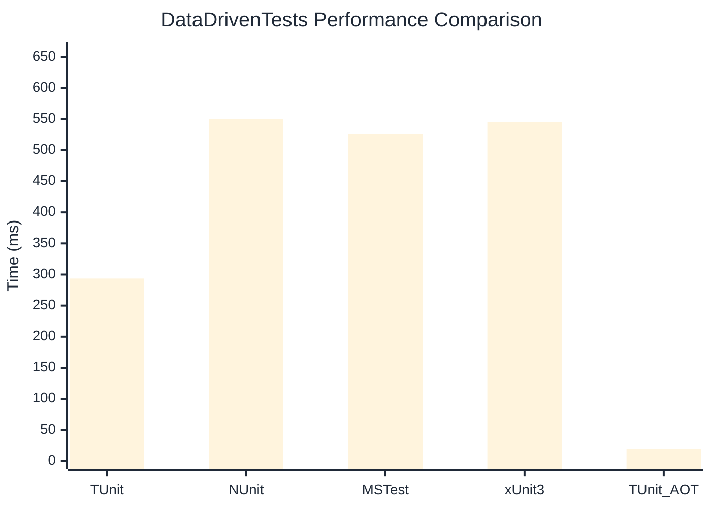

# DataDrivenTests Benchmark

> Parameterized tests with multiple data sources

:::info Last Updated
This benchmark was automatically generated on **2026-06-07** from the latest CI run.

**Environment:** Ubuntu Latest • .NET SDK 10.0.300
:::

## 📊 Results

| Framework | Version | Mean | Median | StdDev |
|-----------|---------|------|--------|--------|
| **TUnit** | 1.50.0 | 293.57 ms | 293.86 ms | 5.402 ms |
| NUnit | 4.6.1 | 550.36 ms | 543.30 ms | 23.687 ms |
| MSTest | 4.2.3 | 526.70 ms | 526.45 ms | 8.533 ms |
| xUnit3 | 3.2.2 | 545.01 ms | 541.85 ms | 21.133 ms |
| **TUnit (AOT)** | 1.50.0 | 19.48 ms | 18.94 ms | 2.943 ms |

## 📈 Visual Comparison

## 🎯 Key Insights

This benchmark compares TUnit's performance against NUnit, MSTest, xUnit3 using identical test scenarios.

---

:::note Methodology
View the [benchmarks overview](/docs/benchmarks) for methodology details and environment information.
:::

*Last generated: 2026-06-07T00:51:01.521Z*
