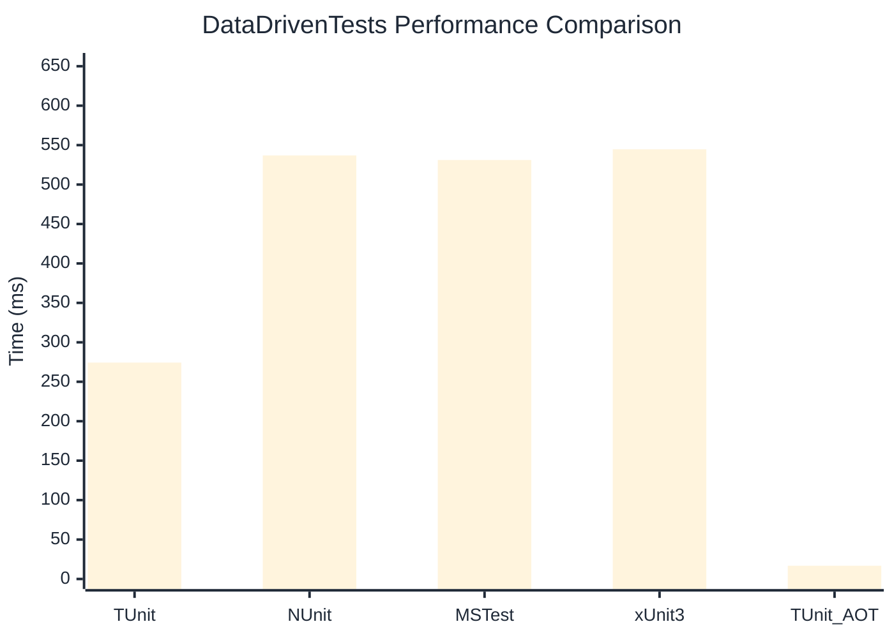

# DataDrivenTests Benchmark

> Parameterized tests with multiple data sources

:::info Last Updated
This benchmark was automatically generated on **2026-06-21** from the latest CI run.

**Environment:** Ubuntu Latest • .NET SDK 10.0.301
:::

## 📊 Results

| Framework | Version | Mean | Median | StdDev |
|-----------|---------|------|--------|--------|
| **TUnit** | 1.56.18 | 274.30 ms | 274.05 ms | 6.523 ms |
| NUnit | 4.6.1 | 536.93 ms | 529.92 ms | 19.563 ms |
| MSTest | 4.2.3 | 531.15 ms | 532.07 ms | 9.820 ms |
| xUnit3 | 3.2.2 | 544.70 ms | 542.55 ms | 17.967 ms |
| **TUnit (AOT)** | 1.56.18 | 16.79 ms | 15.94 ms | 2.511 ms |

## 📈 Visual Comparison

## 🎯 Key Insights

This benchmark compares TUnit's performance against NUnit, MSTest, xUnit3 using identical test scenarios.

---

:::note Methodology
View the [benchmarks overview](/docs/benchmarks) for methodology details and environment information.
:::

*Last generated: 2026-06-21T00:53:41.572Z*
