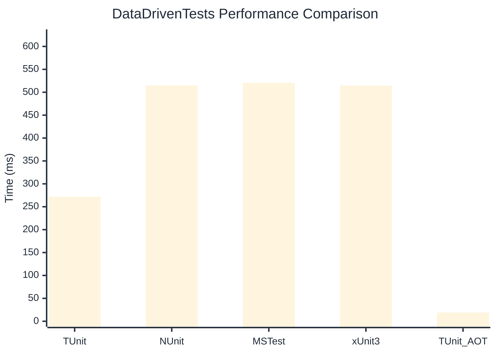

# DataDrivenTests Benchmark

> Parameterized tests with multiple data sources

:::info Last Updated
This benchmark was automatically generated on **2026-06-14** from the latest CI run.

**Environment:** Ubuntu Latest • .NET SDK 10.0.301
:::

## 📊 Results

| Framework | Version | Mean | Median | StdDev |
|-----------|---------|------|--------|--------|
| **TUnit** | 1.54.0 | 271.89 ms | 270.27 ms | 6.176 ms |
| NUnit | 4.6.1 | 514.79 ms | 512.24 ms | 7.857 ms |
| MSTest | 4.2.3 | 520.59 ms | 517.38 ms | 12.178 ms |
| xUnit3 | 3.2.2 | 514.41 ms | 514.06 ms | 7.372 ms |
| **TUnit (AOT)** | 1.54.0 | 18.89 ms | 18.65 ms | 2.391 ms |

## 📈 Visual Comparison

## 🎯 Key Insights

This benchmark compares TUnit's performance against NUnit, MSTest, xUnit3 using identical test scenarios.

---

:::note Methodology
View the [benchmarks overview](/docs/benchmarks) for methodology details and environment information.
:::

*Last generated: 2026-06-14T00:53:32.669Z*
