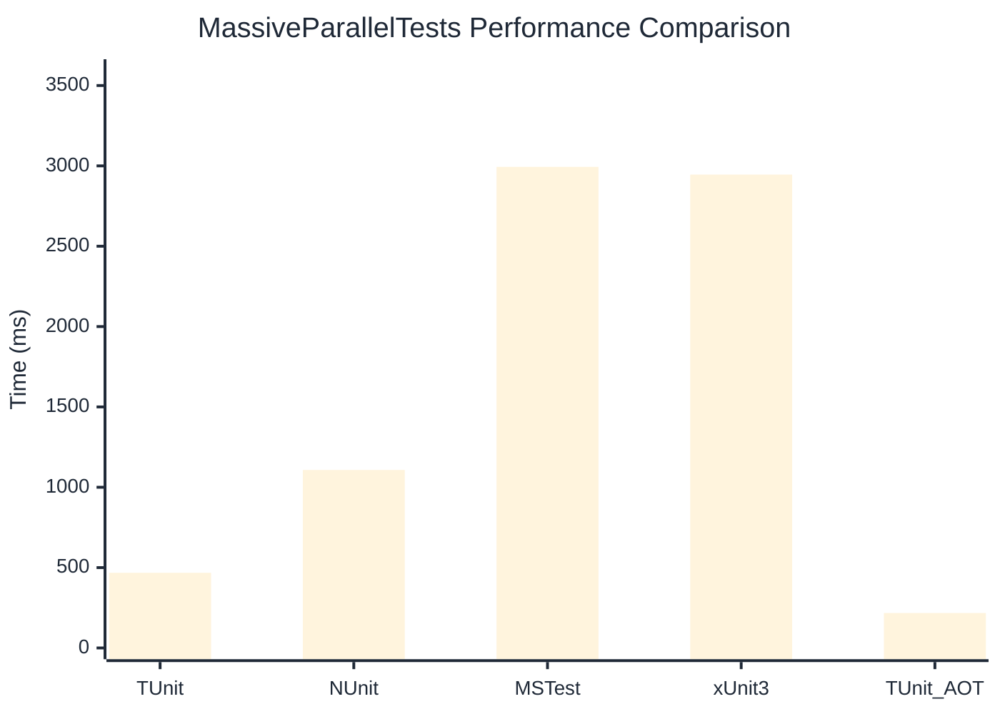

# MassiveParallelTests Benchmark

> Parallel execution stress tests

:::info Last Updated
This benchmark was automatically generated on **2026-07-12** from the latest CI run.

**Environment:** Ubuntu Latest • .NET SDK 10.0.301
:::

## 📊 Results

| Framework | Version | Mean | Median | StdDev |
|-----------|---------|------|--------|--------|
| **TUnit** | 1.58.0 | 467.8 ms | 467.2 ms | 7.40 ms |
| NUnit | 4.6.1 | 1,107.5 ms | 1,109.8 ms | 26.10 ms |
| MSTest | 4.3.0 | 2,993.9 ms | 2,985.5 ms | 23.91 ms |
| xUnit3 | 3.2.2 | 2,945.7 ms | 2,945.5 ms | 13.92 ms |
| **TUnit (AOT)** | 1.58.0 | 217.6 ms | 217.7 ms | 0.42 ms |

## 📈 Visual Comparison

## 🎯 Key Insights

This benchmark compares TUnit's performance against NUnit, MSTest, xUnit3 using identical test scenarios.

---

:::note Methodology
View the [benchmarks overview](/docs/benchmarks) for methodology details and environment information.
:::

*Last generated: 2026-07-12T00:38:25.258Z*
