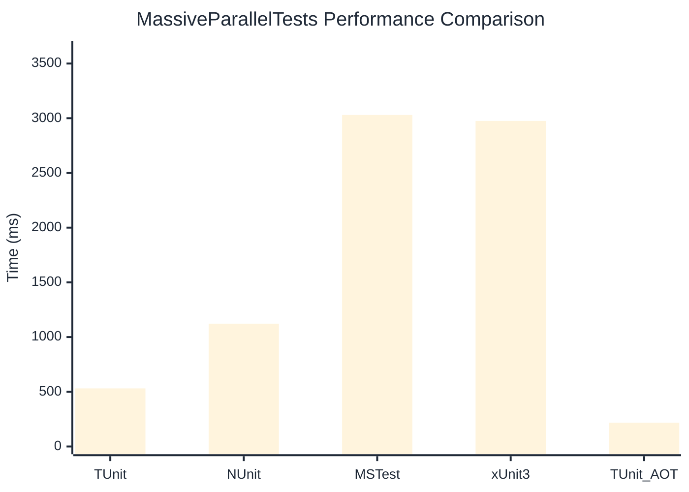

# MassiveParallelTests Benchmark

> Parallel execution stress tests

:::info Last Updated
This benchmark was automatically generated on **2026-07-16** from the latest CI run.

**Environment:** Ubuntu Latest • .NET SDK 10.0.302
:::

## 📊 Results

| Framework | Version | Mean | Median | StdDev |
|-----------|---------|------|--------|--------|
| **TUnit** | 1.60.0 | 530.9 ms | 525.1 ms | 20.42 ms |
| NUnit | 4.6.1 | 1,122.5 ms | 1,114.3 ms | 21.95 ms |
| MSTest | 4.3.2 | 3,029.7 ms | 3,024.8 ms | 30.72 ms |
| xUnit3 | 3.2.2 | 2,975.1 ms | 2,971.1 ms | 44.00 ms |
| **TUnit (AOT)** | 1.60.0 | 217.5 ms | 217.1 ms | 1.20 ms |

## 📈 Visual Comparison

## 🎯 Key Insights

This benchmark compares TUnit's performance against NUnit, MSTest, xUnit3 using identical test scenarios.

---

:::note Methodology
View the [benchmarks overview](/docs/benchmarks) for methodology details and environment information.
:::

*Last generated: 2026-07-16T16:49:09.140Z*
