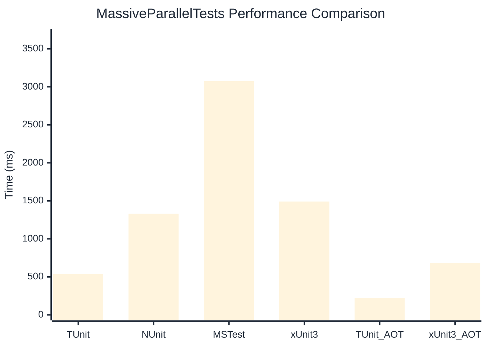

# MassiveParallelTests Benchmark

> Parallel execution stress tests

:::info Last Updated
This benchmark was automatically generated on **2026-09-13** from the latest CI run.

**Environment:** Ubuntu Latest • .NET SDK 10.0.401
:::

## 📊 Results

| Framework | Version | Mean | Median | StdDev |
|-----------|---------|------|--------|--------|
| **TUnit** | 1.67.0 | 538.5 ms | 530.5 ms | 39.13 ms |
| NUnit | 4.6.1 | 1,331.4 ms | 1,328.2 ms | 48.05 ms |
| MSTest | 4.4.0 | 3,075.1 ms | 3,068.6 ms | 51.74 ms |
| xUnit3 | 4.0.1 | 1,491.6 ms | 1,478.7 ms | 76.79 ms |
| **TUnit (AOT)** | 1.67.0 | 224.3 ms | 223.3 ms | 2.91 ms |
| xUnit3_AOT | 4.0.1 | 686.0 ms | 682.6 ms | 9.26 ms |

## 📈 Visual Comparison

```mermaid
%%{init: {
  'theme':'base',
  'themeVariables': {
    'primaryColor': '#2563eb',
    'primaryTextColor': '#1f2937',
    'primaryBorderColor': '#1e40af',
    'lineColor': '#6b7280',
    'secondaryColor': '#7c3aed',
    'tertiaryColor': '#dc2626',
    'background': '#ffffff',
    'mainBkg': '#2563eb',
    'secondBkg': '#7c3aed',
    'tertiaryBkg': '#dc2626',
    'clusterBkg': '#f3f4f6',
    'edgeLabelBackground': '#ffffff',
    'tertiaryTextColor': '#1f2937',
    'pie1': '#2563eb',
    'pie2': '#7c3aed',
    'pie3': '#dc2626',
    'pie4': '#f59e0b',
    'pie5': '#10b981',
    'pie6': '#06b6d4',
    'pie7': '#ec4899',
    'pie8': '#6366f1',
    'pie9': '#84cc16',
    'pie10': '#f97316',
    'pie11': '#14b8a6',
    'pie12': '#a855f7'
  }
}}%%
xychart-beta
  title "MassiveParallelTests Performance Comparison"
  x-axis ["TUnit", "NUnit", "MSTest", "xUnit3", "TUnit_AOT", "xUnit3_AOT"]
  y-axis "Time (ms)" 0 --> 3691
  bar [538.5, 1331.4, 3075.1, 1491.6, 224.3, 686]
```

## 🎯 Key Insights

This benchmark compares TUnit's performance against NUnit, MSTest, xUnit3, xUnit3_AOT using identical test scenarios.

---

:::note Methodology
View the [benchmarks overview](/docs/benchmarks) for methodology details and environment information.
:::

*Last generated: 2026-09-13T00:36:18.780Z*
