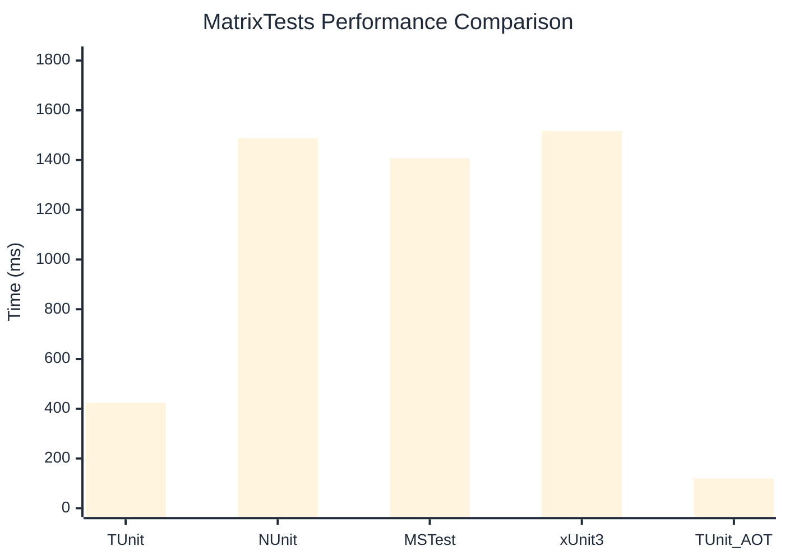

# MatrixTests Benchmark

> Combinatorial test generation and execution

:::info Last Updated
This benchmark was automatically generated on **2026-06-28** from the latest CI run.

**Environment:** Ubuntu Latest • .NET SDK 10.0.301
:::

## 📊 Results

| Framework | Version | Mean | Median | StdDev |
|-----------|---------|------|--------|--------|
| **TUnit** | 1.56.35 | 423.2 ms | 420.7 ms | 29.21 ms |
| NUnit | 4.6.1 | 1,487.8 ms | 1,488.9 ms | 25.72 ms |
| MSTest | 4.2.3 | 1,407.1 ms | 1,403.3 ms | 16.77 ms |
| xUnit3 | 3.2.2 | 1,516.9 ms | 1,506.8 ms | 31.18 ms |
| **TUnit (AOT)** | 1.56.35 | 119.4 ms | 119.6 ms | 1.49 ms |

## 📈 Visual Comparison

## 🎯 Key Insights

This benchmark compares TUnit's performance against NUnit, MSTest, xUnit3 using identical test scenarios.

---

:::note Methodology
View the [benchmarks overview](/docs/benchmarks) for methodology details and environment information.
:::

*Last generated: 2026-06-28T00:49:53.676Z*
