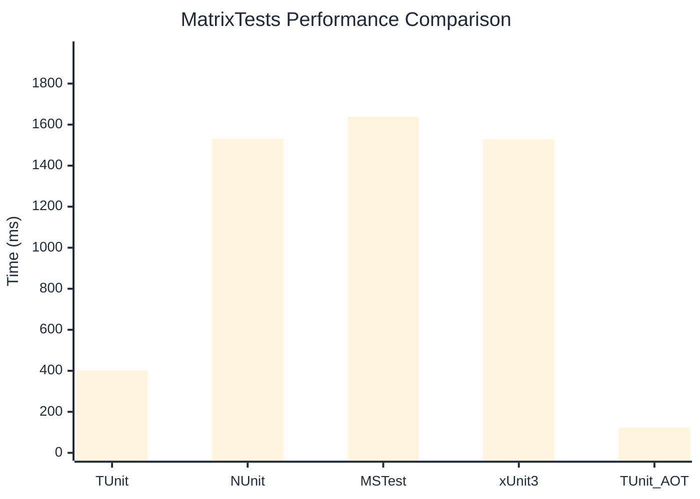

# MatrixTests Benchmark

> Combinatorial test generation and execution

:::info Last Updated
This benchmark was automatically generated on **2026-07-21** from the latest CI run.

**Environment:** Ubuntu Latest • .NET SDK 10.0.302
:::

## 📊 Results

| Framework | Version | Mean | Median | StdDev |
|-----------|---------|------|--------|--------|
| **TUnit** | 1.61.23 | 402.4 ms | 398.0 ms | 19.20 ms |
| NUnit | 4.6.1 | 1,530.4 ms | 1,537.3 ms | 60.07 ms |
| MSTest | 4.3.2 | 1,638.4 ms | 1,638.9 ms | 12.03 ms |
| xUnit3 | 3.2.2 | 1,528.6 ms | 1,524.9 ms | 33.68 ms |
| **TUnit (AOT)** | 1.61.23 | 123.8 ms | 123.6 ms | 3.83 ms |

## 📈 Visual Comparison

## 🎯 Key Insights

This benchmark compares TUnit's performance against NUnit, MSTest, xUnit3 using identical test scenarios.

---

:::note Methodology
View the [benchmarks overview](/docs/benchmarks) for methodology details and environment information.
:::

*Last generated: 2026-07-21T23:54:21.483Z*
