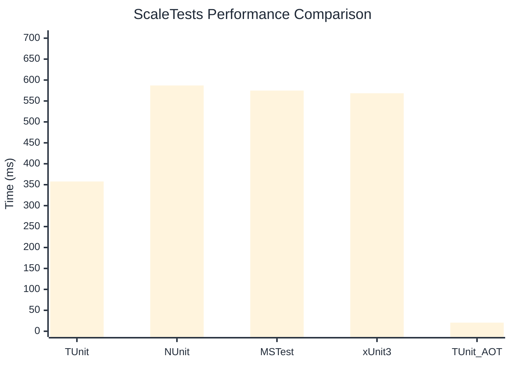

# ScaleTests Benchmark

> Large test suites (150+ tests) measuring scalability

:::info Last Updated
This benchmark was automatically generated on **2026-06-07** from the latest CI run.

**Environment:** Ubuntu Latest • .NET SDK 10.0.300
:::

## 📊 Results

| Framework | Version | Mean | Median | StdDev |
|-----------|---------|------|--------|--------|
| **TUnit** | 1.50.0 | 357.70 ms | 357.32 ms | 25.005 ms |
| NUnit | 4.6.1 | 587.04 ms | 588.62 ms | 17.298 ms |
| MSTest | 4.2.3 | 574.83 ms | 572.35 ms | 21.266 ms |
| xUnit3 | 3.2.2 | 568.45 ms | 569.57 ms | 25.756 ms |
| **TUnit (AOT)** | 1.50.0 | 20.60 ms | 20.50 ms | 1.921 ms |

## 📈 Visual Comparison

## 🎯 Key Insights

This benchmark compares TUnit's performance against NUnit, MSTest, xUnit3 using identical test scenarios.

---

:::note Methodology
View the [benchmarks overview](/docs/benchmarks) for methodology details and environment information.
:::

*Last generated: 2026-06-07T00:51:01.522Z*
