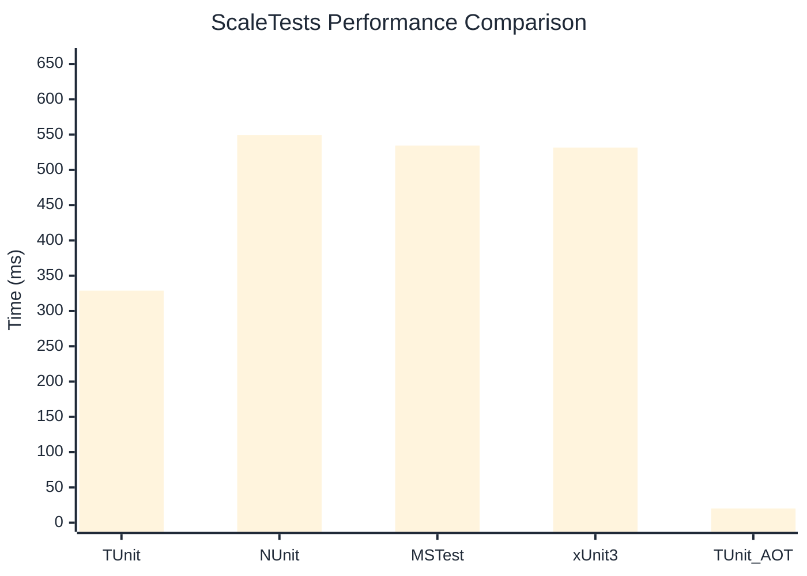

# ScaleTests Benchmark

> Large test suites (150+ tests) measuring scalability

:::info Last Updated
This benchmark was automatically generated on **2026-06-21** from the latest CI run.

**Environment:** Ubuntu Latest • .NET SDK 10.0.301
:::

## 📊 Results

| Framework | Version | Mean | Median | StdDev |
|-----------|---------|------|--------|--------|
| **TUnit** | 1.56.18 | 328.84 ms | 324.74 ms | 31.583 ms |
| NUnit | 4.6.1 | 549.48 ms | 545.41 ms | 15.278 ms |
| MSTest | 4.2.3 | 534.48 ms | 531.80 ms | 10.913 ms |
| xUnit3 | 3.2.2 | 531.44 ms | 528.33 ms | 9.663 ms |
| **TUnit (AOT)** | 1.56.18 | 20.26 ms | 18.75 ms | 3.594 ms |

## 📈 Visual Comparison

## 🎯 Key Insights

This benchmark compares TUnit's performance against NUnit, MSTest, xUnit3 using identical test scenarios.

---

:::note Methodology
View the [benchmarks overview](/docs/benchmarks) for methodology details and environment information.
:::

*Last generated: 2026-06-21T00:53:41.573Z*
