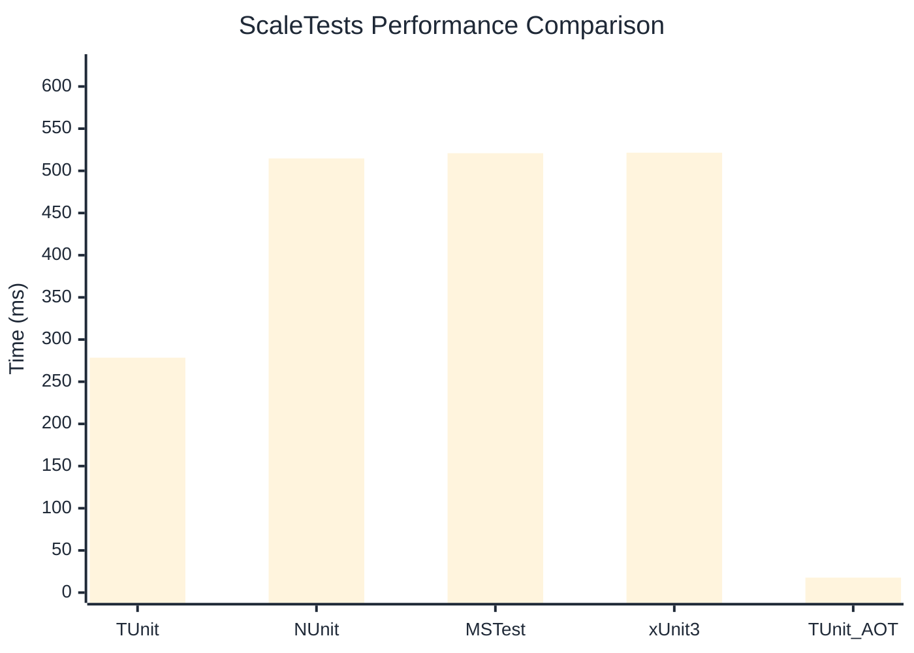

# ScaleTests Benchmark

> Large test suites (150+ tests) measuring scalability

:::info Last Updated
This benchmark was automatically generated on **2026-06-14** from the latest CI run.

**Environment:** Ubuntu Latest • .NET SDK 10.0.301
:::

## 📊 Results

| Framework | Version | Mean | Median | StdDev |
|-----------|---------|------|--------|--------|
| **TUnit** | 1.54.0 | 278.51 ms | 279.06 ms | 3.006 ms |
| NUnit | 4.6.1 | 514.73 ms | 514.84 ms | 14.549 ms |
| MSTest | 4.2.3 | 520.92 ms | 523.50 ms | 11.250 ms |
| xUnit3 | 3.2.2 | 521.52 ms | 516.36 ms | 13.600 ms |
| **TUnit (AOT)** | 1.54.0 | 17.79 ms | 17.52 ms | 1.127 ms |

## 📈 Visual Comparison

## 🎯 Key Insights

This benchmark compares TUnit's performance against NUnit, MSTest, xUnit3 using identical test scenarios.

---

:::note Methodology
View the [benchmarks overview](/docs/benchmarks) for methodology details and environment information.
:::

*Last generated: 2026-06-14T00:53:32.670Z*
