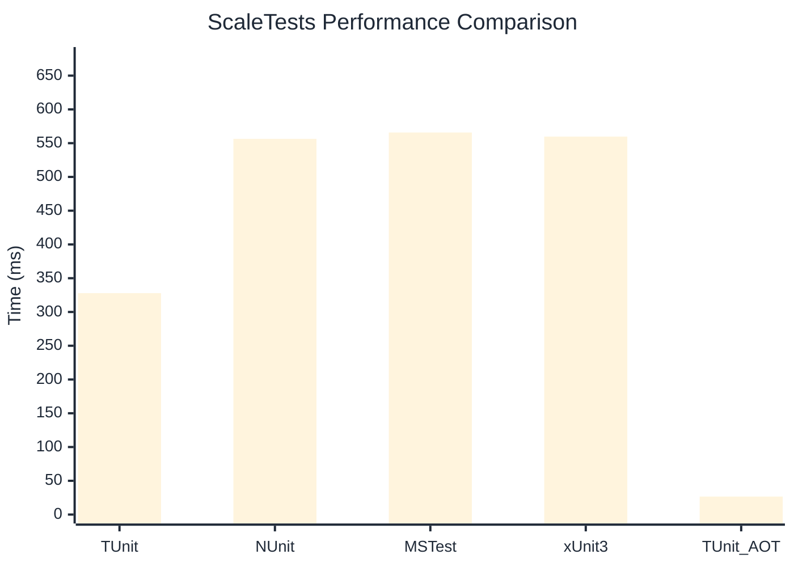

# ScaleTests Benchmark

> Large test suites (150+ tests) measuring scalability

:::info Last Updated
This benchmark was automatically generated on **2026-06-29** from the latest CI run.

**Environment:** Ubuntu Latest • .NET SDK 10.0.301
:::

## 📊 Results

| Framework | Version | Mean | Median | StdDev |
|-----------|---------|------|--------|--------|
| **TUnit** | 1.57.0 | 327.87 ms | 324.00 ms | 16.023 ms |
| NUnit | 4.6.1 | 556.36 ms | 556.29 ms | 19.996 ms |
| MSTest | 4.2.3 | 565.79 ms | 566.91 ms | 13.230 ms |
| xUnit3 | 3.2.2 | 559.76 ms | 558.65 ms | 12.975 ms |
| **TUnit (AOT)** | 1.57.0 | 26.65 ms | 26.33 ms | 2.078 ms |

## 📈 Visual Comparison

## 🎯 Key Insights

This benchmark compares TUnit's performance against NUnit, MSTest, xUnit3 using identical test scenarios.

---

:::note Methodology
View the [benchmarks overview](/docs/benchmarks) for methodology details and environment information.
:::

*Last generated: 2026-06-29T09:11:59.773Z*
