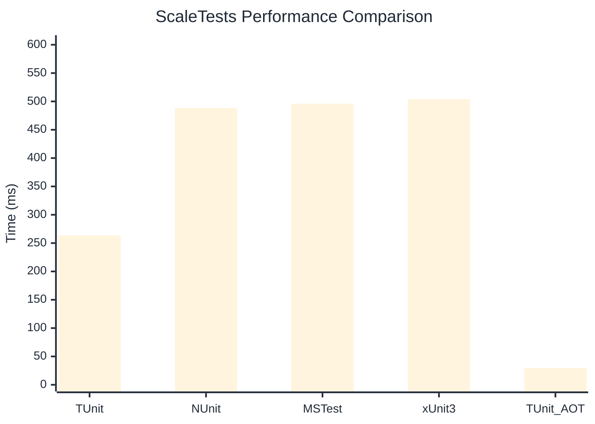

# ScaleTests Benchmark

> Large test suites (150+ tests) measuring scalability

:::info Last Updated
This benchmark was automatically generated on **2026-07-12** from the latest CI run.

**Environment:** Ubuntu Latest • .NET SDK 10.0.301
:::

## 📊 Results

| Framework | Version | Mean | Median | StdDev |
|-----------|---------|------|--------|--------|
| **TUnit** | 1.58.0 | 263.55 ms | 263.67 ms | 1.995 ms |
| NUnit | 4.6.1 | 488.30 ms | 487.42 ms | 7.690 ms |
| MSTest | 4.3.0 | 495.94 ms | 495.27 ms | 8.060 ms |
| xUnit3 | 3.2.2 | 504.14 ms | 499.49 ms | 13.636 ms |
| **TUnit (AOT)** | 1.58.0 | 29.38 ms | 29.52 ms | 2.269 ms |

## 📈 Visual Comparison

## 🎯 Key Insights

This benchmark compares TUnit's performance against NUnit, MSTest, xUnit3 using identical test scenarios.

---

:::note Methodology
View the [benchmarks overview](/docs/benchmarks) for methodology details and environment information.
:::

*Last generated: 2026-07-12T00:38:25.259Z*
