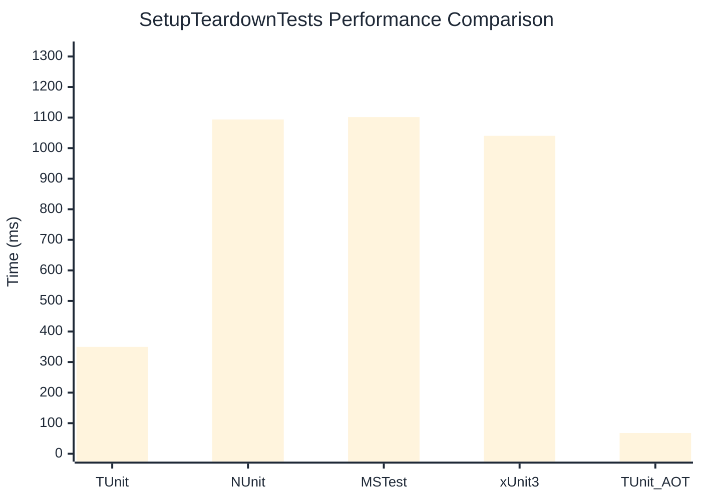

# SetupTeardownTests Benchmark

> Expensive test fixtures with setup/teardown overhead

:::info Last Updated
This benchmark was automatically generated on **2026-07-21** from the latest CI run.

**Environment:** Ubuntu Latest • .NET SDK 10.0.302
:::

## 📊 Results

| Framework | Version | Mean | Median | StdDev |
|-----------|---------|------|--------|--------|
| **TUnit** | 1.61.23 | 349.73 ms | 349.91 ms | 5.702 ms |
| NUnit | 4.6.1 | 1,093.86 ms | 1,094.51 ms | 47.885 ms |
| MSTest | 4.3.2 | 1,101.72 ms | 1,100.89 ms | 12.587 ms |
| xUnit3 | 3.2.2 | 1,040.28 ms | 1,038.61 ms | 7.699 ms |
| **TUnit (AOT)** | 1.61.23 | 67.96 ms | 67.17 ms | 1.813 ms |

## 📈 Visual Comparison

## 🎯 Key Insights

This benchmark compares TUnit's performance against NUnit, MSTest, xUnit3 using identical test scenarios.

---

:::note Methodology
View the [benchmarks overview](/docs/benchmarks) for methodology details and environment information.
:::

*Last generated: 2026-07-21T23:54:21.484Z*
