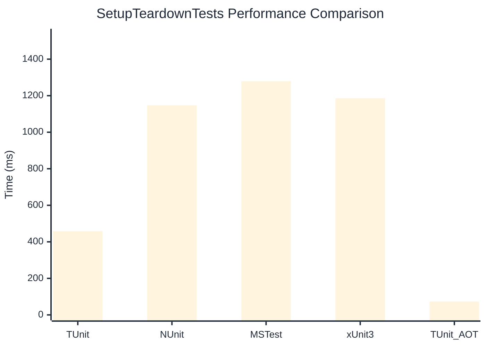

# SetupTeardownTests Benchmark

> Expensive test fixtures with setup/teardown overhead

:::info Last Updated
This benchmark was automatically generated on **2026-07-16** from the latest CI run.

**Environment:** Ubuntu Latest • .NET SDK 10.0.302
:::

## 📊 Results

| Framework | Version | Mean | Median | StdDev |
|-----------|---------|------|--------|--------|
| **TUnit** | 1.60.0 | 458.30 ms | 463.95 ms | 35.039 ms |
| NUnit | 4.6.1 | 1,147.56 ms | 1,149.59 ms | 37.016 ms |
| MSTest | 4.3.2 | 1,279.43 ms | 1,280.80 ms | 24.024 ms |
| xUnit3 | 3.2.2 | 1,186.16 ms | 1,185.53 ms | 29.989 ms |
| **TUnit (AOT)** | 1.60.0 | 73.35 ms | 73.16 ms | 1.190 ms |

## 📈 Visual Comparison

## 🎯 Key Insights

This benchmark compares TUnit's performance against NUnit, MSTest, xUnit3 using identical test scenarios.

---

:::note Methodology
View the [benchmarks overview](/docs/benchmarks) for methodology details and environment information.
:::

*Last generated: 2026-07-16T16:49:09.141Z*
