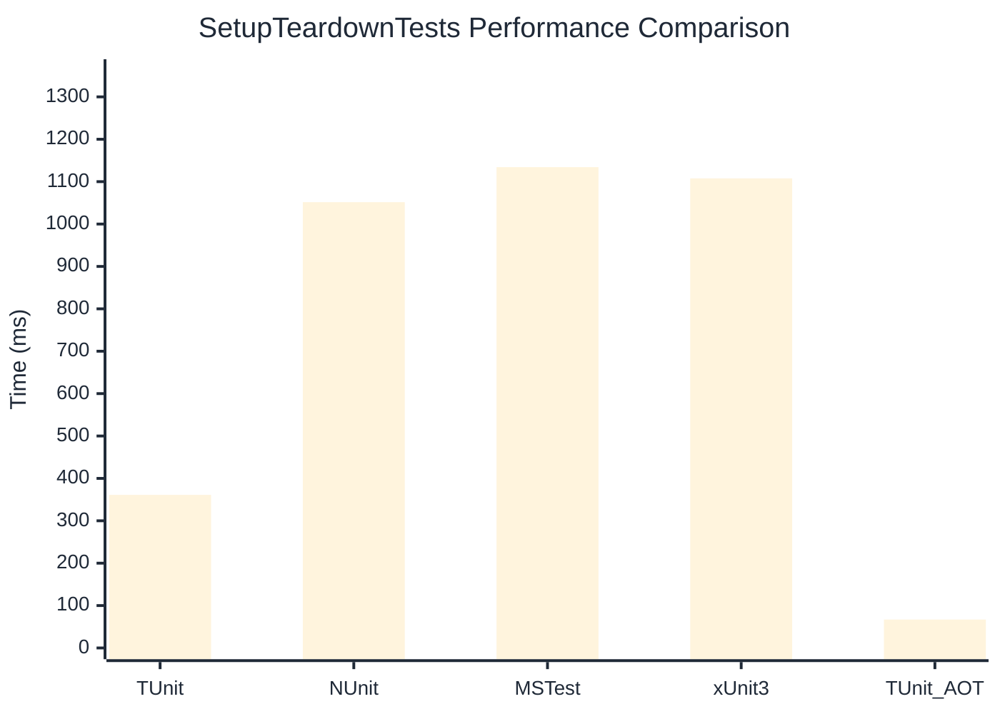

# SetupTeardownTests Benchmark

> Expensive test fixtures with setup/teardown overhead

:::info Last Updated
This benchmark was automatically generated on **2026-07-19** from the latest CI run.

**Environment:** Ubuntu Latest • .NET SDK 10.0.302
:::

## 📊 Results

| Framework | Version | Mean | Median | StdDev |
|-----------|---------|------|--------|--------|
| **TUnit** | 1.61.0 | 361.06 ms | 356.23 ms | 15.519 ms |
| NUnit | 4.6.1 | 1,051.58 ms | 1,050.96 ms | 28.322 ms |
| MSTest | 4.3.2 | 1,134.21 ms | 1,135.69 ms | 20.119 ms |
| xUnit3 | 3.2.2 | 1,107.75 ms | 1,107.74 ms | 33.122 ms |
| **TUnit (AOT)** | 1.61.0 | 67.02 ms | 66.82 ms | 0.819 ms |

## 📈 Visual Comparison

## 🎯 Key Insights

This benchmark compares TUnit's performance against NUnit, MSTest, xUnit3 using identical test scenarios.

---

:::note Methodology
View the [benchmarks overview](/docs/benchmarks) for methodology details and environment information.
:::

*Last generated: 2026-07-19T00:36:15.198Z*
