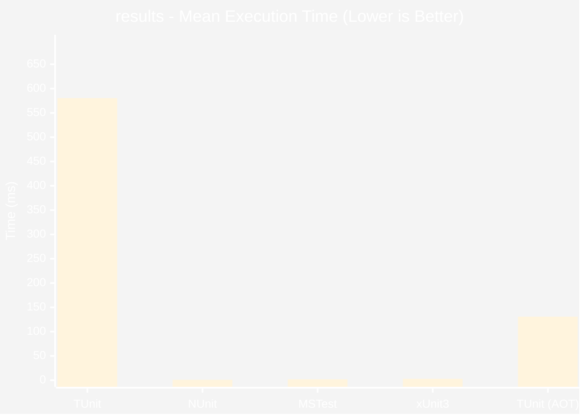
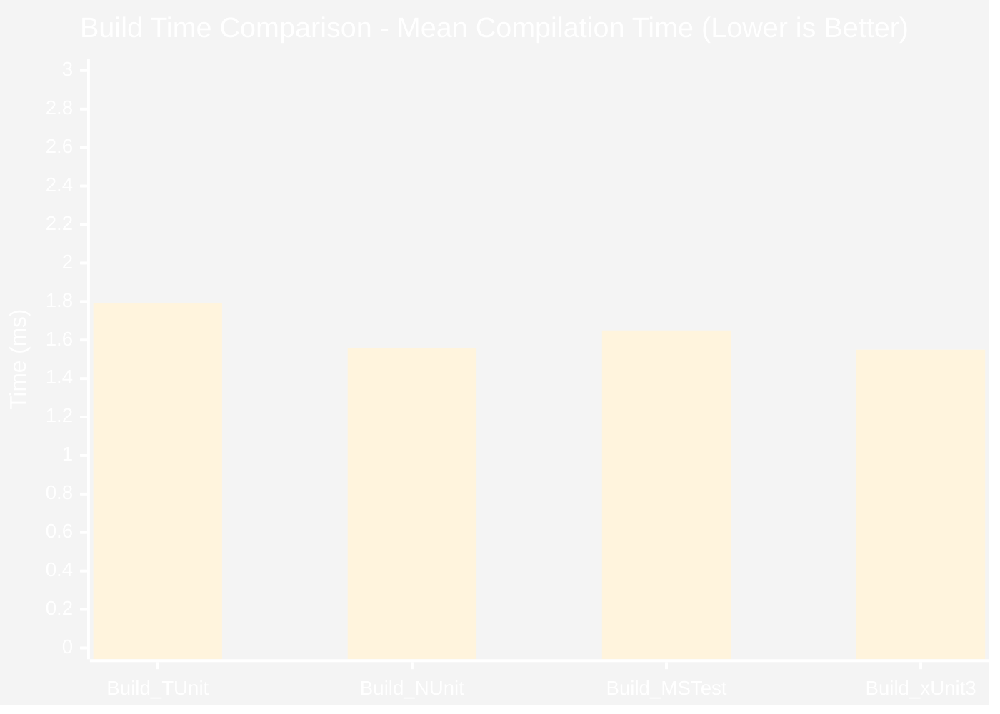

# Performance Benchmarks

:::info Last Updated
These benchmarks were automatically generated on **2025-11-11** from the latest CI run.

**Environment:** Ubuntu Latest • .NET SDK 10.0.100
:::

## 🚀 Runtime Performance

### results

| Framework | Version | Mean | Median | StdDev |
|-----------|---------|------|--------|--------|
| 🏆 **TUnit** | 1.0.78 | 580.4 ms | 578.3 ms | 7.38 ms |
| NUnit | 4.4.0 | 1,211.6 ms | 1,209.8 ms | 9.40 ms |
| MSTest | 4.0.2 | 2,995.4 ms | 2,996.6 ms | 7.68 ms |
| xUnit3 | 3.2.0 | 3,086.8 ms | 3,086.9 ms | 11.28 ms |
| 🏆 **TUnit (AOT)** | 1.0.78 | 130.8 ms | 130.8 ms | 0.47 ms |

📊 Visual Comparison

---

## 🔨 Build Performance

Compilation time comparison across frameworks:

| Framework | Version | Mean | Median | StdDev |
|-----------|---------|------|--------|--------|
| 🏆 **TUnit** | 1.0.78 | 1.791 s | 1.788 s | 0.0257 s |
| Build_NUnit | 4.4.0 | 1.560 s | 1.565 s | 0.0213 s |
| Build_MSTest | 4.0.2 | 1.652 s | 1.656 s | 0.0123 s |
| Build_xUnit3 | 3.2.0 | 1.546 s | 1.551 s | 0.0203 s |

📊 Visual Comparison

---

## 📊 Methodology

These benchmarks compare TUnit against the most popular .NET testing frameworks:

| Framework | Version Tested |
|-----------|----------------|
| **TUnit** | 1.0.78 |
| **xUnit v3** | 3.2.0 |
| **NUnit** | 4.4.0 |
| **MSTest** | 4.0.2 |

### Test Scenarios

The benchmarks measure real-world testing patterns:

- **DataDrivenTests**: Parameterized tests with multiple data sources
- **AsyncTests**: Realistic async/await patterns with I/O simulation
- **ScaleTests**: Large test suites (1000+ tests) measuring scalability
- **MatrixTests**: Combinatorial test generation and execution
- **MassiveParallelTests**: Parallel execution stress tests

### Environment

- **OS**: Ubuntu Latest (GitHub Actions)
- **Runtime**: .NET 10.0.0 (10.0.0, 10.0.25.52411), X64 RyuJIT x86-64-v3
- **SDK**: .NET SDK 10.0.100
- **Hardware**: GitHub Actions Standard Runner (Ubuntu)
- **Tool**: BenchmarkDotNet v0.15.6, Linux Ubuntu 24.04.3 LTS (Noble Numbat)

### Why These Numbers Matter

- **No Mocking**: All tests use realistic patterns, not artificial micro-benchmarks
- **Equivalent Logic**: Each framework implements identical test scenarios
- **Warm-Up Excluded**: Measurements exclude JIT warm-up overhead
- **Statistical Rigor**: Multiple iterations with outlier detection

### Source Code

All benchmark source code is available in the [`tools/speed-comparison`](https://github.com/thomhurst/TUnit/tree/main/tools/speed-comparison) directory.

---

:::note Continuous Benchmarking
These benchmarks run automatically daily via [GitHub Actions](https://github.com/thomhurst/TUnit/actions/workflows/speed-comparison.yml).

Each benchmark runs multiple iterations with statistical analysis to ensure accuracy. Results may vary based on hardware and test characteristics.
:::

*Last generated: 2025-11-11T22:58:18.735Z*
