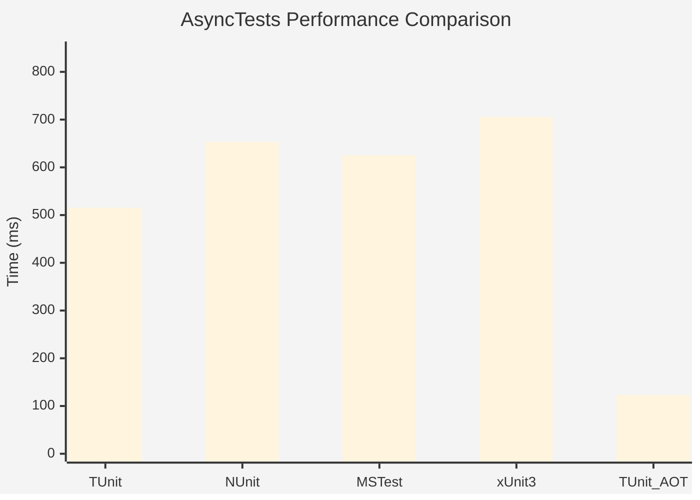
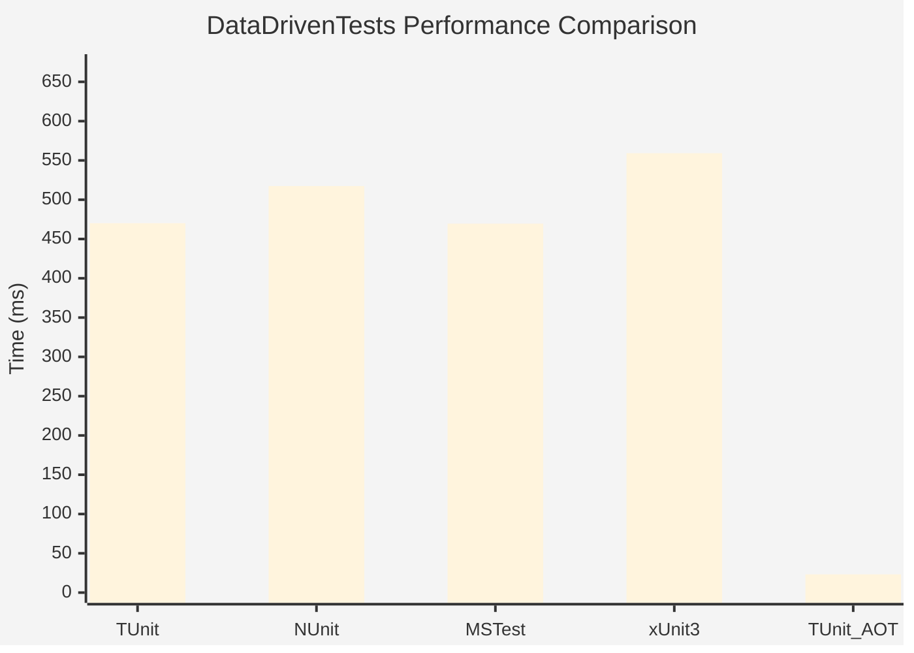
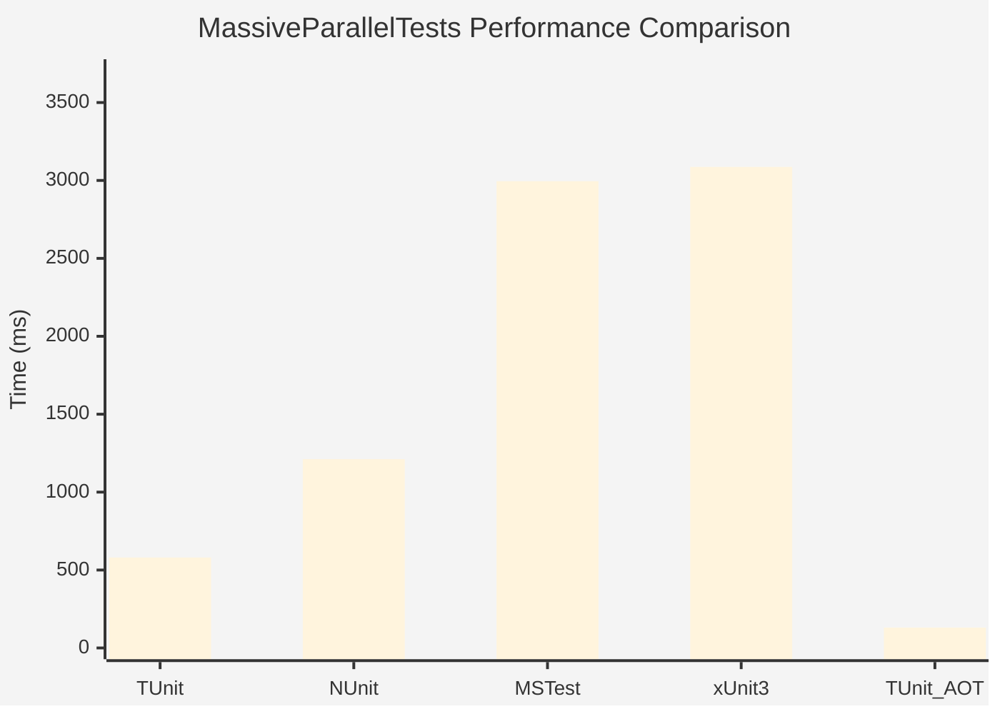
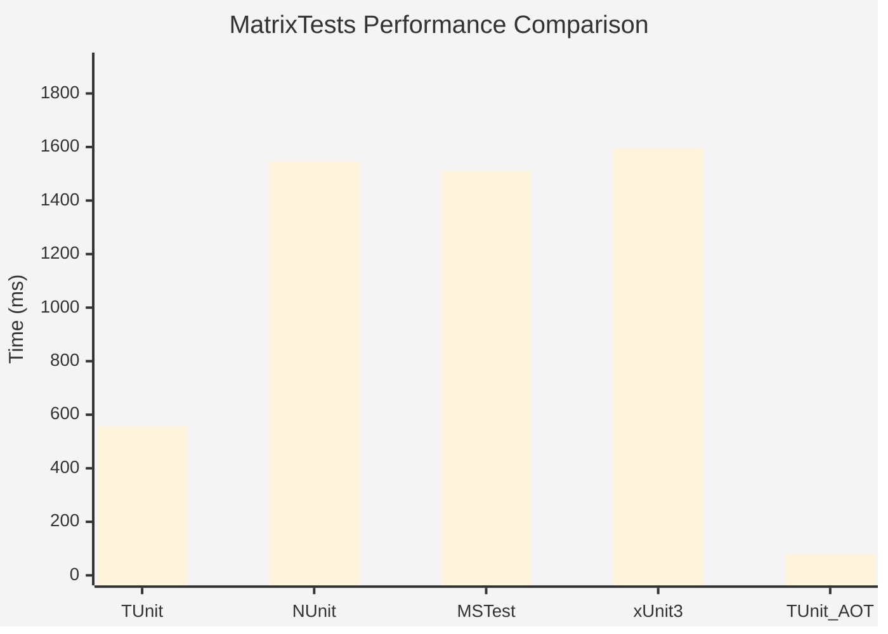
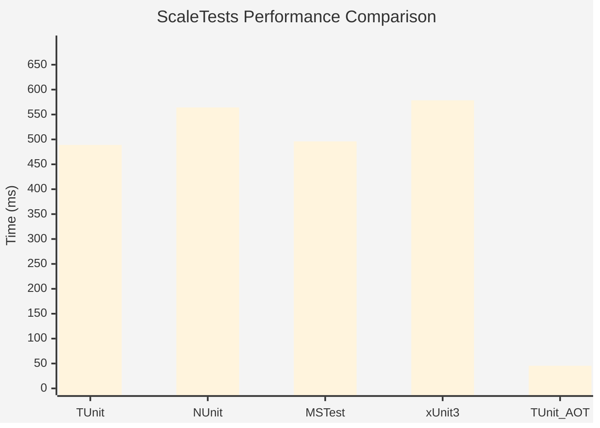
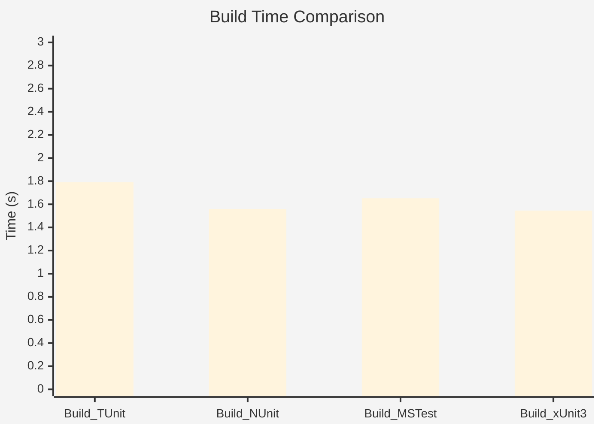

# Performance Benchmarks

:::info Last Updated
These benchmarks were automatically generated on **2025-11-11** from the latest CI run.

**Environment:** Ubuntu Latest • .NET SDK 10.0.100
:::

## 🚀 Runtime Performance

### AsyncTests

| Framework | Version | Mean | Median | StdDev |
|-----------|---------|------|--------|--------|
| **TUnit** | 1.0.78 | 515.2 ms | 514.4 ms | 5.97 ms |
| NUnit | 4.4.0 | 653.0 ms | 651.9 ms | 9.14 ms |
| MSTest | 4.0.2 | 625.0 ms | 626.1 ms | 5.44 ms |
| xUnit3 | 3.2.0 | 705.5 ms | 703.8 ms | 8.57 ms |
| **TUnit (AOT)** | 1.0.78 | 123.0 ms | 123.0 ms | 0.27 ms |

### DataDrivenTests

| Framework | Version | Mean | Median | StdDev |
|-----------|---------|------|--------|--------|
| **TUnit** | 1.0.78 | 470.12 ms | 468.90 ms | 6.656 ms |
| NUnit | 4.4.0 | 517.39 ms | 515.90 ms | 5.243 ms |
| MSTest | 4.0.2 | 469.53 ms | 468.35 ms | 8.490 ms |
| xUnit3 | 3.2.0 | 559.23 ms | 561.96 ms | 6.806 ms |
| **TUnit (AOT)** | 1.0.78 | 23.21 ms | 23.24 ms | 0.216 ms |

### MassiveParallelTests

| Framework | Version | Mean | Median | StdDev |
|-----------|---------|------|--------|--------|
| **TUnit** | 1.0.78 | 580.4 ms | 578.3 ms | 7.38 ms |
| NUnit | 4.4.0 | 1,211.6 ms | 1,209.8 ms | 9.40 ms |
| MSTest | 4.0.2 | 2,995.4 ms | 2,996.6 ms | 7.68 ms |
| xUnit3 | 3.2.0 | 3,086.8 ms | 3,086.9 ms | 11.28 ms |
| **TUnit (AOT)** | 1.0.78 | 130.8 ms | 130.8 ms | 0.47 ms |

### MatrixTests

| Framework | Version | Mean | Median | StdDev |
|-----------|---------|------|--------|--------|
| **TUnit** | 1.0.78 | 556.38 ms | 555.90 ms | 7.361 ms |
| NUnit | 4.4.0 | 1,545.79 ms | 1,548.36 ms | 14.829 ms |
| MSTest | 4.0.2 | 1,510.34 ms | 1,509.61 ms | 12.203 ms |
| xUnit3 | 3.2.0 | 1,595.19 ms | 1,596.19 ms | 9.486 ms |
| **TUnit (AOT)** | 1.0.78 | 78.81 ms | 78.75 ms | 0.441 ms |

### ScaleTests

| Framework | Version | Mean | Median | StdDev |
|-----------|---------|------|--------|--------|
| **TUnit** | 1.0.78 | 488.96 ms | 489.51 ms | 3.711 ms |
| NUnit | 4.4.0 | 564.21 ms | 564.16 ms | 7.073 ms |
| MSTest | 4.0.2 | 496.03 ms | 494.58 ms | 7.211 ms |
| xUnit3 | 3.2.0 | 578.53 ms | 581.03 ms | 10.227 ms |
| **TUnit (AOT)** | 1.0.78 | 45.46 ms | 45.85 ms | 4.083 ms |

---

## 🔨 Build Performance

Compilation time comparison across frameworks:

| Framework | Version | Mean | Median | StdDev |
|-----------|---------|------|--------|--------|
| **TUnit** | 1.0.78 | 1.791 s | 1.788 s | 0.0257 s |
| Build_NUnit | 4.4.0 | 1.560 s | 1.565 s | 0.0213 s |
| Build_MSTest | 4.0.2 | 1.652 s | 1.656 s | 0.0123 s |
| Build_xUnit3 | 3.2.0 | 1.546 s | 1.551 s | 0.0203 s |

---

## 📊 Methodology

These benchmarks compare TUnit against the most popular .NET testing frameworks:

| Framework | Version Tested |
|-----------|----------------|
| **TUnit** | 1.0.78 |
| **xUnit v3** | 3.2.0 |
| **NUnit** | 4.4.0 |
| **MSTest** | 4.0.2 |

### Test Scenarios

The benchmarks measure real-world testing patterns:

- **DataDrivenTests**: Parameterized tests with multiple data sources
- **AsyncTests**: Realistic async/await patterns with I/O simulation
- **ScaleTests**: Large test suites (150+ tests) measuring scalability
- **MatrixTests**: Combinatorial test generation and execution
- **MassiveParallelTests**: Parallel execution stress tests
- **SetupTeardownTests**: Expensive test fixtures with setup/teardown overhead

### Environment

- **OS**: Ubuntu Latest (GitHub Actions)
- **Runtime**: .NET 10.0.0 (10.0.0, 10.0.25.52411), X64 RyuJIT x86-64-v3
- **SDK**: .NET SDK 10.0.100
- **Hardware**: GitHub Actions Standard Runner (Ubuntu)
- **Tool**: BenchmarkDotNet v0.15.6, Linux Ubuntu 24.04.3 LTS (Noble Numbat)

### Why These Numbers Matter

- **No Mocking**: All tests use realistic patterns, not artificial micro-benchmarks
- **Equivalent Logic**: Each framework implements identical test scenarios
- **Warm-Up Excluded**: Measurements exclude JIT warm-up overhead
- **Statistical Rigor**: Multiple iterations with outlier detection

### Source Code

All benchmark source code is available in the [`tools/speed-comparison`](https://github.com/thomhurst/TUnit/tree/main/tools/speed-comparison) directory.

---

:::note Continuous Benchmarking
These benchmarks run automatically daily via [GitHub Actions](https://github.com/thomhurst/TUnit/actions/workflows/speed-comparison.yml).

Each benchmark runs multiple iterations with statistical analysis to ensure accuracy. Results may vary based on hardware and test characteristics.
:::

*Last generated: 2025-11-11T23:54:26.122Z*
