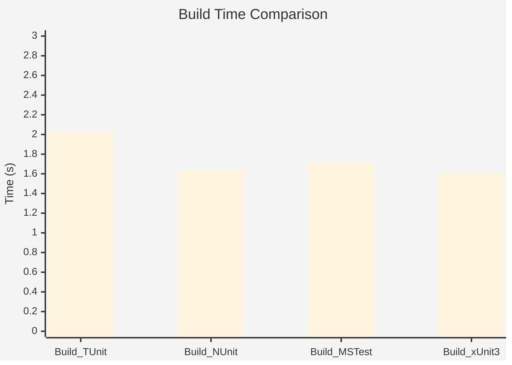

# Performance Benchmarks

:::info Last Updated
These benchmarks were automatically generated on **2025-11-12** from the latest CI run.

**Environment:** Ubuntu Latest • .NET SDK 10.0.100
:::

## 🚀 Runtime Performance

### results

| Framework | Version | Mean | Median | StdDev |
|-----------|---------|------|--------|--------|
| **TUnit** | 1.0.78 | 495.66 ms | 496.75 ms | 3.288 ms |
| NUnit | 4.4.0 | 533.59 ms | 534.97 ms | 10.858 ms |
| MSTest | 4.0.2 | 505.82 ms | 502.05 ms | 13.674 ms |
| xUnit3 | 3.2.0 | 583.29 ms | 580.92 ms | 10.011 ms |
| **TUnit (AOT)** | 1.0.78 | 25.84 ms | 25.90 ms | 0.241 ms |

---

## 🔨 Build Performance

Compilation time comparison across frameworks:

| Framework | Version | Mean | Median | StdDev |
|-----------|---------|------|--------|--------|
| **TUnit** | 1.0.78 | 2.025 s | 2.022 s | 0.0200 s |
| Build_NUnit | 4.4.0 | 1.630 s | 1.634 s | 0.0153 s |
| Build_MSTest | 4.0.2 | 1.712 s | 1.714 s | 0.0165 s |
| Build_xUnit3 | 3.2.0 | 1.600 s | 1.600 s | 0.0100 s |

---

## 📊 Methodology

These benchmarks compare TUnit against the most popular .NET testing frameworks:

| Framework | Version Tested |
|-----------|----------------|
| **TUnit** | 1.0.78 |
| **xUnit v3** | 3.2.0 |
| **NUnit** | 4.4.0 |
| **MSTest** | 4.0.2 |

### Test Scenarios

The benchmarks measure real-world testing patterns:

- **DataDrivenTests**: Parameterized tests with multiple data sources
- **AsyncTests**: Realistic async/await patterns with I/O simulation
- **ScaleTests**: Large test suites (150+ tests) measuring scalability
- **MatrixTests**: Combinatorial test generation and execution
- **MassiveParallelTests**: Parallel execution stress tests
- **SetupTeardownTests**: Expensive test fixtures with setup/teardown overhead

### Environment

- **OS**: Ubuntu Latest (GitHub Actions)
- **Runtime**: .NET 10.0.0 (10.0.0, 10.0.25.52411), X64 RyuJIT x86-64-v3
- **SDK**: .NET SDK 10.0.100
- **Hardware**: GitHub Actions Standard Runner (Ubuntu)
- **Tool**: BenchmarkDotNet v0.15.6, Linux Ubuntu 24.04.3 LTS (Noble Numbat)

### Why These Numbers Matter

- **No Mocking**: All tests use realistic patterns, not artificial micro-benchmarks
- **Equivalent Logic**: Each framework implements identical test scenarios
- **Warm-Up Excluded**: Measurements exclude JIT warm-up overhead
- **Statistical Rigor**: Multiple iterations with outlier detection

### Source Code

All benchmark source code is available in the [`tools/speed-comparison`](https://github.com/thomhurst/TUnit/tree/main/tools/speed-comparison) directory.

---

:::note Continuous Benchmarking
These benchmarks run automatically daily via [GitHub Actions](https://github.com/thomhurst/TUnit/actions/workflows/speed-comparison.yml).

Each benchmark runs multiple iterations with statistical analysis to ensure accuracy. Results may vary based on hardware and test characteristics.
:::

*Last generated: 2025-11-12T00:04:00.609Z*
