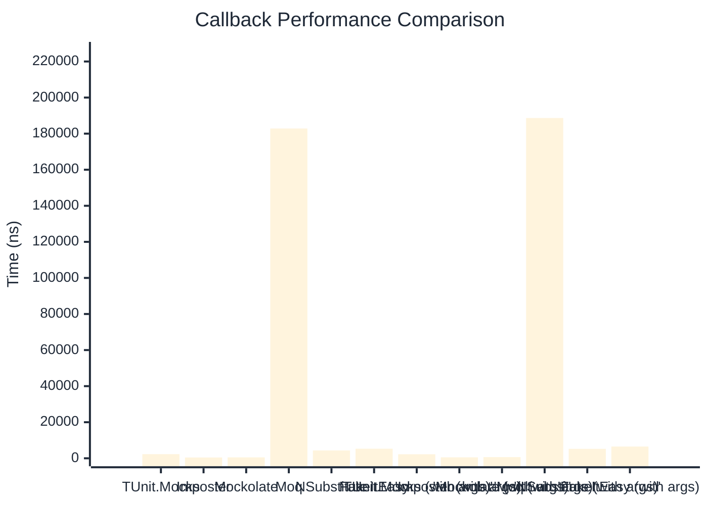

# Callback Benchmark

:::info Last Updated
This benchmark was automatically generated on **2026-03-29** from the latest CI run.

**Environment:** Ubuntu Latest • .NET SDK 10.0.201
:::

## 📊 Results

Callback registration and execution:

| Method | Mean | Error | StdDev | Allocated |
|--------|------|-------|--------|-----------|
| **TUnit.Mocks** | 2,288.0 ns | 30.53 ns | 25.49 ns | 3.94 KB |
| Imposter | 445.4 ns | 2.92 ns | 2.44 ns | 2.66 KB |
| Mockolate | 508.7 ns | 2.03 ns | 1.80 ns | 1.84 KB |
| Moq | 182,843.3 ns | 1,126.89 ns | 1,054.09 ns | 13.14 KB |
| NSubstitute | 4,350.1 ns | 25.64 ns | 20.02 ns | 7.93 KB |
| FakeItEasy | 5,316.0 ns | 56.34 ns | 49.95 ns | 7.44 KB |
| **'TUnit.Mocks (with args)'** | 2,230.4 ns | 26.26 ns | 24.57 ns | 4.04 KB |
| 'Imposter (with args)' | 533.0 ns | 4.56 ns | 3.81 ns | 2.82 KB |
| 'Mockolate (with args)' | 644.6 ns | 5.46 ns | 5.11 ns | 2.22 KB |
| 'Moq (with args)' | 188,679.4 ns | 683.48 ns | 570.74 ns | 13.73 KB |
| 'NSubstitute (with args)' | 5,249.4 ns | 80.98 ns | 71.78 ns | 8.53 KB |
| 'FakeItEasy (with args)' | 6,507.8 ns | 79.76 ns | 66.61 ns | 9.4 KB |

## 📈 Visual Comparison

## 🎯 Key Insights

This benchmark compares **TUnit.Mocks** (source-generated) against runtime proxy-based mocking libraries for callback registration and execution.

---

:::note Methodology
View the [mock benchmarks overview](/docs/benchmarks/mocks) for methodology details and environment information.
:::

*Last generated: 2026-03-29T21:50:09.523Z*
