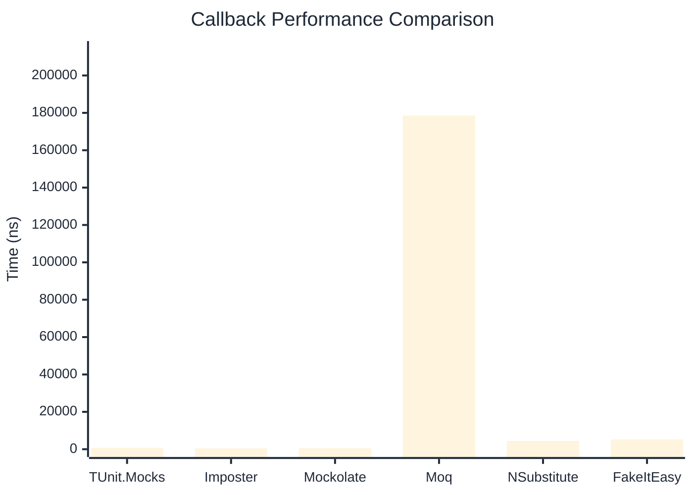

# Callback Benchmark

:::info Last Updated
This benchmark was automatically generated on **2026-03-30** from the latest CI run.

**Environment:** Ubuntu Latest • .NET SDK 10.0.201
:::

## 📊 Results

Callback registration and execution:

| Library | Mean | Error | StdDev | Allocated |
|---------|------|-------|--------|-----------|
| **TUnit.Mocks** | 740.2 ns | 11.54 ns | 10.79 ns | 3.72 KB |
| Imposter | 452.3 ns | 2.77 ns | 2.59 ns | 2.66 KB |
| Mockolate | 519.3 ns | 2.93 ns | 2.60 ns | 1.84 KB |
| Moq | 178,505.1 ns | 942.35 ns | 881.48 ns | 13.14 KB |
| NSubstitute | 4,419.0 ns | 50.22 ns | 44.52 ns | 7.93 KB |
| FakeItEasy | 5,227.9 ns | 53.06 ns | 47.03 ns | 7.44 KB |

---

### with args

| Library | Mean | Error | StdDev | Allocated |
|---------|------|-------|--------|-----------|
| **TUnit.Mocks** | 882.0 ns | 9.09 ns | 8.50 ns | 3.8 KB |
| Imposter | 528.8 ns | 3.37 ns | 2.99 ns | 2.82 KB |
| Mockolate | 678.0 ns | 4.77 ns | 3.98 ns | 2.22 KB |
| Moq | 189,676.3 ns | 904.24 ns | 801.59 ns | 13.85 KB |
| NSubstitute | 5,288.4 ns | 66.31 ns | 62.02 ns | 8.53 KB |
| FakeItEasy | 6,535.3 ns | 101.49 ns | 89.97 ns | 9.4 KB |

## 🎯 Key Insights

This benchmark compares **TUnit.Mocks** (source-generated) against runtime proxy-based mocking libraries for callback registration and execution.

---

:::note Methodology
View the [mock benchmarks overview](/docs/benchmarks/mocks) for methodology details and environment information.
:::

*Last generated: 2026-03-30T01:06:26.815Z*
