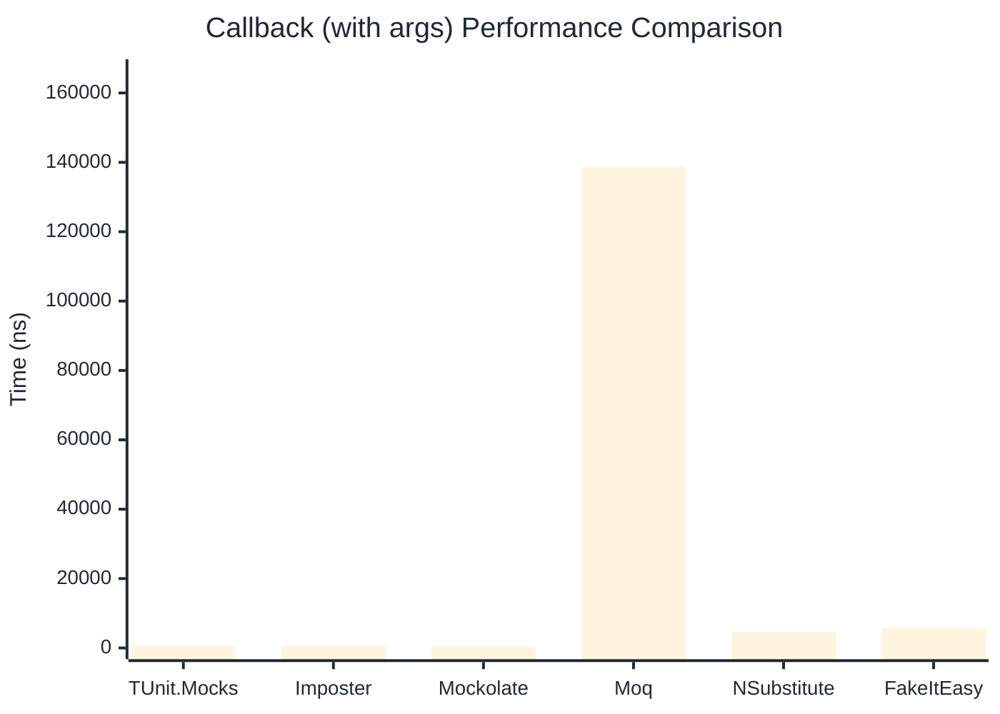

# Callback Benchmark

:::info Last Updated
This benchmark was automatically generated on **2026-05-03** from the latest CI run.

**Environment:** Ubuntu Latest • .NET SDK 10.0.203
:::

## 📊 Results

Callback registration and execution:

| Library | Mean | Error | StdDev | Allocated |
|---------|------|-------|--------|-----------|
| **TUnit.Mocks** | 600.8 ns | 2.68 ns | 2.50 ns | 2.98 KB |
| Imposter | 457.3 ns | 0.80 ns | 0.71 ns | 2.66 KB |
| Mockolate | 352.0 ns | 2.29 ns | 2.14 ns | 1.89 KB |
| Moq | 134,330.0 ns | 872.04 ns | 773.04 ns | 13.29 KB |
| NSubstitute | 4,186.9 ns | 45.24 ns | 42.32 ns | 7.93 KB |
| FakeItEasy | 4,551.3 ns | 31.13 ns | 27.59 ns | 7.44 KB |

---

### with args

| Library | Mean | Error | StdDev | Allocated |
|---------|------|-------|--------|-----------|
| **TUnit.Mocks** | 685.6 ns | 4.16 ns | 3.89 ns | 3.06 KB |
| Imposter | 534.3 ns | 1.23 ns | 1.02 ns | 2.82 KB |
| Mockolate | 399.8 ns | 1.52 ns | 1.27 ns | 1.94 KB |
| Moq | 138,707.6 ns | 602.72 ns | 503.30 ns | 13.73 KB |
| NSubstitute | 4,542.1 ns | 31.29 ns | 29.27 ns | 8.53 KB |
| FakeItEasy | 5,632.5 ns | 25.15 ns | 22.30 ns | 9.4 KB |

## 🎯 Key Insights

This benchmark compares **TUnit.Mocks** (source-generated) against runtime proxy-based mocking libraries for callback registration and execution.

---

:::note Methodology
View the [mock benchmarks overview](/docs/benchmarks/mocks) for methodology details and environment information.
:::

*Last generated: 2026-05-03T03:31:53.295Z*
