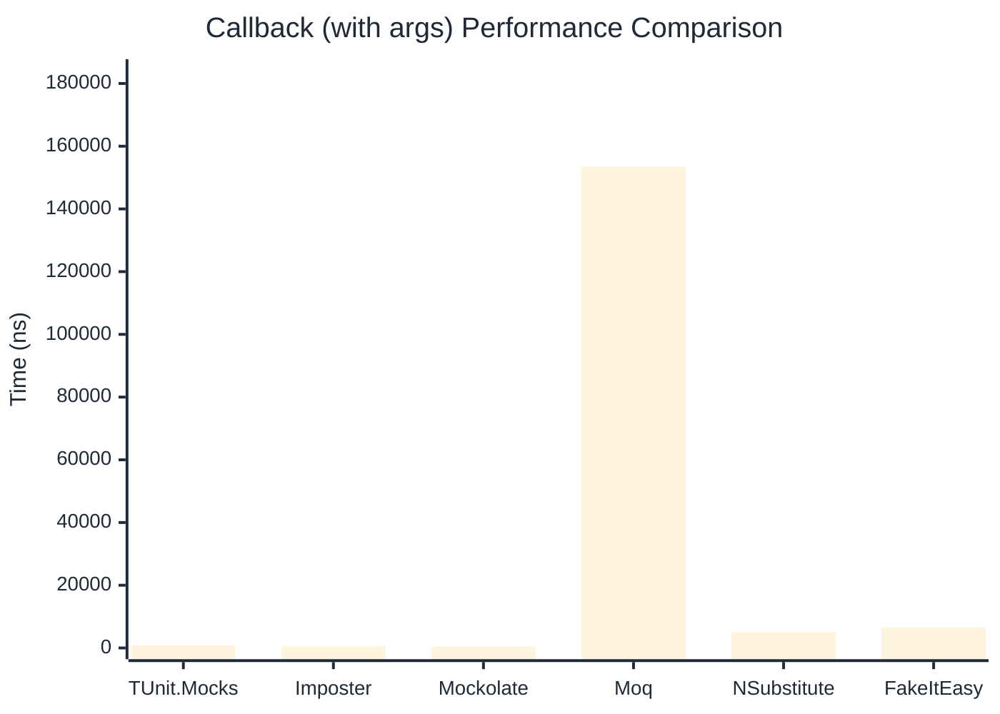

# Callback Benchmark

:::info Last Updated
This benchmark was automatically generated on **2026-05-05** from the latest CI run.

**Environment:** Ubuntu Latest • .NET SDK 10.0.203
:::

## 📊 Results

Callback registration and execution:

| Library | Mean | Error | StdDev | Allocated |
|---------|------|-------|--------|-----------|
| **TUnit.Mocks** | 731.1 ns | 10.87 ns | 10.17 ns | 2.98 KB |
| Imposter | 542.4 ns | 6.50 ns | 6.08 ns | 2.66 KB |
| Mockolate | 431.7 ns | 3.82 ns | 3.19 ns | 1.89 KB |
| Moq | 140,551.6 ns | 2,108.15 ns | 1,971.96 ns | 13.29 KB |
| NSubstitute | 4,399.2 ns | 47.69 ns | 44.61 ns | 7.93 KB |
| FakeItEasy | 5,226.8 ns | 13.69 ns | 11.43 ns | 7.43 KB |

---

### with args

| Library | Mean | Error | StdDev | Allocated |
|---------|------|-------|--------|-----------|
| **TUnit.Mocks** | 852.8 ns | 8.96 ns | 8.38 ns | 3.06 KB |
| Imposter | 633.5 ns | 11.50 ns | 10.76 ns | 2.82 KB |
| Mockolate | 500.8 ns | 7.06 ns | 6.26 ns | 1.94 KB |
| Moq | 153,428.6 ns | 1,851.95 ns | 1,732.31 ns | 13.75 KB |
| NSubstitute | 5,095.5 ns | 16.26 ns | 13.58 ns | 8.53 KB |
| FakeItEasy | 6,588.3 ns | 28.39 ns | 26.55 ns | 9.26 KB |

## 🎯 Key Insights

This benchmark compares **TUnit.Mocks** (source-generated) against runtime proxy-based mocking libraries for callback registration and execution.

---

:::note Methodology
View the [mock benchmarks overview](/docs/benchmarks/mocks) for methodology details and environment information.
:::

*Last generated: 2026-05-05T03:26:21.616Z*
