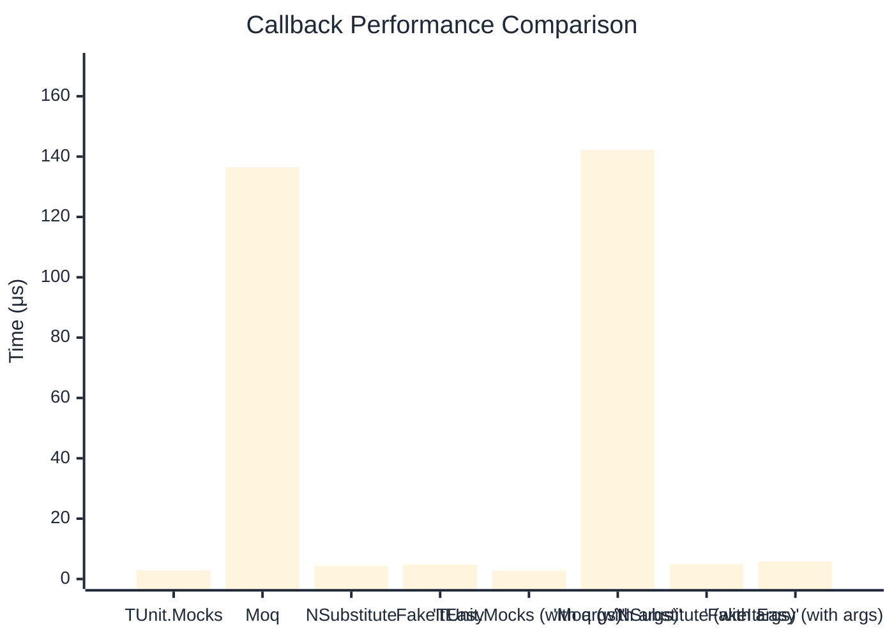

# Callback Benchmark

:::info Last Updated
This benchmark was automatically generated on **2026-03-28** from the latest CI run.

**Environment:** Ubuntu Latest • .NET SDK 10.0.201
:::

## 📊 Results

Callback registration and execution:

| Method | Mean | Error | StdDev | Allocated |
|--------|------|-------|--------|-----------|
| **TUnit.Mocks** | 2.828 μs | 0.0513 μs | 0.0455 μs | 7.28 KB |
| Moq | 136.434 μs | 0.6351 μs | 0.4959 μs | 13.24 KB |
| NSubstitute | 4.337 μs | 0.0635 μs | 0.0563 μs | 7.93 KB |
| FakeItEasy | 4.793 μs | 0.0662 μs | 0.0619 μs | 7.44 KB |
| **'TUnit.Mocks (with args)'** | 2.708 μs | 0.0299 μs | 0.0265 μs | 7.4 KB |
| 'Moq (with args)' | 142.187 μs | 0.7043 μs | 0.5881 μs | 13.73 KB |
| 'NSubstitute (with args)' | 4.886 μs | 0.0262 μs | 0.0245 μs | 8.53 KB |
| 'FakeItEasy (with args)' | 5.857 μs | 0.1023 μs | 0.0957 μs | 9.4 KB |

## 📈 Visual Comparison

## 🎯 Key Insights

This benchmark compares **TUnit.Mocks** (source-generated) against runtime proxy-based mocking libraries for callback registration and execution.

---

:::note Methodology
View the [mock benchmarks overview](/docs/benchmarks/mocks) for methodology details and environment information.
:::

*Last generated: 2026-03-28T22:34:52.302Z*
