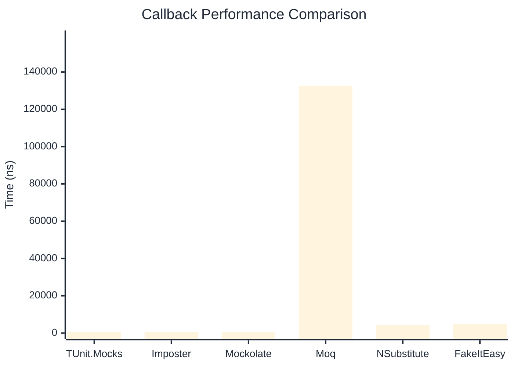

# Callback Benchmark

:::info Last Updated
This benchmark was automatically generated on **2026-04-20** from the latest CI run.

**Environment:** Ubuntu Latest • .NET SDK 10.0.202
:::

## 📊 Results

Callback registration and execution:

| Library | Mean | Error | StdDev | Allocated |
|---------|------|-------|--------|-----------|
| **TUnit.Mocks** | 704.4 ns | 10.11 ns | 8.96 ns | 3.13 KB |
| Imposter | 493.2 ns | 2.90 ns | 2.57 ns | 2.66 KB |
| Mockolate | 539.0 ns | 4.43 ns | 3.93 ns | 1.8 KB |
| Moq | 132,620.3 ns | 923.83 ns | 818.95 ns | 13.14 KB |
| NSubstitute | 4,329.5 ns | 28.99 ns | 27.12 ns | 7.93 KB |
| FakeItEasy | 4,899.4 ns | 17.96 ns | 15.92 ns | 7.44 KB |

---

### with args

| Library | Mean | Error | StdDev | Allocated |
|---------|------|-------|--------|-----------|
| **TUnit.Mocks** | 823.3 ns | 16.26 ns | 19.97 ns | 3.22 KB |
| Imposter | 566.2 ns | 6.46 ns | 6.04 ns | 2.82 KB |
| Mockolate | 746.0 ns | 11.31 ns | 10.58 ns | 2.13 KB |
| Moq | 141,310.7 ns | 1,304.13 ns | 1,156.08 ns | 13.73 KB |
| NSubstitute | 4,988.9 ns | 15.68 ns | 13.90 ns | 8.53 KB |
| FakeItEasy | 6,072.2 ns | 22.50 ns | 19.95 ns | 9.26 KB |

## 🎯 Key Insights

This benchmark compares **TUnit.Mocks** (source-generated) against runtime proxy-based mocking libraries for callback registration and execution.

---

:::note Methodology
View the [mock benchmarks overview](/docs/benchmarks/mocks) for methodology details and environment information.
:::

*Last generated: 2026-04-20T03:23:48.728Z*
