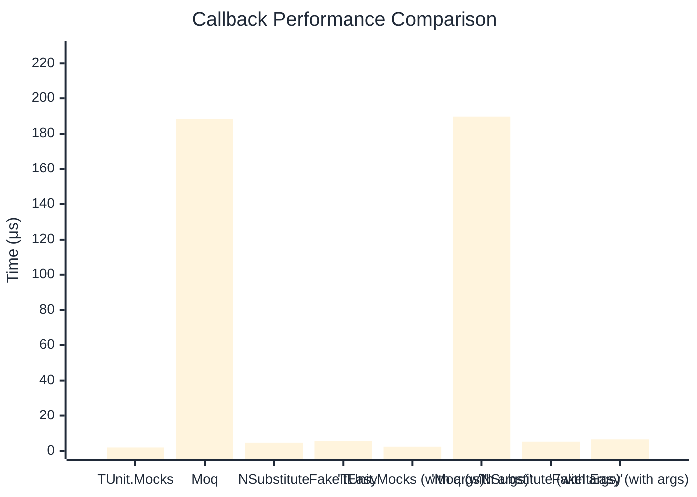

# Callback Benchmark

:::info Last Updated
This benchmark was automatically generated on **2026-03-29** from the latest CI run.

**Environment:** Ubuntu Latest • .NET SDK 10.0.201
:::

## 📊 Results

Callback registration and execution:

| Method | Mean | Error | StdDev | Allocated |
|--------|------|-------|--------|-----------|
| **TUnit.Mocks** | 1.991 μs | 0.0274 μs | 0.0256 μs | 3.94 KB |
| Moq | 188.239 μs | 1.4776 μs | 1.3821 μs | 13.14 KB |
| NSubstitute | 4.688 μs | 0.0363 μs | 0.0322 μs | 7.93 KB |
| FakeItEasy | 5.490 μs | 0.0253 μs | 0.0237 μs | 7.44 KB |
| **'TUnit.Mocks (with args)'** | 2.449 μs | 0.0339 μs | 0.0317 μs | 4.04 KB |
| 'Moq (with args)' | 189.687 μs | 1.6805 μs | 1.5719 μs | 13.73 KB |
| 'NSubstitute (with args)' | 5.275 μs | 0.0296 μs | 0.0247 μs | 8.53 KB |
| 'FakeItEasy (with args)' | 6.544 μs | 0.0647 μs | 0.0573 μs | 9.4 KB |

## 📈 Visual Comparison

## 🎯 Key Insights

This benchmark compares **TUnit.Mocks** (source-generated) against runtime proxy-based mocking libraries for callback registration and execution.

---

:::note Methodology
View the [mock benchmarks overview](/docs/benchmarks/mocks) for methodology details and environment information.
:::

*Last generated: 2026-03-29T03:29:47.876Z*
