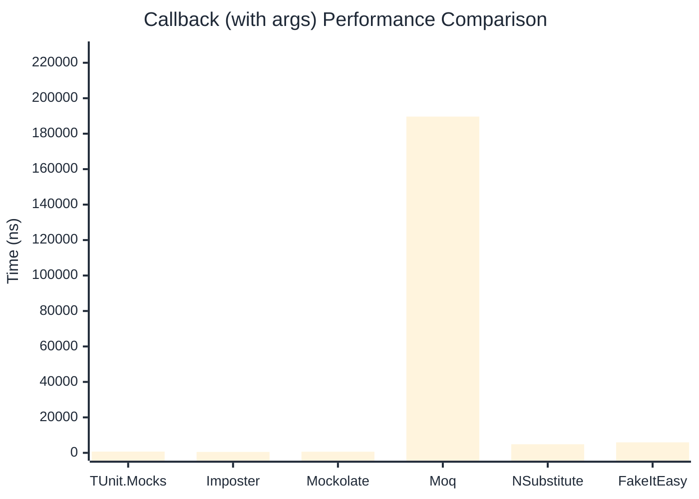

# Callback Benchmark

:::info Last Updated
This benchmark was automatically generated on **2026-04-27** from the latest CI run.

**Environment:** Ubuntu Latest • .NET SDK 10.0.203
:::

## 📊 Results

Callback registration and execution:

| Library | Mean | Error | StdDev | Allocated |
|---------|------|-------|--------|-----------|
| **TUnit.Mocks** | 604.3 ns | 4.93 ns | 4.37 ns | 2.98 KB |
| Imposter | 506.4 ns | 5.07 ns | 4.49 ns | 2.66 KB |
| Mockolate | 512.6 ns | 1.90 ns | 1.68 ns | 1.8 KB |
| Moq | 182,240.5 ns | 780.80 ns | 730.36 ns | 13.14 KB |
| NSubstitute | 4,501.5 ns | 18.31 ns | 16.23 ns | 7.93 KB |
| FakeItEasy | 5,148.5 ns | 30.30 ns | 26.86 ns | 7.44 KB |

---

### with args

| Library | Mean | Error | StdDev | Allocated |
|---------|------|-------|--------|-----------|
| **TUnit.Mocks** | 704.2 ns | 3.80 ns | 3.37 ns | 3.06 KB |
| Imposter | 513.4 ns | 2.16 ns | 1.69 ns | 2.82 KB |
| Mockolate | 631.1 ns | 4.14 ns | 3.67 ns | 2.13 KB |
| Moq | 189,645.5 ns | 1,528.33 ns | 1,354.82 ns | 13.73 KB |
| NSubstitute | 4,844.3 ns | 31.85 ns | 28.23 ns | 8.53 KB |
| FakeItEasy | 5,914.0 ns | 90.65 ns | 80.36 ns | 9.26 KB |

## 🎯 Key Insights

This benchmark compares **TUnit.Mocks** (source-generated) against runtime proxy-based mocking libraries for callback registration and execution.

---

:::note Methodology
View the [mock benchmarks overview](/docs/benchmarks/mocks) for methodology details and environment information.
:::

*Last generated: 2026-04-27T03:25:25.011Z*
