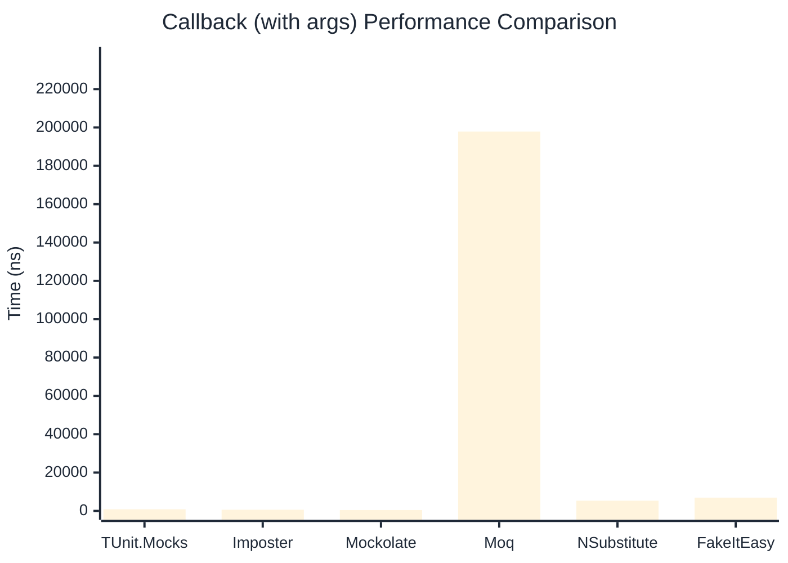

# Callback Benchmark

> Callback registration and execution — comparing **TUnit.Mocks** (source-generated) against runtime proxy-based mocking libraries.

:::info Last Updated
This benchmark was automatically generated on **2026-07-11** from the latest CI run.

**Environment:** Ubuntu Latest • .NET SDK 10.0.301
:::

## 📊 Results

Callback registration and execution:

| Library | Mean | Error | StdDev | Allocated |
|---------|------|-------|--------|-----------|
| **TUnit.Mocks** | 642.9 ns | 2.85 ns | 2.38 ns | 3.11 KB |
| Imposter | 462.6 ns | 0.86 ns | 0.72 ns | 2.66 KB |
| Mockolate | 339.0 ns | 0.66 ns | 0.55 ns | 1.8 KB |
| Moq | 184,911.0 ns | 1,278.12 ns | 1,133.02 ns | 13.14 KB |
| NSubstitute | 4,504.4 ns | 38.58 ns | 36.09 ns | 7.93 KB |
| FakeItEasy | 5,162.9 ns | 30.38 ns | 25.37 ns | 7.44 KB |

---

### with args

| Library | Mean | Error | StdDev | Allocated |
|---------|------|-------|--------|-----------|
| **TUnit.Mocks** | 861.7 ns | 17.15 ns | 18.36 ns | 3.2 KB |
| Imposter | 625.8 ns | 6.98 ns | 6.19 ns | 2.82 KB |
| Mockolate | 472.7 ns | 6.05 ns | 5.66 ns | 1.84 KB |
| Moq | 197,879.2 ns | 1,224.94 ns | 1,022.88 ns | 13.75 KB |
| NSubstitute | 5,322.1 ns | 25.72 ns | 24.05 ns | 8.53 KB |
| FakeItEasy | 6,927.7 ns | 95.10 ns | 84.30 ns | 9.4 KB |

## 🎯 Key Insights

This benchmark compares **TUnit.Mocks** (source-generated) against runtime proxy-based mocking libraries for callback registration and execution.

---

:::note Methodology
View the [mock benchmarks overview](/docs/benchmarks/mocks) for methodology details and environment information.
:::

*Last generated: 2026-07-11T03:21:26.661Z*
