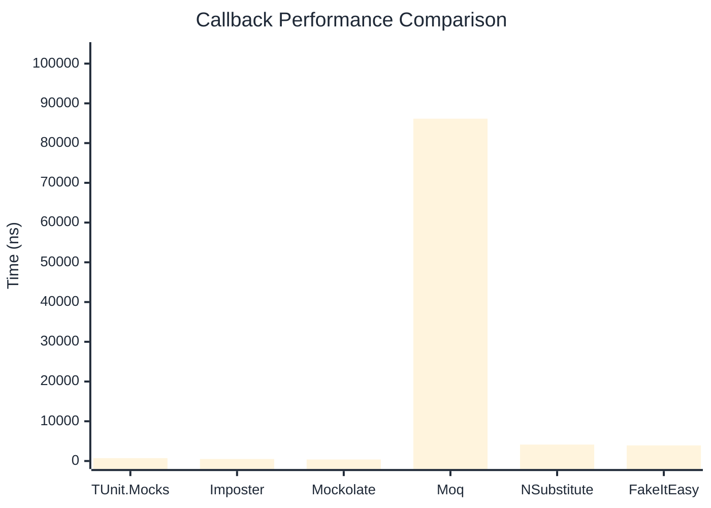
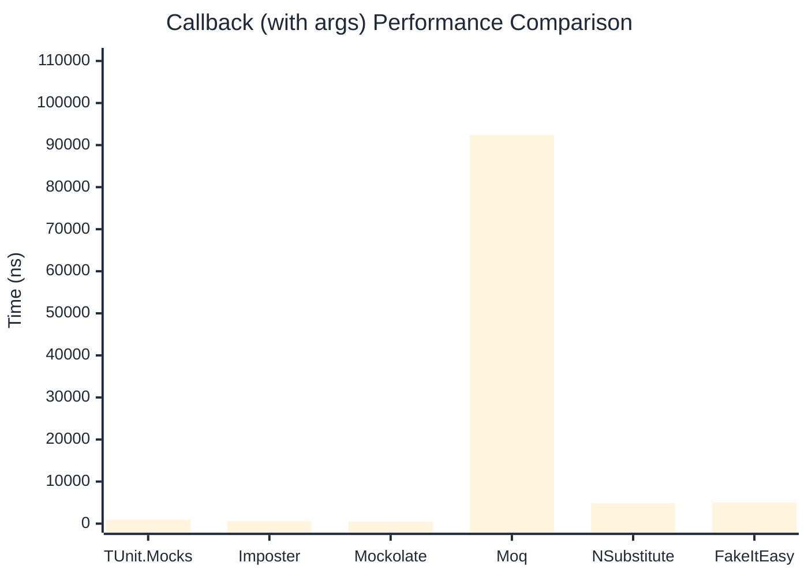

# Callback Benchmark

> Callback registration and execution — comparing **TUnit.Mocks** (source-generated) against runtime proxy-based mocking libraries.

:::info Last Updated
This benchmark was automatically generated on **2026-07-06** from the latest CI run.

**Environment:** Ubuntu Latest • .NET SDK 10.0.301
:::

## 📊 Results

Callback registration and execution:

| Library | Mean | Error | StdDev | Allocated |
|---------|------|-------|--------|-----------|
| **TUnit.Mocks** | 725.6 ns | 8.26 ns | 7.72 ns | 3.11 KB |
| Imposter | 509.3 ns | 5.70 ns | 5.33 ns | 2.66 KB |
| Mockolate | 392.1 ns | 5.39 ns | 5.04 ns | 1.8 KB |
| Moq | 86,139.5 ns | 723.36 ns | 641.24 ns | 13.24 KB |
| NSubstitute | 4,132.7 ns | 39.77 ns | 37.20 ns | 7.93 KB |
| FakeItEasy | 3,928.5 ns | 24.84 ns | 19.39 ns | 7.44 KB |

---

### with args

| Library | Mean | Error | StdDev | Allocated |
|---------|------|-------|--------|-----------|
| **TUnit.Mocks** | 901.2 ns | 18.07 ns | 16.91 ns | 3.2 KB |
| Imposter | 565.3 ns | 9.89 ns | 9.25 ns | 2.82 KB |
| Mockolate | 454.5 ns | 5.75 ns | 5.37 ns | 1.84 KB |
| Moq | 92,444.0 ns | 389.39 ns | 325.16 ns | 13.83 KB |
| NSubstitute | 4,820.4 ns | 73.18 ns | 68.45 ns | 8.53 KB |
| FakeItEasy | 4,981.3 ns | 63.05 ns | 58.97 ns | 9.27 KB |

## 🎯 Key Insights

This benchmark compares **TUnit.Mocks** (source-generated) against runtime proxy-based mocking libraries for callback registration and execution.

---

:::note Methodology
View the [mock benchmarks overview](/docs/benchmarks/mocks) for methodology details and environment information.
:::

*Last generated: 2026-07-06T03:43:04.080Z*
