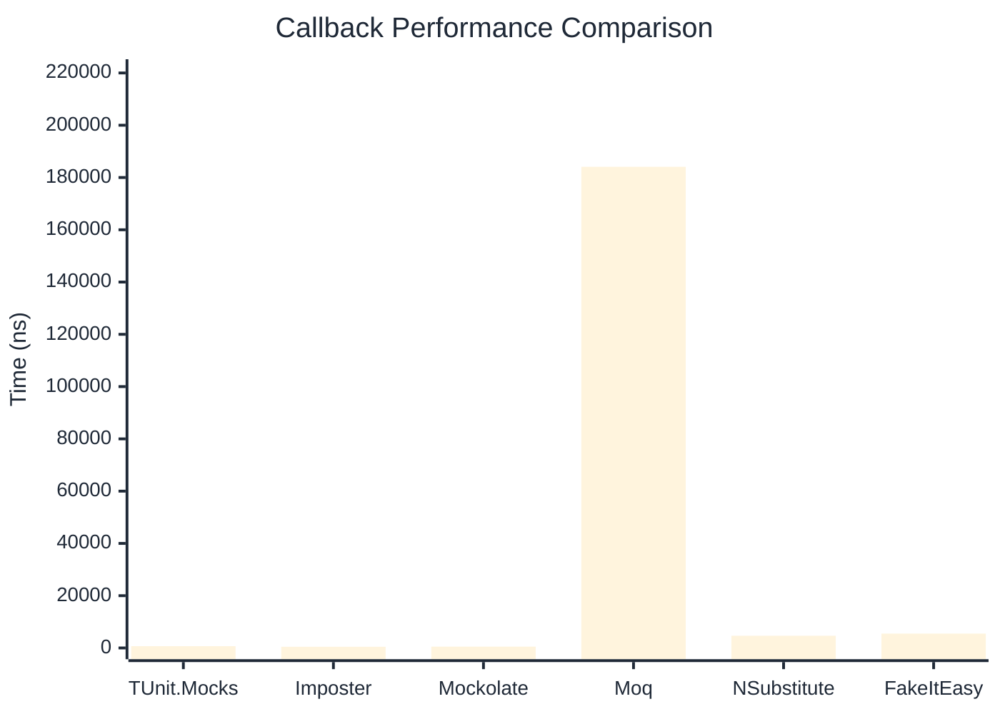

# Callback Benchmark

:::info Last Updated
This benchmark was automatically generated on **2026-04-14** from the latest CI run.

**Environment:** Ubuntu Latest • .NET SDK 10.0.201
:::

## 📊 Results

Callback registration and execution:

| Library | Mean | Error | StdDev | Allocated |
|---------|------|-------|--------|-----------|
| **TUnit.Mocks** | 675.7 ns | 13.02 ns | 11.54 ns | 3.13 KB |
| Imposter | 457.7 ns | 8.52 ns | 11.37 ns | 2.66 KB |
| Mockolate | 510.7 ns | 8.04 ns | 9.88 ns | 1.8 KB |
| Moq | 184,089.7 ns | 1,673.41 ns | 1,483.43 ns | 13.14 KB |
| NSubstitute | 4,677.0 ns | 59.31 ns | 52.58 ns | 7.93 KB |
| FakeItEasy | 5,482.9 ns | 48.31 ns | 42.83 ns | 7.44 KB |

---

### with args

| Library | Mean | Error | StdDev | Allocated |
|---------|------|-------|--------|-----------|
| **TUnit.Mocks** | 846.7 ns | 16.85 ns | 31.23 ns | 3.22 KB |
| Imposter | 568.3 ns | 11.20 ns | 18.72 ns | 2.82 KB |
| Mockolate | 682.2 ns | 13.67 ns | 19.60 ns | 2.13 KB |
| Moq | 190,202.5 ns | 995.51 ns | 931.20 ns | 13.73 KB |
| NSubstitute | 5,070.5 ns | 99.72 ns | 93.28 ns | 8.53 KB |
| FakeItEasy | 6,256.1 ns | 90.28 ns | 80.03 ns | 9.26 KB |

## 🎯 Key Insights

This benchmark compares **TUnit.Mocks** (source-generated) against runtime proxy-based mocking libraries for callback registration and execution.

---

:::note Methodology
View the [mock benchmarks overview](/docs/benchmarks/mocks) for methodology details and environment information.
:::

*Last generated: 2026-04-14T03:22:19.526Z*
