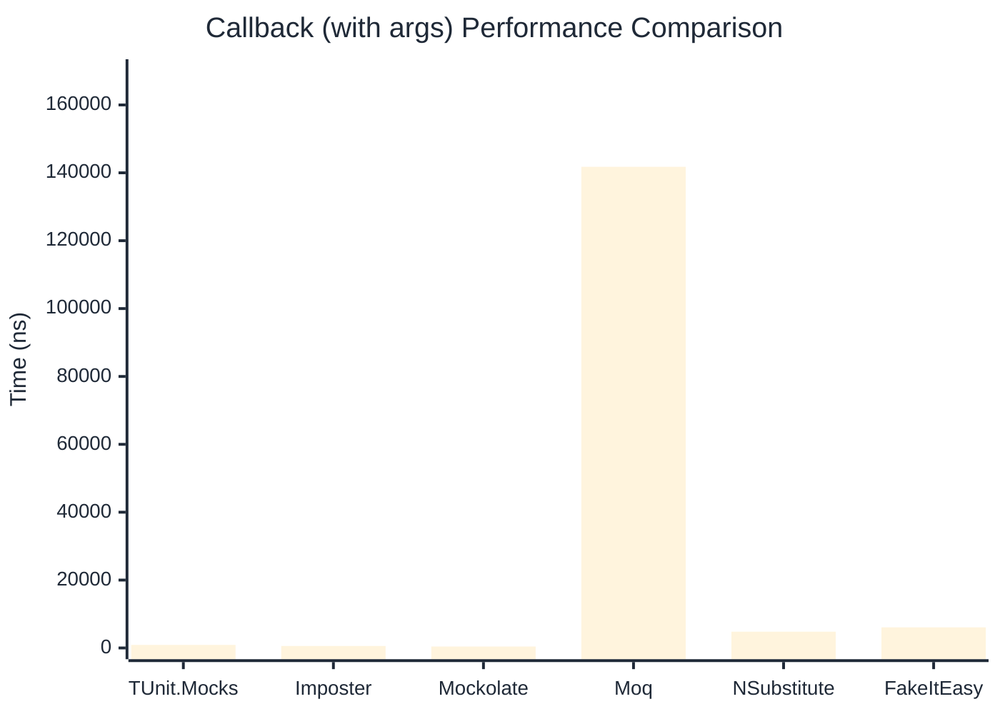

# Callback Benchmark

> Callback registration and execution — comparing **TUnit.Mocks** (source-generated) against runtime proxy-based mocking libraries.

:::info Last Updated
This benchmark was automatically generated on **2026-06-02** from the latest CI run.

**Environment:** Ubuntu Latest • .NET SDK 10.0.300
:::

## 📊 Results

Callback registration and execution:

| Library | Mean | Error | StdDev | Allocated |
|---------|------|-------|--------|-----------|
| **TUnit.Mocks** | 668.1 ns | 13.12 ns | 19.23 ns | 3.08 KB |
| Imposter | 473.6 ns | 7.18 ns | 6.37 ns | 2.66 KB |
| Mockolate | 366.4 ns | 6.92 ns | 6.80 ns | 1.91 KB |
| Moq | 134,492.3 ns | 598.19 ns | 467.03 ns | 13.14 KB |
| NSubstitute | 4,415.3 ns | 18.59 ns | 16.48 ns | 7.93 KB |
| FakeItEasy | 4,950.9 ns | 97.61 ns | 123.44 ns | 7.44 KB |

---

### with args

| Library | Mean | Error | StdDev | Allocated |
|---------|------|-------|--------|-----------|
| **TUnit.Mocks** | 893.4 ns | 6.22 ns | 5.51 ns | 3.16 KB |
| Imposter | 586.8 ns | 6.99 ns | 6.53 ns | 2.82 KB |
| Mockolate | 421.3 ns | 1.39 ns | 1.30 ns | 1.95 KB |
| Moq | 141,768.9 ns | 606.77 ns | 506.68 ns | 13.73 KB |
| NSubstitute | 4,794.5 ns | 23.35 ns | 20.70 ns | 8.53 KB |
| FakeItEasy | 6,067.5 ns | 60.30 ns | 53.46 ns | 9.52 KB |

## 🎯 Key Insights

This benchmark compares **TUnit.Mocks** (source-generated) against runtime proxy-based mocking libraries for callback registration and execution.

---

:::note Methodology
View the [mock benchmarks overview](/docs/benchmarks/mocks) for methodology details and environment information.
:::

*Last generated: 2026-06-02T03:30:24.417Z*
