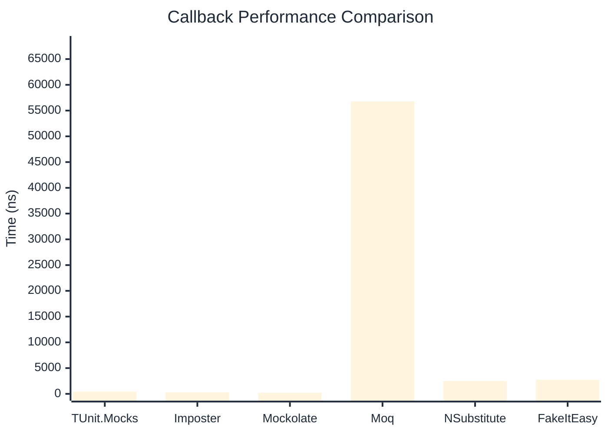
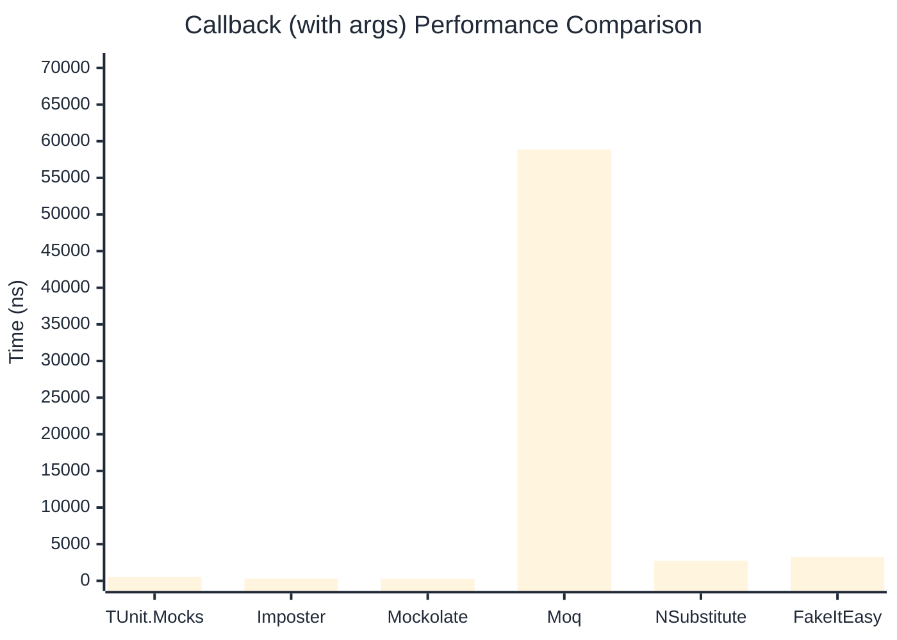

# Callback Benchmark

> Callback registration and execution — comparing **TUnit.Mocks** (source-generated) against runtime proxy-based mocking libraries.

:::info Last Updated
This benchmark was automatically generated on **2026-09-21** from the latest CI run.

**Environment:** Ubuntu Latest • .NET SDK 10.0.401
:::

## 📊 Results

Callback registration and execution:

| Library | Mean | Error | StdDev | Allocated |
|---------|------|-------|--------|-----------|
| **TUnit.Mocks** | 423.2 ns | 8.43 ns | 14.08 ns | 3.11 KB |
| Imposter | 273.2 ns | 5.03 ns | 9.19 ns | 2.66 KB |
| Mockolate | 220.6 ns | 4.41 ns | 4.53 ns | 1.8 KB |
| Moq | 56,781.9 ns | 769.60 ns | 682.23 ns | 13.29 KB |
| NSubstitute | 2,482.9 ns | 35.35 ns | 29.52 ns | 7.85 KB |
| FakeItEasy | 2,727.0 ns | 25.78 ns | 22.85 ns | 7.44 KB |

```mermaid
%%{init: {
  'theme':'base',
  'themeVariables': {
    'primaryColor': '#2563eb',
    'primaryTextColor': '#1f2937',
    'primaryBorderColor': '#1e40af',
    'lineColor': '#6b7280',
    'secondaryColor': '#7c3aed',
    'tertiaryColor': '#dc2626',
    'background': '#ffffff',
    'pie1': '#2563eb',
    'pie2': '#7c3aed',
    'pie3': '#dc2626',
    'pie4': '#f59e0b',
    'pie5': '#10b981',
    'pie6': '#06b6d4',
    'pie7': '#ec4899',
    'pie8': '#6366f1'
  }
}}%%
xychart-beta
  title "Callback Performance Comparison"
  x-axis ["TUnit.Mocks", "Imposter", "Mockolate", "Moq", "NSubstitute", "FakeItEasy"]
  y-axis "Time (ns)" 0 --> 68139
  bar [423.2, 273.2, 220.6, 56781.9, 2482.9, 2727]
```

---

### with args

| Library | Mean | Error | StdDev | Allocated |
|---------|------|-------|--------|-----------|
| **TUnit.Mocks** | 498.9 ns | 6.54 ns | 5.47 ns | 3.2 KB |
| Imposter | 309.4 ns | 4.40 ns | 3.67 ns | 2.82 KB |
| Mockolate | 253.9 ns | 2.91 ns | 2.58 ns | 1.84 KB |
| Moq | 58,866.9 ns | 674.01 ns | 597.49 ns | 13.75 KB |
| NSubstitute | 2,741.8 ns | 44.45 ns | 41.58 ns | 8.41 KB |
| FakeItEasy | 3,266.3 ns | 49.16 ns | 41.05 ns | 9.4 KB |

```mermaid
%%{init: {
  'theme':'base',
  'themeVariables': {
    'primaryColor': '#2563eb',
    'primaryTextColor': '#1f2937',
    'primaryBorderColor': '#1e40af',
    'lineColor': '#6b7280',
    'secondaryColor': '#7c3aed',
    'tertiaryColor': '#dc2626',
    'background': '#ffffff',
    'pie1': '#2563eb',
    'pie2': '#7c3aed',
    'pie3': '#dc2626',
    'pie4': '#f59e0b',
    'pie5': '#10b981',
    'pie6': '#06b6d4',
    'pie7': '#ec4899',
    'pie8': '#6366f1'
  }
}}%%
xychart-beta
  title "Callback (with args) Performance Comparison"
  x-axis ["TUnit.Mocks", "Imposter", "Mockolate", "Moq", "NSubstitute", "FakeItEasy"]
  y-axis "Time (ns)" 0 --> 70641
  bar [498.9, 309.4, 253.9, 58866.9, 2741.8, 3266.3]
```

## 🎯 Key Insights

This benchmark compares **TUnit.Mocks** (source-generated) against runtime proxy-based mocking libraries for callback registration and execution.

---

:::note Methodology
View the [mock benchmarks overview](/docs/benchmarks/mocks) for methodology details and environment information.
:::

*Last generated: 2026-09-21T02:37:24.392Z*
