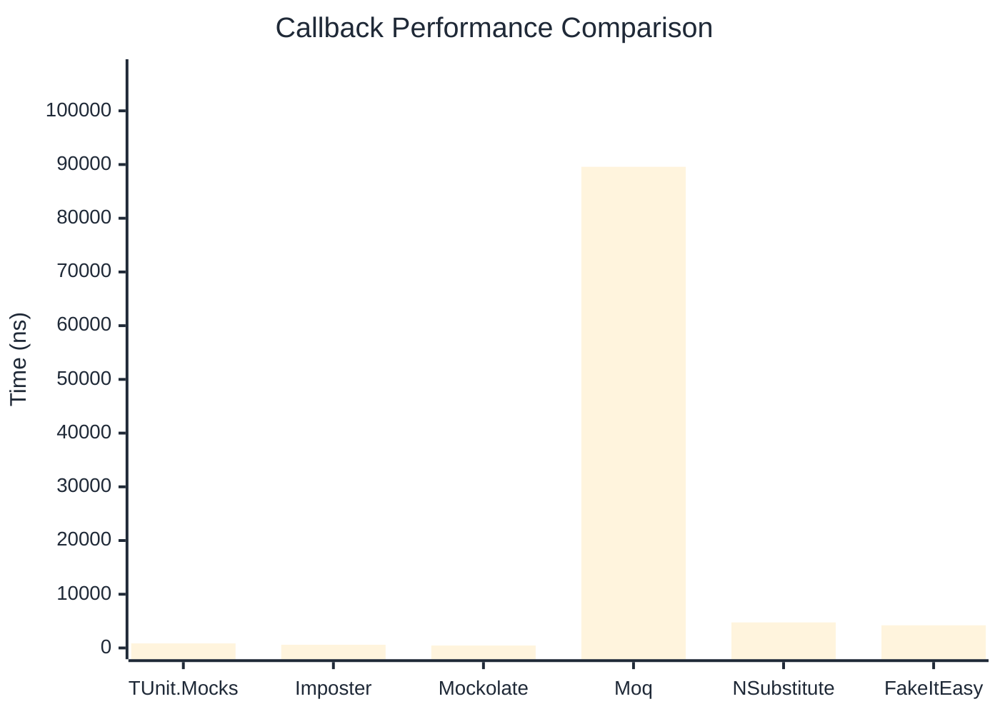

# Callback Benchmark

> Callback registration and execution — comparing **TUnit.Mocks** (source-generated) against runtime proxy-based mocking libraries.

:::info Last Updated
This benchmark was automatically generated on **2026-09-13** from the latest CI run.

**Environment:** Ubuntu Latest • .NET SDK 10.0.401
:::

## 📊 Results

Callback registration and execution:

| Library | Mean | Error | StdDev | Allocated |
|---------|------|-------|--------|-----------|
| **TUnit.Mocks** | 847.9 ns | 3.20 ns | 2.67 ns | 3.11 KB |
| Imposter | 591.2 ns | 3.49 ns | 3.27 ns | 2.66 KB |
| Mockolate | 451.6 ns | 1.29 ns | 1.15 ns | 1.8 KB |
| Moq | 89,574.2 ns | 442.23 ns | 392.02 ns | 13.25 KB |
| NSubstitute | 4,755.8 ns | 48.17 ns | 42.70 ns | 7.85 KB |
| FakeItEasy | 4,220.5 ns | 14.73 ns | 13.77 ns | 7.44 KB |

```mermaid
%%{init: {
  'theme':'base',
  'themeVariables': {
    'primaryColor': '#2563eb',
    'primaryTextColor': '#1f2937',
    'primaryBorderColor': '#1e40af',
    'lineColor': '#6b7280',
    'secondaryColor': '#7c3aed',
    'tertiaryColor': '#dc2626',
    'background': '#ffffff',
    'pie1': '#2563eb',
    'pie2': '#7c3aed',
    'pie3': '#dc2626',
    'pie4': '#f59e0b',
    'pie5': '#10b981',
    'pie6': '#06b6d4',
    'pie7': '#ec4899',
    'pie8': '#6366f1'
  }
}}%%
xychart-beta
  title "Callback Performance Comparison"
  x-axis ["TUnit.Mocks", "Imposter", "Mockolate", "Moq", "NSubstitute", "FakeItEasy"]
  y-axis "Time (ns)" 0 --> 107490
  bar [847.9, 591.2, 451.6, 89574.2, 4755.8, 4220.5]
```

---

### with args

| Library | Mean | Error | StdDev | Allocated |
|---------|------|-------|--------|-----------|
| **TUnit.Mocks** | 967.4 ns | 16.11 ns | 15.07 ns | 3.2 KB |
| Imposter | 667.3 ns | 3.60 ns | 3.19 ns | 2.82 KB |
| Mockolate | 503.5 ns | 2.61 ns | 2.31 ns | 1.84 KB |
| Moq | 92,902.1 ns | 581.19 ns | 485.32 ns | 13.71 KB |
| NSubstitute | 5,398.6 ns | 30.17 ns | 28.22 ns | 8.41 KB |
| FakeItEasy | 5,340.2 ns | 67.51 ns | 63.15 ns | 9.27 KB |

```mermaid
%%{init: {
  'theme':'base',
  'themeVariables': {
    'primaryColor': '#2563eb',
    'primaryTextColor': '#1f2937',
    'primaryBorderColor': '#1e40af',
    'lineColor': '#6b7280',
    'secondaryColor': '#7c3aed',
    'tertiaryColor': '#dc2626',
    'background': '#ffffff',
    'pie1': '#2563eb',
    'pie2': '#7c3aed',
    'pie3': '#dc2626',
    'pie4': '#f59e0b',
    'pie5': '#10b981',
    'pie6': '#06b6d4',
    'pie7': '#ec4899',
    'pie8': '#6366f1'
  }
}}%%
xychart-beta
  title "Callback (with args) Performance Comparison"
  x-axis ["TUnit.Mocks", "Imposter", "Mockolate", "Moq", "NSubstitute", "FakeItEasy"]
  y-axis "Time (ns)" 0 --> 111483
  bar [967.4, 667.3, 503.5, 92902.1, 5398.6, 5340.2]
```

## 🎯 Key Insights

This benchmark compares **TUnit.Mocks** (source-generated) against runtime proxy-based mocking libraries for callback registration and execution.

---

:::note Methodology
View the [mock benchmarks overview](/docs/benchmarks/mocks) for methodology details and environment information.
:::

*Last generated: 2026-09-13T02:33:28.296Z*
