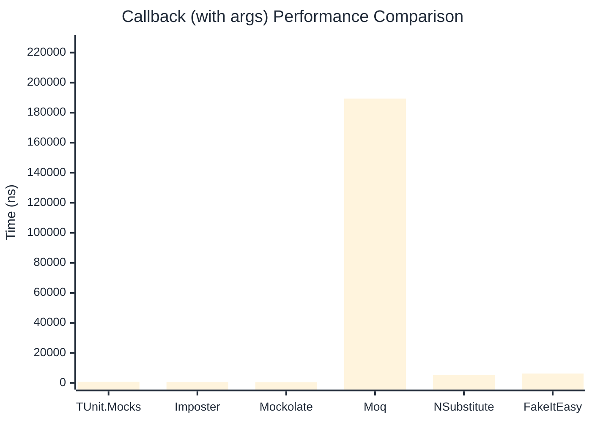

# Callback Benchmark

> Callback registration and execution — comparing **TUnit.Mocks** (source-generated) against runtime proxy-based mocking libraries.

:::info Last Updated
This benchmark was automatically generated on **2026-07-28** from the latest CI run.

**Environment:** Ubuntu Latest • .NET SDK 10.0.302
:::

## 📊 Results

Callback registration and execution:

| Library | Mean | Error | StdDev | Allocated |
|---------|------|-------|--------|-----------|
| **TUnit.Mocks** | 848.5 ns | 8.53 ns | 7.56 ns | 3.11 KB |
| Imposter | 499.4 ns | 3.79 ns | 3.36 ns | 2.66 KB |
| Mockolate | 362.5 ns | 7.09 ns | 6.64 ns | 1.8 KB |
| Moq | 183,763.3 ns | 1,132.42 ns | 945.62 ns | 13.14 KB |
| NSubstitute | 4,729.0 ns | 44.54 ns | 41.67 ns | 7.85 KB |
| FakeItEasy | 5,408.3 ns | 32.22 ns | 28.56 ns | 7.44 KB |

```mermaid
%%{init: {
  'theme':'base',
  'themeVariables': {
    'primaryColor': '#2563eb',
    'primaryTextColor': '#1f2937',
    'primaryBorderColor': '#1e40af',
    'lineColor': '#6b7280',
    'secondaryColor': '#7c3aed',
    'tertiaryColor': '#dc2626',
    'background': '#ffffff',
    'pie1': '#2563eb',
    'pie2': '#7c3aed',
    'pie3': '#dc2626',
    'pie4': '#f59e0b',
    'pie5': '#10b981',
    'pie6': '#06b6d4',
    'pie7': '#ec4899',
    'pie8': '#6366f1'
  }
}}%%
xychart-beta
  title "Callback Performance Comparison"
  x-axis ["TUnit.Mocks", "Imposter", "Mockolate", "Moq", "NSubstitute", "FakeItEasy"]
  y-axis "Time (ns)" 0 --> 220516
  bar [848.5, 499.4, 362.5, 183763.3, 4729, 5408.3]
```

---

### with args

| Library | Mean | Error | StdDev | Allocated |
|---------|------|-------|--------|-----------|
| **TUnit.Mocks** | 771.3 ns | 6.36 ns | 5.31 ns | 3.2 KB |
| Imposter | 531.6 ns | 10.44 ns | 10.72 ns | 2.82 KB |
| Mockolate | 408.0 ns | 6.39 ns | 5.98 ns | 1.84 KB |
| Moq | 189,369.4 ns | 810.50 ns | 718.48 ns | 13.73 KB |
| NSubstitute | 5,414.4 ns | 55.87 ns | 49.53 ns | 8.41 KB |
| FakeItEasy | 6,254.9 ns | 71.22 ns | 63.13 ns | 9.4 KB |

```mermaid
%%{init: {
  'theme':'base',
  'themeVariables': {
    'primaryColor': '#2563eb',
    'primaryTextColor': '#1f2937',
    'primaryBorderColor': '#1e40af',
    'lineColor': '#6b7280',
    'secondaryColor': '#7c3aed',
    'tertiaryColor': '#dc2626',
    'background': '#ffffff',
    'pie1': '#2563eb',
    'pie2': '#7c3aed',
    'pie3': '#dc2626',
    'pie4': '#f59e0b',
    'pie5': '#10b981',
    'pie6': '#06b6d4',
    'pie7': '#ec4899',
    'pie8': '#6366f1'
  }
}}%%
xychart-beta
  title "Callback (with args) Performance Comparison"
  x-axis ["TUnit.Mocks", "Imposter", "Mockolate", "Moq", "NSubstitute", "FakeItEasy"]
  y-axis "Time (ns)" 0 --> 227244
  bar [771.3, 531.6, 408, 189369.4, 5414.4, 6254.9]
```

## 🎯 Key Insights

This benchmark compares **TUnit.Mocks** (source-generated) against runtime proxy-based mocking libraries for callback registration and execution.

---

:::note Methodology
View the [mock benchmarks overview](/docs/benchmarks/mocks) for methodology details and environment information.
:::

*Last generated: 2026-07-28T03:20:43.557Z*
