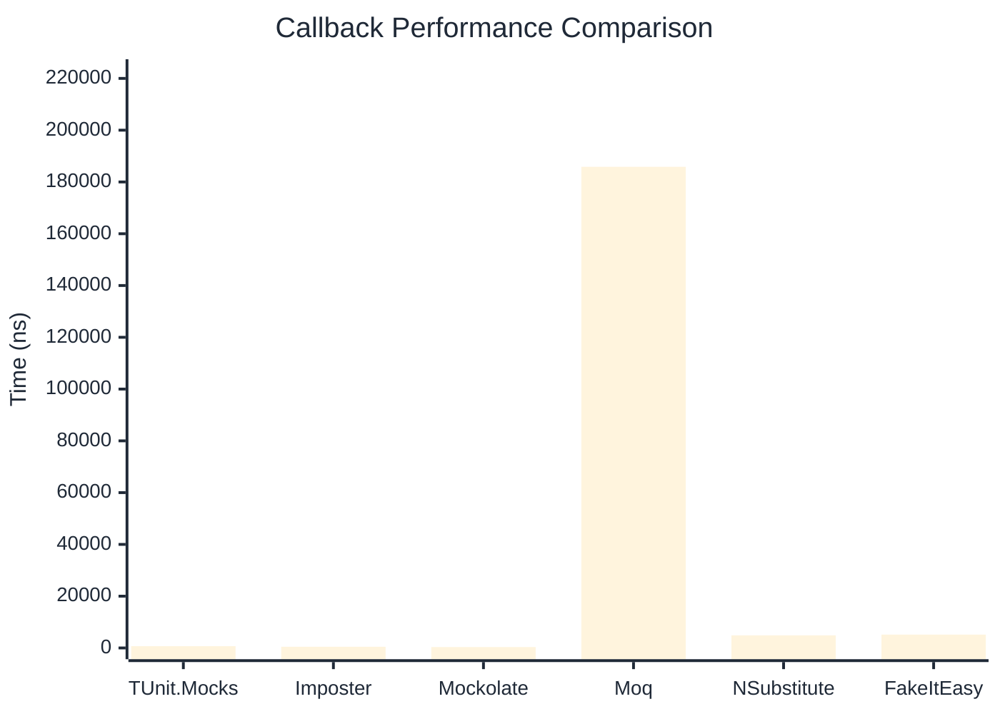

# Callback Benchmark

> Callback registration and execution — comparing **TUnit.Mocks** (source-generated) against runtime proxy-based mocking libraries.

:::info Last Updated
This benchmark was automatically generated on **2026-08-22** from the latest CI run.

**Environment:** Ubuntu Latest • .NET SDK 10.0.400
:::

## 📊 Results

Callback registration and execution:

| Library | Mean | Error | StdDev | Allocated |
|---------|------|-------|--------|-----------|
| **TUnit.Mocks** | 687.1 ns | 4.60 ns | 4.07 ns | 3.11 KB |
| Imposter | 463.4 ns | 4.46 ns | 4.17 ns | 2.66 KB |
| Mockolate | 341.4 ns | 4.67 ns | 4.14 ns | 1.8 KB |
| Moq | 185,849.2 ns | 793.02 ns | 741.79 ns | 13.14 KB |
| NSubstitute | 4,879.0 ns | 58.79 ns | 52.12 ns | 7.85 KB |
| FakeItEasy | 5,150.7 ns | 31.90 ns | 28.28 ns | 7.44 KB |

```mermaid
%%{init: {
  'theme':'base',
  'themeVariables': {
    'primaryColor': '#2563eb',
    'primaryTextColor': '#1f2937',
    'primaryBorderColor': '#1e40af',
    'lineColor': '#6b7280',
    'secondaryColor': '#7c3aed',
    'tertiaryColor': '#dc2626',
    'background': '#ffffff',
    'pie1': '#2563eb',
    'pie2': '#7c3aed',
    'pie3': '#dc2626',
    'pie4': '#f59e0b',
    'pie5': '#10b981',
    'pie6': '#06b6d4',
    'pie7': '#ec4899',
    'pie8': '#6366f1'
  }
}}%%
xychart-beta
  title "Callback Performance Comparison"
  x-axis ["TUnit.Mocks", "Imposter", "Mockolate", "Moq", "NSubstitute", "FakeItEasy"]
  y-axis "Time (ns)" 0 --> 223020
  bar [687.1, 463.4, 341.4, 185849.2, 4879, 5150.7]
```

---

### with args

| Library | Mean | Error | StdDev | Allocated |
|---------|------|-------|--------|-----------|
| **TUnit.Mocks** | 786.1 ns | 6.61 ns | 5.52 ns | 3.2 KB |
| Imposter | 556.7 ns | 4.76 ns | 3.97 ns | 2.82 KB |
| Mockolate | 408.0 ns | 4.31 ns | 3.82 ns | 1.84 KB |
| Moq | 188,268.6 ns | 860.81 ns | 763.09 ns | 13.85 KB |
| NSubstitute | 5,557.3 ns | 40.04 ns | 35.49 ns | 8.41 KB |
| FakeItEasy | 6,311.4 ns | 69.77 ns | 61.85 ns | 9.4 KB |

```mermaid
%%{init: {
  'theme':'base',
  'themeVariables': {
    'primaryColor': '#2563eb',
    'primaryTextColor': '#1f2937',
    'primaryBorderColor': '#1e40af',
    'lineColor': '#6b7280',
    'secondaryColor': '#7c3aed',
    'tertiaryColor': '#dc2626',
    'background': '#ffffff',
    'pie1': '#2563eb',
    'pie2': '#7c3aed',
    'pie3': '#dc2626',
    'pie4': '#f59e0b',
    'pie5': '#10b981',
    'pie6': '#06b6d4',
    'pie7': '#ec4899',
    'pie8': '#6366f1'
  }
}}%%
xychart-beta
  title "Callback (with args) Performance Comparison"
  x-axis ["TUnit.Mocks", "Imposter", "Mockolate", "Moq", "NSubstitute", "FakeItEasy"]
  y-axis "Time (ns)" 0 --> 225923
  bar [786.1, 556.7, 408, 188268.6, 5557.3, 6311.4]
```

## 🎯 Key Insights

This benchmark compares **TUnit.Mocks** (source-generated) against runtime proxy-based mocking libraries for callback registration and execution.

---

:::note Methodology
View the [mock benchmarks overview](/docs/benchmarks/mocks) for methodology details and environment information.
:::

*Last generated: 2026-08-22T02:40:44.558Z*
