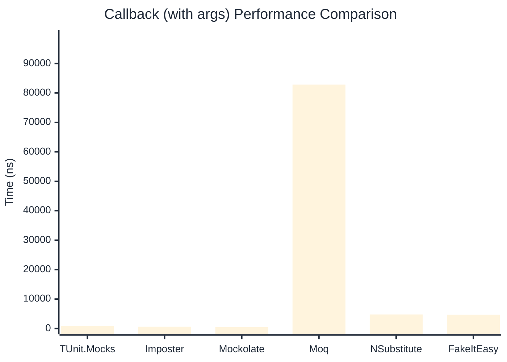

# Callback Benchmark

> Callback registration and execution — comparing **TUnit.Mocks** (source-generated) against runtime proxy-based mocking libraries.

:::info Last Updated
This benchmark was automatically generated on **2026-09-16** from the latest CI run.

**Environment:** Ubuntu Latest • .NET SDK 10.0.401
:::

## 📊 Results

Callback registration and execution:

| Library | Mean | Error | StdDev | Allocated |
|---------|------|-------|--------|-----------|
| **TUnit.Mocks** | 751.6 ns | 6.03 ns | 5.34 ns | 3.11 KB |
| Imposter | 533.6 ns | 5.67 ns | 5.30 ns | 2.66 KB |
| Mockolate | 417.1 ns | 2.58 ns | 2.29 ns | 1.8 KB |
| Moq | 80,335.6 ns | 786.91 ns | 697.57 ns | 13.28 KB |
| NSubstitute | 4,304.9 ns | 56.45 ns | 52.81 ns | 7.85 KB |
| FakeItEasy | 3,823.2 ns | 9.67 ns | 8.08 ns | 7.44 KB |

```mermaid
%%{init: {
  'theme':'base',
  'themeVariables': {
    'primaryColor': '#2563eb',
    'primaryTextColor': '#1f2937',
    'primaryBorderColor': '#1e40af',
    'lineColor': '#6b7280',
    'secondaryColor': '#7c3aed',
    'tertiaryColor': '#dc2626',
    'background': '#ffffff',
    'pie1': '#2563eb',
    'pie2': '#7c3aed',
    'pie3': '#dc2626',
    'pie4': '#f59e0b',
    'pie5': '#10b981',
    'pie6': '#06b6d4',
    'pie7': '#ec4899',
    'pie8': '#6366f1'
  }
}}%%
xychart-beta
  title "Callback Performance Comparison"
  x-axis ["TUnit.Mocks", "Imposter", "Mockolate", "Moq", "NSubstitute", "FakeItEasy"]
  y-axis "Time (ns)" 0 --> 96403
  bar [751.6, 533.6, 417.1, 80335.6, 4304.9, 3823.2]
```

---

### with args

| Library | Mean | Error | StdDev | Allocated |
|---------|------|-------|--------|-----------|
| **TUnit.Mocks** | 876.9 ns | 8.53 ns | 7.98 ns | 3.2 KB |
| Imposter | 602.7 ns | 11.39 ns | 12.66 ns | 2.82 KB |
| Mockolate | 465.3 ns | 4.78 ns | 4.24 ns | 1.84 KB |
| Moq | 82,845.2 ns | 724.54 ns | 677.74 ns | 13.71 KB |
| NSubstitute | 4,776.6 ns | 53.20 ns | 49.76 ns | 8.41 KB |
| FakeItEasy | 4,678.7 ns | 36.22 ns | 32.11 ns | 9.26 KB |

```mermaid
%%{init: {
  'theme':'base',
  'themeVariables': {
    'primaryColor': '#2563eb',
    'primaryTextColor': '#1f2937',
    'primaryBorderColor': '#1e40af',
    'lineColor': '#6b7280',
    'secondaryColor': '#7c3aed',
    'tertiaryColor': '#dc2626',
    'background': '#ffffff',
    'pie1': '#2563eb',
    'pie2': '#7c3aed',
    'pie3': '#dc2626',
    'pie4': '#f59e0b',
    'pie5': '#10b981',
    'pie6': '#06b6d4',
    'pie7': '#ec4899',
    'pie8': '#6366f1'
  }
}}%%
xychart-beta
  title "Callback (with args) Performance Comparison"
  x-axis ["TUnit.Mocks", "Imposter", "Mockolate", "Moq", "NSubstitute", "FakeItEasy"]
  y-axis "Time (ns)" 0 --> 99415
  bar [876.9, 602.7, 465.3, 82845.2, 4776.6, 4678.7]
```

## 🎯 Key Insights

This benchmark compares **TUnit.Mocks** (source-generated) against runtime proxy-based mocking libraries for callback registration and execution.

---

:::note Methodology
View the [mock benchmarks overview](/docs/benchmarks/mocks) for methodology details and environment information.
:::

*Last generated: 2026-09-16T02:32:43.042Z*
