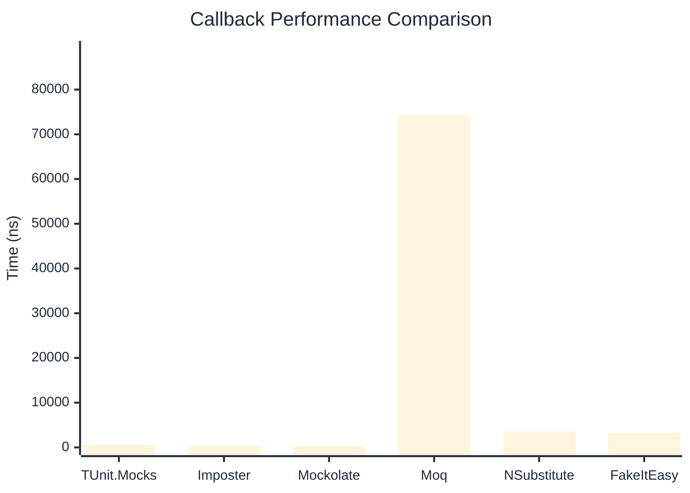

# Callback Benchmark

> Callback registration and execution — comparing **TUnit.Mocks** (source-generated) against runtime proxy-based mocking libraries.

:::info Last Updated
This benchmark was automatically generated on **2026-08-01** from the latest CI run.

**Environment:** Ubuntu Latest • .NET SDK 10.0.302
:::

## 📊 Results

Callback registration and execution:

| Library | Mean | Error | StdDev | Allocated |
|---------|------|-------|--------|-----------|
| **TUnit.Mocks** | 582.8 ns | 1.63 ns | 1.52 ns | 3.11 KB |
| Imposter | 383.3 ns | 1.23 ns | 0.96 ns | 2.66 KB |
| Mockolate | 307.7 ns | 1.29 ns | 1.14 ns | 1.8 KB |
| Moq | 74,275.2 ns | 283.33 ns | 251.16 ns | 13.28 KB |
| NSubstitute | 3,498.1 ns | 9.59 ns | 8.00 ns | 7.85 KB |
| FakeItEasy | 3,214.4 ns | 11.78 ns | 9.84 ns | 7.44 KB |

```mermaid
%%{init: {
  'theme':'base',
  'themeVariables': {
    'primaryColor': '#2563eb',
    'primaryTextColor': '#1f2937',
    'primaryBorderColor': '#1e40af',
    'lineColor': '#6b7280',
    'secondaryColor': '#7c3aed',
    'tertiaryColor': '#dc2626',
    'background': '#ffffff',
    'pie1': '#2563eb',
    'pie2': '#7c3aed',
    'pie3': '#dc2626',
    'pie4': '#f59e0b',
    'pie5': '#10b981',
    'pie6': '#06b6d4',
    'pie7': '#ec4899',
    'pie8': '#6366f1'
  }
}}%%
xychart-beta
  title "Callback Performance Comparison"
  x-axis ["TUnit.Mocks", "Imposter", "Mockolate", "Moq", "NSubstitute", "FakeItEasy"]
  y-axis "Time (ns)" 0 --> 89131
  bar [582.8, 383.3, 307.7, 74275.2, 3498.1, 3214.4]
```

---

### with args

| Library | Mean | Error | StdDev | Allocated |
|---------|------|-------|--------|-----------|
| **TUnit.Mocks** | 687.0 ns | 1.06 ns | 0.88 ns | 3.2 KB |
| Imposter | 439.4 ns | 1.07 ns | 0.95 ns | 2.82 KB |
| Mockolate | 354.9 ns | 1.02 ns | 0.95 ns | 1.84 KB |
| Moq | 78,084.3 ns | 726.93 ns | 644.40 ns | 13.71 KB |
| NSubstitute | 4,071.3 ns | 27.06 ns | 23.99 ns | 8.41 KB |
| FakeItEasy | 4,062.7 ns | 69.59 ns | 65.09 ns | 9.41 KB |

```mermaid
%%{init: {
  'theme':'base',
  'themeVariables': {
    'primaryColor': '#2563eb',
    'primaryTextColor': '#1f2937',
    'primaryBorderColor': '#1e40af',
    'lineColor': '#6b7280',
    'secondaryColor': '#7c3aed',
    'tertiaryColor': '#dc2626',
    'background': '#ffffff',
    'pie1': '#2563eb',
    'pie2': '#7c3aed',
    'pie3': '#dc2626',
    'pie4': '#f59e0b',
    'pie5': '#10b981',
    'pie6': '#06b6d4',
    'pie7': '#ec4899',
    'pie8': '#6366f1'
  }
}}%%
xychart-beta
  title "Callback (with args) Performance Comparison"
  x-axis ["TUnit.Mocks", "Imposter", "Mockolate", "Moq", "NSubstitute", "FakeItEasy"]
  y-axis "Time (ns)" 0 --> 93702
  bar [687, 439.4, 354.9, 78084.3, 4071.3, 4062.7]
```

## 🎯 Key Insights

This benchmark compares **TUnit.Mocks** (source-generated) against runtime proxy-based mocking libraries for callback registration and execution.

---

:::note Methodology
View the [mock benchmarks overview](/docs/benchmarks/mocks) for methodology details and environment information.
:::

*Last generated: 2026-08-01T03:21:53.196Z*
