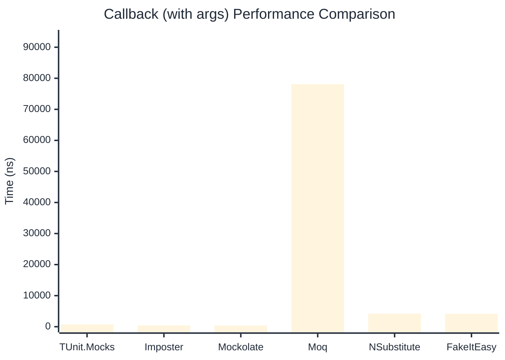

# Callback Benchmark

> Callback registration and execution — comparing **TUnit.Mocks** (source-generated) against runtime proxy-based mocking libraries.

:::info Last Updated
This benchmark was automatically generated on **2026-09-20** from the latest CI run.

**Environment:** Ubuntu Latest • .NET SDK 10.0.401
:::

## 📊 Results

Callback registration and execution:

| Library | Mean | Error | StdDev | Allocated |
|---------|------|-------|--------|-----------|
| **TUnit.Mocks** | 593.3 ns | 4.21 ns | 3.94 ns | 3.11 KB |
| Imposter | 385.1 ns | 3.22 ns | 2.69 ns | 2.66 KB |
| Mockolate | 310.2 ns | 1.77 ns | 1.65 ns | 1.8 KB |
| Moq | 77,177.9 ns | 444.16 ns | 415.47 ns | 13.28 KB |
| NSubstitute | 3,810.9 ns | 68.14 ns | 60.40 ns | 7.85 KB |
| FakeItEasy | 3,293.1 ns | 22.35 ns | 18.67 ns | 7.44 KB |

```mermaid
%%{init: {
  'theme':'base',
  'themeVariables': {
    'primaryColor': '#2563eb',
    'primaryTextColor': '#1f2937',
    'primaryBorderColor': '#1e40af',
    'lineColor': '#6b7280',
    'secondaryColor': '#7c3aed',
    'tertiaryColor': '#dc2626',
    'background': '#ffffff',
    'pie1': '#2563eb',
    'pie2': '#7c3aed',
    'pie3': '#dc2626',
    'pie4': '#f59e0b',
    'pie5': '#10b981',
    'pie6': '#06b6d4',
    'pie7': '#ec4899',
    'pie8': '#6366f1'
  }
}}%%
xychart-beta
  title "Callback Performance Comparison"
  x-axis ["TUnit.Mocks", "Imposter", "Mockolate", "Moq", "NSubstitute", "FakeItEasy"]
  y-axis "Time (ns)" 0 --> 92614
  bar [593.3, 385.1, 310.2, 77177.9, 3810.9, 3293.1]
```

---

### with args

| Library | Mean | Error | StdDev | Allocated |
|---------|------|-------|--------|-----------|
| **TUnit.Mocks** | 711.7 ns | 5.70 ns | 5.06 ns | 3.2 KB |
| Imposter | 442.6 ns | 3.13 ns | 2.61 ns | 2.82 KB |
| Mockolate | 364.2 ns | 5.57 ns | 5.21 ns | 1.84 KB |
| Moq | 78,123.7 ns | 467.18 ns | 414.14 ns | 13.71 KB |
| NSubstitute | 4,192.0 ns | 43.87 ns | 41.03 ns | 8.41 KB |
| FakeItEasy | 4,148.2 ns | 80.77 ns | 79.33 ns | 9.27 KB |

```mermaid
%%{init: {
  'theme':'base',
  'themeVariables': {
    'primaryColor': '#2563eb',
    'primaryTextColor': '#1f2937',
    'primaryBorderColor': '#1e40af',
    'lineColor': '#6b7280',
    'secondaryColor': '#7c3aed',
    'tertiaryColor': '#dc2626',
    'background': '#ffffff',
    'pie1': '#2563eb',
    'pie2': '#7c3aed',
    'pie3': '#dc2626',
    'pie4': '#f59e0b',
    'pie5': '#10b981',
    'pie6': '#06b6d4',
    'pie7': '#ec4899',
    'pie8': '#6366f1'
  }
}}%%
xychart-beta
  title "Callback (with args) Performance Comparison"
  x-axis ["TUnit.Mocks", "Imposter", "Mockolate", "Moq", "NSubstitute", "FakeItEasy"]
  y-axis "Time (ns)" 0 --> 93749
  bar [711.7, 442.6, 364.2, 78123.7, 4192, 4148.2]
```

## 🎯 Key Insights

This benchmark compares **TUnit.Mocks** (source-generated) against runtime proxy-based mocking libraries for callback registration and execution.

---

:::note Methodology
View the [mock benchmarks overview](/docs/benchmarks/mocks) for methodology details and environment information.
:::

*Last generated: 2026-09-20T02:32:50.293Z*
