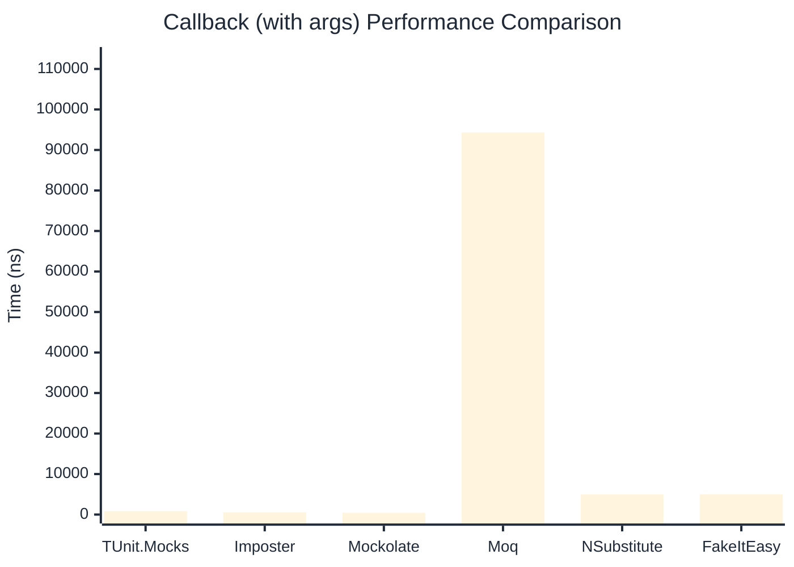

# Callback Benchmark

> Callback registration and execution — comparing **TUnit.Mocks** (source-generated) against runtime proxy-based mocking libraries.

:::info Last Updated
This benchmark was automatically generated on **2026-09-12** from the latest CI run.

**Environment:** Ubuntu Latest • .NET SDK 10.0.401
:::

## 📊 Results

Callback registration and execution:

| Library | Mean | Error | StdDev | Allocated |
|---------|------|-------|--------|-----------|
| **TUnit.Mocks** | 766.2 ns | 8.51 ns | 7.54 ns | 3.11 KB |
| Imposter | 541.9 ns | 10.79 ns | 10.09 ns | 2.66 KB |
| Mockolate | 461.0 ns | 6.86 ns | 6.42 ns | 1.8 KB |
| Moq | 86,447.7 ns | 435.40 ns | 407.27 ns | 13.24 KB |
| NSubstitute | 4,686.8 ns | 27.78 ns | 25.99 ns | 7.85 KB |
| FakeItEasy | 3,904.2 ns | 30.54 ns | 28.56 ns | 7.44 KB |

```mermaid
%%{init: {
  'theme':'base',
  'themeVariables': {
    'primaryColor': '#2563eb',
    'primaryTextColor': '#1f2937',
    'primaryBorderColor': '#1e40af',
    'lineColor': '#6b7280',
    'secondaryColor': '#7c3aed',
    'tertiaryColor': '#dc2626',
    'background': '#ffffff',
    'pie1': '#2563eb',
    'pie2': '#7c3aed',
    'pie3': '#dc2626',
    'pie4': '#f59e0b',
    'pie5': '#10b981',
    'pie6': '#06b6d4',
    'pie7': '#ec4899',
    'pie8': '#6366f1'
  }
}}%%
xychart-beta
  title "Callback Performance Comparison"
  x-axis ["TUnit.Mocks", "Imposter", "Mockolate", "Moq", "NSubstitute", "FakeItEasy"]
  y-axis "Time (ns)" 0 --> 103738
  bar [766.2, 541.9, 461, 86447.7, 4686.8, 3904.2]
```

---

### with args

| Library | Mean | Error | StdDev | Allocated |
|---------|------|-------|--------|-----------|
| **TUnit.Mocks** | 851.1 ns | 3.61 ns | 3.01 ns | 3.2 KB |
| Imposter | 554.8 ns | 4.03 ns | 3.77 ns | 2.82 KB |
| Mockolate | 448.1 ns | 6.66 ns | 6.23 ns | 1.84 KB |
| Moq | 94,319.2 ns | 410.17 ns | 383.67 ns | 13.71 KB |
| NSubstitute | 4,991.3 ns | 38.27 ns | 31.96 ns | 8.41 KB |
| FakeItEasy | 4,995.3 ns | 48.52 ns | 43.01 ns | 9.41 KB |

```mermaid
%%{init: {
  'theme':'base',
  'themeVariables': {
    'primaryColor': '#2563eb',
    'primaryTextColor': '#1f2937',
    'primaryBorderColor': '#1e40af',
    'lineColor': '#6b7280',
    'secondaryColor': '#7c3aed',
    'tertiaryColor': '#dc2626',
    'background': '#ffffff',
    'pie1': '#2563eb',
    'pie2': '#7c3aed',
    'pie3': '#dc2626',
    'pie4': '#f59e0b',
    'pie5': '#10b981',
    'pie6': '#06b6d4',
    'pie7': '#ec4899',
    'pie8': '#6366f1'
  }
}}%%
xychart-beta
  title "Callback (with args) Performance Comparison"
  x-axis ["TUnit.Mocks", "Imposter", "Mockolate", "Moq", "NSubstitute", "FakeItEasy"]
  y-axis "Time (ns)" 0 --> 113184
  bar [851.1, 554.8, 448.1, 94319.2, 4991.3, 4995.3]
```

## 🎯 Key Insights

This benchmark compares **TUnit.Mocks** (source-generated) against runtime proxy-based mocking libraries for callback registration and execution.

---

:::note Methodology
View the [mock benchmarks overview](/docs/benchmarks/mocks) for methodology details and environment information.
:::

*Last generated: 2026-09-12T02:33:29.738Z*
