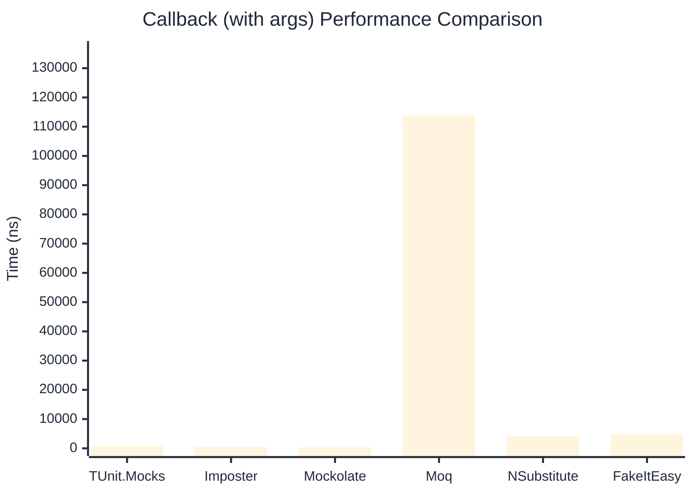

# Callback Benchmark

> Callback registration and execution — comparing **TUnit.Mocks** (source-generated) against runtime proxy-based mocking libraries.

:::info Last Updated
This benchmark was automatically generated on **2026-08-24** from the latest CI run.

**Environment:** Ubuntu Latest • .NET SDK 10.0.400
:::

## 📊 Results

Callback registration and execution:

| Library | Mean | Error | StdDev | Allocated |
|---------|------|-------|--------|-----------|
| **TUnit.Mocks** | 564.1 ns | 5.27 ns | 4.93 ns | 3.11 KB |
| Imposter | 393.3 ns | 1.99 ns | 1.66 ns | 2.66 KB |
| Mockolate | 288.8 ns | 1.56 ns | 1.46 ns | 1.8 KB |
| Moq | 109,276.8 ns | 969.40 ns | 809.49 ns | 13.29 KB |
| NSubstitute | 3,746.2 ns | 24.99 ns | 20.86 ns | 7.85 KB |
| FakeItEasy | 3,983.2 ns | 17.39 ns | 15.42 ns | 7.44 KB |

```mermaid
%%{init: {
  'theme':'base',
  'themeVariables': {
    'primaryColor': '#2563eb',
    'primaryTextColor': '#1f2937',
    'primaryBorderColor': '#1e40af',
    'lineColor': '#6b7280',
    'secondaryColor': '#7c3aed',
    'tertiaryColor': '#dc2626',
    'background': '#ffffff',
    'pie1': '#2563eb',
    'pie2': '#7c3aed',
    'pie3': '#dc2626',
    'pie4': '#f59e0b',
    'pie5': '#10b981',
    'pie6': '#06b6d4',
    'pie7': '#ec4899',
    'pie8': '#6366f1'
  }
}}%%
xychart-beta
  title "Callback Performance Comparison"
  x-axis ["TUnit.Mocks", "Imposter", "Mockolate", "Moq", "NSubstitute", "FakeItEasy"]
  y-axis "Time (ns)" 0 --> 131133
  bar [564.1, 393.3, 288.8, 109276.8, 3746.2, 3983.2]
```

---

### with args

| Library | Mean | Error | StdDev | Allocated |
|---------|------|-------|--------|-----------|
| **TUnit.Mocks** | 658.5 ns | 3.55 ns | 3.32 ns | 3.2 KB |
| Imposter | 470.7 ns | 3.09 ns | 2.74 ns | 2.82 KB |
| Mockolate | 321.4 ns | 2.67 ns | 2.50 ns | 1.84 KB |
| Moq | 113,856.5 ns | 312.38 ns | 276.92 ns | 13.76 KB |
| NSubstitute | 4,167.0 ns | 21.98 ns | 19.49 ns | 8.41 KB |
| FakeItEasy | 4,851.8 ns | 31.29 ns | 29.27 ns | 9.4 KB |

```mermaid
%%{init: {
  'theme':'base',
  'themeVariables': {
    'primaryColor': '#2563eb',
    'primaryTextColor': '#1f2937',
    'primaryBorderColor': '#1e40af',
    'lineColor': '#6b7280',
    'secondaryColor': '#7c3aed',
    'tertiaryColor': '#dc2626',
    'background': '#ffffff',
    'pie1': '#2563eb',
    'pie2': '#7c3aed',
    'pie3': '#dc2626',
    'pie4': '#f59e0b',
    'pie5': '#10b981',
    'pie6': '#06b6d4',
    'pie7': '#ec4899',
    'pie8': '#6366f1'
  }
}}%%
xychart-beta
  title "Callback (with args) Performance Comparison"
  x-axis ["TUnit.Mocks", "Imposter", "Mockolate", "Moq", "NSubstitute", "FakeItEasy"]
  y-axis "Time (ns)" 0 --> 136628
  bar [658.5, 470.7, 321.4, 113856.5, 4167, 4851.8]
```

## 🎯 Key Insights

This benchmark compares **TUnit.Mocks** (source-generated) against runtime proxy-based mocking libraries for callback registration and execution.

---

:::note Methodology
View the [mock benchmarks overview](/docs/benchmarks/mocks) for methodology details and environment information.
:::

*Last generated: 2026-08-24T02:46:06.016Z*
