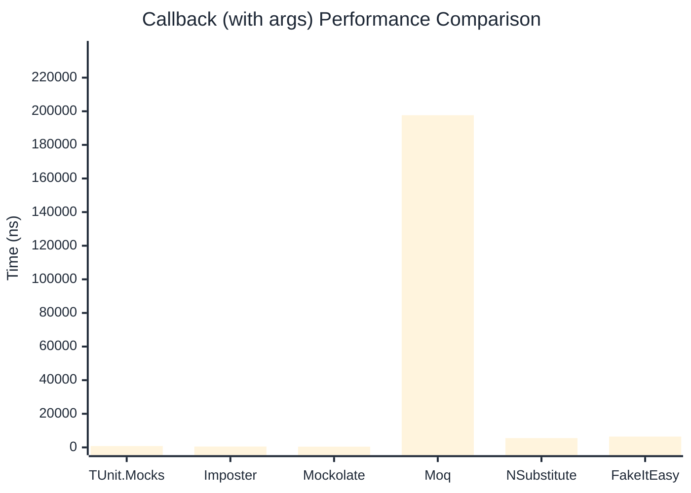

# Callback Benchmark

> Callback registration and execution — comparing **TUnit.Mocks** (source-generated) against runtime proxy-based mocking libraries.

:::info Last Updated
This benchmark was automatically generated on **2026-09-23** from the latest CI run.

**Environment:** Ubuntu Latest • .NET SDK 10.0.401
:::

## 📊 Results

Callback registration and execution:

| Library | Mean | Error | StdDev | Allocated |
|---------|------|-------|--------|-----------|
| **TUnit.Mocks** | 653.5 ns | 11.93 ns | 11.16 ns | 3.11 KB |
| Imposter | 471.0 ns | 8.58 ns | 8.42 ns | 2.66 KB |
| Mockolate | 353.5 ns | 6.89 ns | 8.96 ns | 1.8 KB |
| Moq | 187,482.4 ns | 1,743.13 ns | 1,545.24 ns | 13.14 KB |
| NSubstitute | 5,051.5 ns | 70.24 ns | 65.70 ns | 7.85 KB |
| FakeItEasy | 5,288.6 ns | 25.77 ns | 24.11 ns | 7.44 KB |

```mermaid
%%{init: {
  'theme':'base',
  'themeVariables': {
    'primaryColor': '#2563eb',
    'primaryTextColor': '#1f2937',
    'primaryBorderColor': '#1e40af',
    'lineColor': '#6b7280',
    'secondaryColor': '#7c3aed',
    'tertiaryColor': '#dc2626',
    'background': '#ffffff',
    'pie1': '#2563eb',
    'pie2': '#7c3aed',
    'pie3': '#dc2626',
    'pie4': '#f59e0b',
    'pie5': '#10b981',
    'pie6': '#06b6d4',
    'pie7': '#ec4899',
    'pie8': '#6366f1'
  }
}}%%
xychart-beta
  title "Callback Performance Comparison"
  x-axis ["TUnit.Mocks", "Imposter", "Mockolate", "Moq", "NSubstitute", "FakeItEasy"]
  y-axis "Time (ns)" 0 --> 224979
  bar [653.5, 471, 353.5, 187482.4, 5051.5, 5288.6]
```

---

### with args

| Library | Mean | Error | StdDev | Allocated |
|---------|------|-------|--------|-----------|
| **TUnit.Mocks** | 824.3 ns | 10.26 ns | 9.60 ns | 3.2 KB |
| Imposter | 530.5 ns | 8.52 ns | 7.55 ns | 2.82 KB |
| Mockolate | 438.0 ns | 8.80 ns | 16.95 ns | 1.84 KB |
| Moq | 197,672.8 ns | 1,006.81 ns | 892.51 ns | 13.73 KB |
| NSubstitute | 5,535.6 ns | 59.00 ns | 55.18 ns | 8.41 KB |
| FakeItEasy | 6,436.8 ns | 74.20 ns | 69.41 ns | 9.4 KB |

```mermaid
%%{init: {
  'theme':'base',
  'themeVariables': {
    'primaryColor': '#2563eb',
    'primaryTextColor': '#1f2937',
    'primaryBorderColor': '#1e40af',
    'lineColor': '#6b7280',
    'secondaryColor': '#7c3aed',
    'tertiaryColor': '#dc2626',
    'background': '#ffffff',
    'pie1': '#2563eb',
    'pie2': '#7c3aed',
    'pie3': '#dc2626',
    'pie4': '#f59e0b',
    'pie5': '#10b981',
    'pie6': '#06b6d4',
    'pie7': '#ec4899',
    'pie8': '#6366f1'
  }
}}%%
xychart-beta
  title "Callback (with args) Performance Comparison"
  x-axis ["TUnit.Mocks", "Imposter", "Mockolate", "Moq", "NSubstitute", "FakeItEasy"]
  y-axis "Time (ns)" 0 --> 237208
  bar [824.3, 530.5, 438, 197672.8, 5535.6, 6436.8]
```

## 🎯 Key Insights

This benchmark compares **TUnit.Mocks** (source-generated) against runtime proxy-based mocking libraries for callback registration and execution.

---

:::note Methodology
View the [mock benchmarks overview](/docs/benchmarks/mocks) for methodology details and environment information.
:::

*Last generated: 2026-09-23T02:34:56.618Z*
