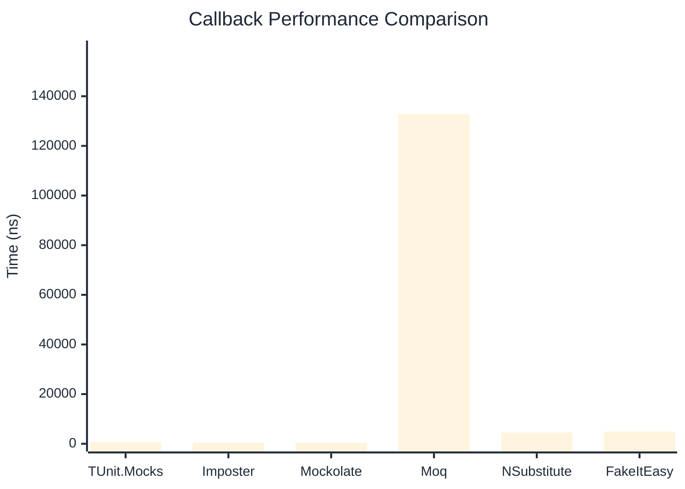

# Callback Benchmark

> Callback registration and execution — comparing **TUnit.Mocks** (source-generated) against runtime proxy-based mocking libraries.

:::info Last Updated
This benchmark was automatically generated on **2026-07-27** from the latest CI run.

**Environment:** Ubuntu Latest • .NET SDK 10.0.302
:::

## 📊 Results

Callback registration and execution:

| Library | Mean | Error | StdDev | Allocated |
|---------|------|-------|--------|-----------|
| **TUnit.Mocks** | 712.0 ns | 13.72 ns | 13.48 ns | 3.11 KB |
| Imposter | 490.5 ns | 4.66 ns | 4.36 ns | 2.66 KB |
| Mockolate | 352.6 ns | 2.51 ns | 2.35 ns | 1.8 KB |
| Moq | 132,744.2 ns | 1,124.00 ns | 1,051.39 ns | 13.14 KB |
| NSubstitute | 4,530.0 ns | 32.56 ns | 28.86 ns | 7.85 KB |
| FakeItEasy | 4,881.3 ns | 51.93 ns | 43.36 ns | 7.44 KB |

```mermaid
%%{init: {
  'theme':'base',
  'themeVariables': {
    'primaryColor': '#2563eb',
    'primaryTextColor': '#1f2937',
    'primaryBorderColor': '#1e40af',
    'lineColor': '#6b7280',
    'secondaryColor': '#7c3aed',
    'tertiaryColor': '#dc2626',
    'background': '#ffffff',
    'pie1': '#2563eb',
    'pie2': '#7c3aed',
    'pie3': '#dc2626',
    'pie4': '#f59e0b',
    'pie5': '#10b981',
    'pie6': '#06b6d4',
    'pie7': '#ec4899',
    'pie8': '#6366f1'
  }
}}%%
xychart-beta
  title "Callback Performance Comparison"
  x-axis ["TUnit.Mocks", "Imposter", "Mockolate", "Moq", "NSubstitute", "FakeItEasy"]
  y-axis "Time (ns)" 0 --> 159294
  bar [712, 490.5, 352.6, 132744.2, 4530, 4881.3]
```

---

### with args

| Library | Mean | Error | StdDev | Allocated |
|---------|------|-------|--------|-----------|
| **TUnit.Mocks** | 841.9 ns | 6.48 ns | 6.06 ns | 3.2 KB |
| Imposter | 578.5 ns | 3.89 ns | 3.45 ns | 2.82 KB |
| Mockolate | 402.5 ns | 2.24 ns | 1.99 ns | 1.84 KB |
| Moq | 146,241.2 ns | 881.83 ns | 781.72 ns | 13.73 KB |
| NSubstitute | 5,212.4 ns | 53.28 ns | 44.49 ns | 8.41 KB |
| FakeItEasy | 5,982.4 ns | 41.32 ns | 34.51 ns | 9.26 KB |

```mermaid
%%{init: {
  'theme':'base',
  'themeVariables': {
    'primaryColor': '#2563eb',
    'primaryTextColor': '#1f2937',
    'primaryBorderColor': '#1e40af',
    'lineColor': '#6b7280',
    'secondaryColor': '#7c3aed',
    'tertiaryColor': '#dc2626',
    'background': '#ffffff',
    'pie1': '#2563eb',
    'pie2': '#7c3aed',
    'pie3': '#dc2626',
    'pie4': '#f59e0b',
    'pie5': '#10b981',
    'pie6': '#06b6d4',
    'pie7': '#ec4899',
    'pie8': '#6366f1'
  }
}}%%
xychart-beta
  title "Callback (with args) Performance Comparison"
  x-axis ["TUnit.Mocks", "Imposter", "Mockolate", "Moq", "NSubstitute", "FakeItEasy"]
  y-axis "Time (ns)" 0 --> 175490
  bar [841.9, 578.5, 402.5, 146241.2, 5212.4, 5982.4]
```

## 🎯 Key Insights

This benchmark compares **TUnit.Mocks** (source-generated) against runtime proxy-based mocking libraries for callback registration and execution.

---

:::note Methodology
View the [mock benchmarks overview](/docs/benchmarks/mocks) for methodology details and environment information.
:::

*Last generated: 2026-07-27T03:23:36.716Z*
