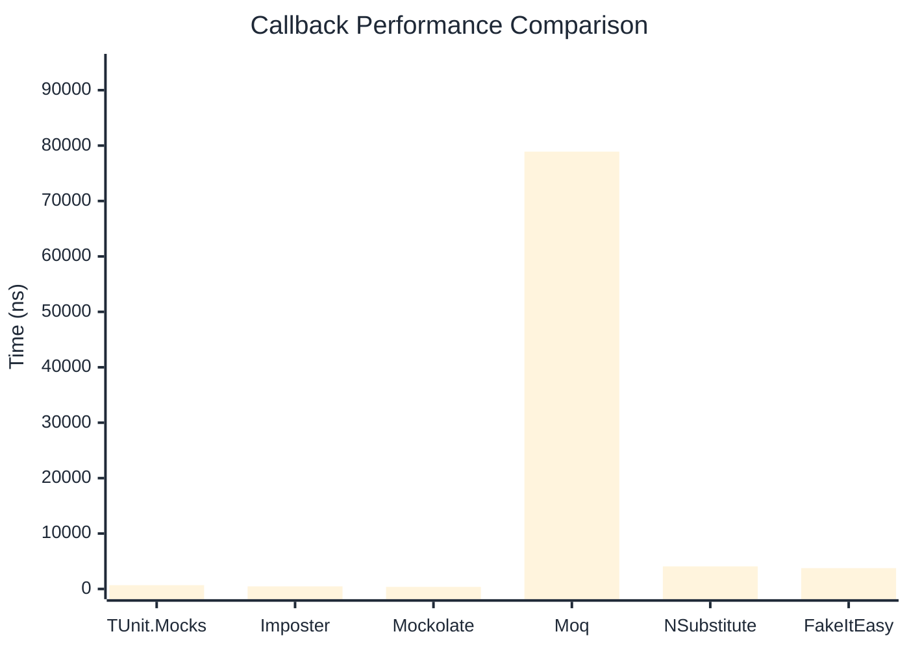

# Callback Benchmark

> Callback registration and execution — comparing **TUnit.Mocks** (source-generated) against runtime proxy-based mocking libraries.

:::info Last Updated
This benchmark was automatically generated on **2026-08-04** from the latest CI run.

**Environment:** Ubuntu Latest • .NET SDK 10.0.302
:::

## 📊 Results

Callback registration and execution:

| Library | Mean | Error | StdDev | Allocated |
|---------|------|-------|--------|-----------|
| **TUnit.Mocks** | 687.2 ns | 12.77 ns | 11.32 ns | 3.11 KB |
| Imposter | 472.5 ns | 9.24 ns | 9.88 ns | 2.66 KB |
| Mockolate | 376.6 ns | 7.47 ns | 11.17 ns | 1.8 KB |
| Moq | 78,909.9 ns | 355.26 ns | 314.93 ns | 13.43 KB |
| NSubstitute | 4,077.9 ns | 21.52 ns | 19.08 ns | 7.85 KB |
| FakeItEasy | 3,760.4 ns | 28.18 ns | 26.36 ns | 7.44 KB |

```mermaid
%%{init: {
  'theme':'base',
  'themeVariables': {
    'primaryColor': '#2563eb',
    'primaryTextColor': '#1f2937',
    'primaryBorderColor': '#1e40af',
    'lineColor': '#6b7280',
    'secondaryColor': '#7c3aed',
    'tertiaryColor': '#dc2626',
    'background': '#ffffff',
    'pie1': '#2563eb',
    'pie2': '#7c3aed',
    'pie3': '#dc2626',
    'pie4': '#f59e0b',
    'pie5': '#10b981',
    'pie6': '#06b6d4',
    'pie7': '#ec4899',
    'pie8': '#6366f1'
  }
}}%%
xychart-beta
  title "Callback Performance Comparison"
  x-axis ["TUnit.Mocks", "Imposter", "Mockolate", "Moq", "NSubstitute", "FakeItEasy"]
  y-axis "Time (ns)" 0 --> 94692
  bar [687.2, 472.5, 376.6, 78909.9, 4077.9, 3760.4]
```

---

### with args

| Library | Mean | Error | StdDev | Allocated |
|---------|------|-------|--------|-----------|
| **TUnit.Mocks** | 814.6 ns | 15.38 ns | 16.45 ns | 3.2 KB |
| Imposter | 549.6 ns | 11.04 ns | 19.62 ns | 2.82 KB |
| Mockolate | 437.5 ns | 7.34 ns | 6.87 ns | 1.84 KB |
| Moq | 78,880.2 ns | 273.86 ns | 242.77 ns | 13.71 KB |
| NSubstitute | 4,434.1 ns | 26.72 ns | 23.68 ns | 8.41 KB |
| FakeItEasy | 4,661.7 ns | 29.45 ns | 24.59 ns | 9.27 KB |

```mermaid
%%{init: {
  'theme':'base',
  'themeVariables': {
    'primaryColor': '#2563eb',
    'primaryTextColor': '#1f2937',
    'primaryBorderColor': '#1e40af',
    'lineColor': '#6b7280',
    'secondaryColor': '#7c3aed',
    'tertiaryColor': '#dc2626',
    'background': '#ffffff',
    'pie1': '#2563eb',
    'pie2': '#7c3aed',
    'pie3': '#dc2626',
    'pie4': '#f59e0b',
    'pie5': '#10b981',
    'pie6': '#06b6d4',
    'pie7': '#ec4899',
    'pie8': '#6366f1'
  }
}}%%
xychart-beta
  title "Callback (with args) Performance Comparison"
  x-axis ["TUnit.Mocks", "Imposter", "Mockolate", "Moq", "NSubstitute", "FakeItEasy"]
  y-axis "Time (ns)" 0 --> 94657
  bar [814.6, 549.6, 437.5, 78880.2, 4434.1, 4661.7]
```

## 🎯 Key Insights

This benchmark compares **TUnit.Mocks** (source-generated) against runtime proxy-based mocking libraries for callback registration and execution.

---

:::note Methodology
View the [mock benchmarks overview](/docs/benchmarks/mocks) for methodology details and environment information.
:::

*Last generated: 2026-08-04T03:21:55.003Z*
