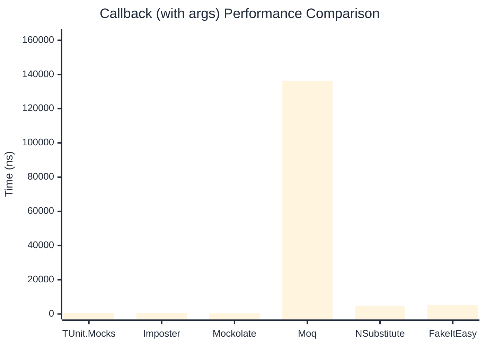

# Callback Benchmark

> Callback registration and execution — comparing **TUnit.Mocks** (source-generated) against runtime proxy-based mocking libraries.

:::info Last Updated
This benchmark was automatically generated on **2026-09-09** from the latest CI run.

**Environment:** Ubuntu Latest • .NET SDK 10.0.401
:::

## 📊 Results

Callback registration and execution:

| Library | Mean | Error | StdDev | Allocated |
|---------|------|-------|--------|-----------|
| **TUnit.Mocks** | 635.5 ns | 7.16 ns | 6.35 ns | 3.11 KB |
| Imposter | 437.6 ns | 3.41 ns | 3.19 ns | 2.66 KB |
| Mockolate | 321.2 ns | 5.19 ns | 4.85 ns | 1.8 KB |
| Moq | 129,011.0 ns | 1,514.14 ns | 1,342.24 ns | 13.29 KB |
| NSubstitute | 4,281.0 ns | 82.02 ns | 103.73 ns | 7.85 KB |
| FakeItEasy | 4,405.0 ns | 49.45 ns | 46.26 ns | 7.44 KB |

```mermaid
%%{init: {
  'theme':'base',
  'themeVariables': {
    'primaryColor': '#2563eb',
    'primaryTextColor': '#1f2937',
    'primaryBorderColor': '#1e40af',
    'lineColor': '#6b7280',
    'secondaryColor': '#7c3aed',
    'tertiaryColor': '#dc2626',
    'background': '#ffffff',
    'pie1': '#2563eb',
    'pie2': '#7c3aed',
    'pie3': '#dc2626',
    'pie4': '#f59e0b',
    'pie5': '#10b981',
    'pie6': '#06b6d4',
    'pie7': '#ec4899',
    'pie8': '#6366f1'
  }
}}%%
xychart-beta
  title "Callback Performance Comparison"
  x-axis ["TUnit.Mocks", "Imposter", "Mockolate", "Moq", "NSubstitute", "FakeItEasy"]
  y-axis "Time (ns)" 0 --> 154814
  bar [635.5, 437.6, 321.2, 129011, 4281, 4405]
```

---

### with args

| Library | Mean | Error | StdDev | Allocated |
|---------|------|-------|--------|-----------|
| **TUnit.Mocks** | 733.8 ns | 14.00 ns | 13.75 ns | 3.2 KB |
| Imposter | 493.5 ns | 8.61 ns | 8.05 ns | 2.82 KB |
| Mockolate | 380.1 ns | 6.75 ns | 6.31 ns | 1.84 KB |
| Moq | 136,286.9 ns | 1,196.63 ns | 1,119.33 ns | 13.75 KB |
| NSubstitute | 4,787.1 ns | 93.56 ns | 111.38 ns | 8.41 KB |
| FakeItEasy | 5,338.3 ns | 101.66 ns | 104.40 ns | 9.4 KB |

```mermaid
%%{init: {
  'theme':'base',
  'themeVariables': {
    'primaryColor': '#2563eb',
    'primaryTextColor': '#1f2937',
    'primaryBorderColor': '#1e40af',
    'lineColor': '#6b7280',
    'secondaryColor': '#7c3aed',
    'tertiaryColor': '#dc2626',
    'background': '#ffffff',
    'pie1': '#2563eb',
    'pie2': '#7c3aed',
    'pie3': '#dc2626',
    'pie4': '#f59e0b',
    'pie5': '#10b981',
    'pie6': '#06b6d4',
    'pie7': '#ec4899',
    'pie8': '#6366f1'
  }
}}%%
xychart-beta
  title "Callback (with args) Performance Comparison"
  x-axis ["TUnit.Mocks", "Imposter", "Mockolate", "Moq", "NSubstitute", "FakeItEasy"]
  y-axis "Time (ns)" 0 --> 163545
  bar [733.8, 493.5, 380.1, 136286.9, 4787.1, 5338.3]
```

## 🎯 Key Insights

This benchmark compares **TUnit.Mocks** (source-generated) against runtime proxy-based mocking libraries for callback registration and execution.

---

:::note Methodology
View the [mock benchmarks overview](/docs/benchmarks/mocks) for methodology details and environment information.
:::

*Last generated: 2026-09-09T02:32:56.707Z*
