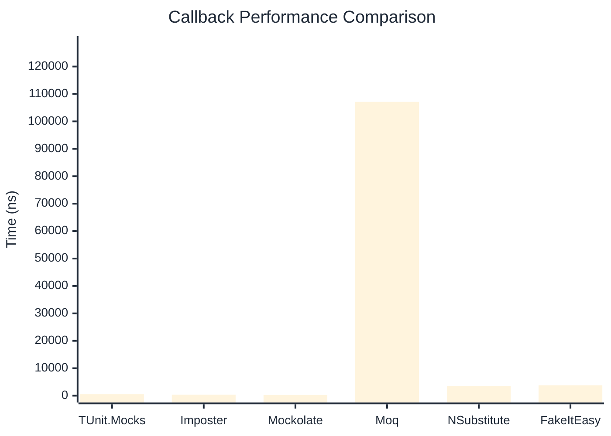

# Callback Benchmark

> Callback registration and execution — comparing **TUnit.Mocks** (source-generated) against runtime proxy-based mocking libraries.

:::info Last Updated
This benchmark was automatically generated on **2026-09-04** from the latest CI run.

**Environment:** Ubuntu Latest • .NET SDK 10.0.400
:::

## 📊 Results

Callback registration and execution:

| Library | Mean | Error | StdDev | Allocated |
|---------|------|-------|--------|-----------|
| **TUnit.Mocks** | 525.9 ns | 10.29 ns | 10.10 ns | 3.11 KB |
| Imposter | 356.3 ns | 2.99 ns | 2.79 ns | 2.66 KB |
| Mockolate | 277.9 ns | 3.23 ns | 3.02 ns | 1.8 KB |
| Moq | 107,115.3 ns | 524.39 ns | 490.52 ns | 13.29 KB |
| NSubstitute | 3,576.5 ns | 59.01 ns | 52.32 ns | 7.85 KB |
| FakeItEasy | 3,780.5 ns | 28.35 ns | 23.67 ns | 7.44 KB |

```mermaid
%%{init: {
  'theme':'base',
  'themeVariables': {
    'primaryColor': '#2563eb',
    'primaryTextColor': '#1f2937',
    'primaryBorderColor': '#1e40af',
    'lineColor': '#6b7280',
    'secondaryColor': '#7c3aed',
    'tertiaryColor': '#dc2626',
    'background': '#ffffff',
    'pie1': '#2563eb',
    'pie2': '#7c3aed',
    'pie3': '#dc2626',
    'pie4': '#f59e0b',
    'pie5': '#10b981',
    'pie6': '#06b6d4',
    'pie7': '#ec4899',
    'pie8': '#6366f1'
  }
}}%%
xychart-beta
  title "Callback Performance Comparison"
  x-axis ["TUnit.Mocks", "Imposter", "Mockolate", "Moq", "NSubstitute", "FakeItEasy"]
  y-axis "Time (ns)" 0 --> 128539
  bar [525.9, 356.3, 277.9, 107115.3, 3576.5, 3780.5]
```

---

### with args

| Library | Mean | Error | StdDev | Allocated |
|---------|------|-------|--------|-----------|
| **TUnit.Mocks** | 600.6 ns | 3.98 ns | 3.53 ns | 3.2 KB |
| Imposter | 434.1 ns | 2.38 ns | 2.11 ns | 2.82 KB |
| Mockolate | 305.6 ns | 2.68 ns | 2.51 ns | 1.84 KB |
| Moq | 114,961.5 ns | 454.49 ns | 402.89 ns | 13.76 KB |
| NSubstitute | 3,942.0 ns | 37.84 ns | 35.40 ns | 8.41 KB |
| FakeItEasy | 4,552.1 ns | 61.89 ns | 54.86 ns | 9.26 KB |

```mermaid
%%{init: {
  'theme':'base',
  'themeVariables': {
    'primaryColor': '#2563eb',
    'primaryTextColor': '#1f2937',
    'primaryBorderColor': '#1e40af',
    'lineColor': '#6b7280',
    'secondaryColor': '#7c3aed',
    'tertiaryColor': '#dc2626',
    'background': '#ffffff',
    'pie1': '#2563eb',
    'pie2': '#7c3aed',
    'pie3': '#dc2626',
    'pie4': '#f59e0b',
    'pie5': '#10b981',
    'pie6': '#06b6d4',
    'pie7': '#ec4899',
    'pie8': '#6366f1'
  }
}}%%
xychart-beta
  title "Callback (with args) Performance Comparison"
  x-axis ["TUnit.Mocks", "Imposter", "Mockolate", "Moq", "NSubstitute", "FakeItEasy"]
  y-axis "Time (ns)" 0 --> 137954
  bar [600.6, 434.1, 305.6, 114961.5, 3942, 4552.1]
```

## 🎯 Key Insights

This benchmark compares **TUnit.Mocks** (source-generated) against runtime proxy-based mocking libraries for callback registration and execution.

---

:::note Methodology
View the [mock benchmarks overview](/docs/benchmarks/mocks) for methodology details and environment information.
:::

*Last generated: 2026-09-04T02:33:16.366Z*
