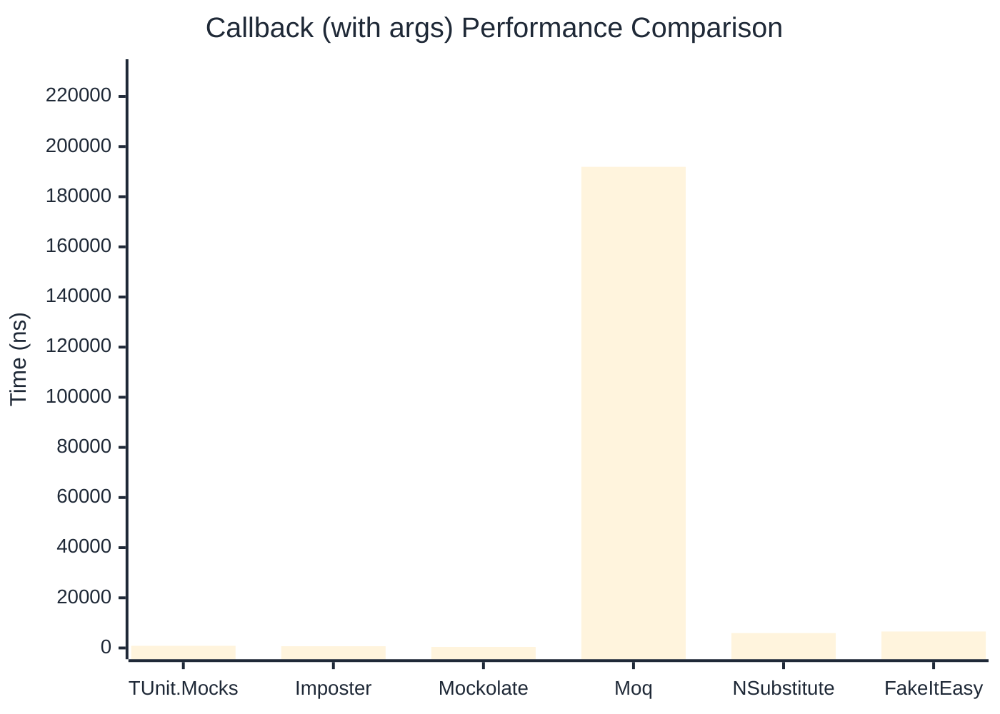

# Callback Benchmark

> Callback registration and execution — comparing **TUnit.Mocks** (source-generated) against runtime proxy-based mocking libraries.

:::info Last Updated
This benchmark was automatically generated on **2026-10-08** from the latest CI run.

**Environment:** Ubuntu Latest • .NET SDK 10.0.401
:::

## 📊 Results

Callback registration and execution:

| Library | Mean | Error | StdDev | Allocated |
|---------|------|-------|--------|-----------|
| **TUnit.Mocks** | 720.9 ns | 10.99 ns | 10.28 ns | 3.12 KB |
| Imposter | 509.8 ns | 10.18 ns | 11.32 ns | 2.64 KB |
| Mockolate | 378.0 ns | 7.02 ns | 6.57 ns | 1.8 KB |
| Moq | 187,963.7 ns | 1,117.10 ns | 1,044.93 ns | 13.26 KB |
| NSubstitute | 5,122.6 ns | 30.03 ns | 26.62 ns | 7.85 KB |
| FakeItEasy | 5,510.6 ns | 69.23 ns | 64.76 ns | 7.44 KB |

```mermaid
%%{init: {
  'theme':'base',
  'themeVariables': {
    'primaryColor': '#2563eb',
    'primaryTextColor': '#1f2937',
    'primaryBorderColor': '#1e40af',
    'lineColor': '#6b7280',
    'secondaryColor': '#7c3aed',
    'tertiaryColor': '#dc2626',
    'background': '#ffffff',
    'pie1': '#2563eb',
    'pie2': '#7c3aed',
    'pie3': '#dc2626',
    'pie4': '#f59e0b',
    'pie5': '#10b981',
    'pie6': '#06b6d4',
    'pie7': '#ec4899',
    'pie8': '#6366f1'
  }
}}%%
xychart-beta
  title "Callback Performance Comparison"
  x-axis ["TUnit.Mocks", "Imposter", "Mockolate", "Moq", "NSubstitute", "FakeItEasy"]
  y-axis "Time (ns)" 0 --> 225557
  bar [720.9, 509.8, 378, 187963.7, 5122.6, 5510.6]
```

---

### with args

| Library | Mean | Error | StdDev | Allocated |
|---------|------|-------|--------|-----------|
| **TUnit.Mocks** | 860.3 ns | 12.82 ns | 11.37 ns | 3.21 KB |
| Imposter | 683.5 ns | 12.30 ns | 11.51 ns | 2.8 KB |
| Mockolate | 421.4 ns | 8.21 ns | 8.78 ns | 1.84 KB |
| Moq | 191,916.0 ns | 786.97 ns | 736.13 ns | 13.7 KB |
| NSubstitute | 5,938.7 ns | 66.76 ns | 62.45 ns | 8.41 KB |
| FakeItEasy | 6,562.4 ns | 88.70 ns | 78.63 ns | 9.4 KB |

```mermaid
%%{init: {
  'theme':'base',
  'themeVariables': {
    'primaryColor': '#2563eb',
    'primaryTextColor': '#1f2937',
    'primaryBorderColor': '#1e40af',
    'lineColor': '#6b7280',
    'secondaryColor': '#7c3aed',
    'tertiaryColor': '#dc2626',
    'background': '#ffffff',
    'pie1': '#2563eb',
    'pie2': '#7c3aed',
    'pie3': '#dc2626',
    'pie4': '#f59e0b',
    'pie5': '#10b981',
    'pie6': '#06b6d4',
    'pie7': '#ec4899',
    'pie8': '#6366f1'
  }
}}%%
xychart-beta
  title "Callback (with args) Performance Comparison"
  x-axis ["TUnit.Mocks", "Imposter", "Mockolate", "Moq", "NSubstitute", "FakeItEasy"]
  y-axis "Time (ns)" 0 --> 230300
  bar [860.3, 683.5, 421.4, 191916, 5938.7, 6562.4]
```

## 🎯 Key Insights

This benchmark compares **TUnit.Mocks** (source-generated) against runtime proxy-based mocking libraries for callback registration and execution.

---

:::note Methodology
View the [mock benchmarks overview](/docs/benchmarks/mocks) for methodology details and environment information.
:::

*Last generated: 2026-10-08T02:41:51.713Z*
