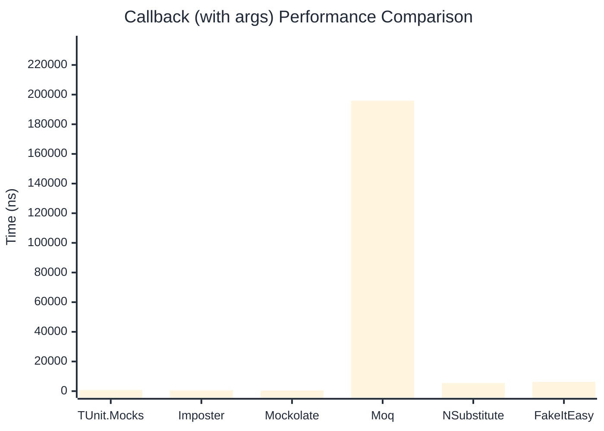

# Callback Benchmark

> Callback registration and execution — comparing **TUnit.Mocks** (source-generated) against runtime proxy-based mocking libraries.

:::info Last Updated
This benchmark was automatically generated on **2026-10-01** from the latest CI run.

**Environment:** Ubuntu Latest • .NET SDK 10.0.401
:::

## 📊 Results

Callback registration and execution:

| Library | Mean | Error | StdDev | Allocated |
|---------|------|-------|--------|-----------|
| **TUnit.Mocks** | 656.4 ns | 12.21 ns | 11.42 ns | 3.12 KB |
| Imposter | 452.5 ns | 1.24 ns | 1.16 ns | 2.66 KB |
| Mockolate | 336.0 ns | 2.38 ns | 2.11 ns | 1.8 KB |
| Moq | 184,089.9 ns | 1,125.40 ns | 997.64 ns | 13.14 KB |
| NSubstitute | 5,006.9 ns | 11.98 ns | 10.62 ns | 7.85 KB |
| FakeItEasy | 5,157.0 ns | 32.91 ns | 29.17 ns | 7.44 KB |

```mermaid
%%{init: {
  'theme':'base',
  'themeVariables': {
    'primaryColor': '#2563eb',
    'primaryTextColor': '#1f2937',
    'primaryBorderColor': '#1e40af',
    'lineColor': '#6b7280',
    'secondaryColor': '#7c3aed',
    'tertiaryColor': '#dc2626',
    'background': '#ffffff',
    'pie1': '#2563eb',
    'pie2': '#7c3aed',
    'pie3': '#dc2626',
    'pie4': '#f59e0b',
    'pie5': '#10b981',
    'pie6': '#06b6d4',
    'pie7': '#ec4899',
    'pie8': '#6366f1'
  }
}}%%
xychart-beta
  title "Callback Performance Comparison"
  x-axis ["TUnit.Mocks", "Imposter", "Mockolate", "Moq", "NSubstitute", "FakeItEasy"]
  y-axis "Time (ns)" 0 --> 220908
  bar [656.4, 452.5, 336, 184089.9, 5006.9, 5157]
```

---

### with args

| Library | Mean | Error | StdDev | Allocated |
|---------|------|-------|--------|-----------|
| **TUnit.Mocks** | 774.2 ns | 2.21 ns | 1.85 ns | 3.21 KB |
| Imposter | 552.7 ns | 3.65 ns | 3.23 ns | 2.82 KB |
| Mockolate | 385.3 ns | 1.19 ns | 1.11 ns | 1.84 KB |
| Moq | 195,896.8 ns | 1,152.22 ns | 1,021.41 ns | 13.7 KB |
| NSubstitute | 5,531.2 ns | 27.96 ns | 24.79 ns | 8.41 KB |
| FakeItEasy | 6,204.4 ns | 97.63 ns | 81.52 ns | 9.26 KB |

```mermaid
%%{init: {
  'theme':'base',
  'themeVariables': {
    'primaryColor': '#2563eb',
    'primaryTextColor': '#1f2937',
    'primaryBorderColor': '#1e40af',
    'lineColor': '#6b7280',
    'secondaryColor': '#7c3aed',
    'tertiaryColor': '#dc2626',
    'background': '#ffffff',
    'pie1': '#2563eb',
    'pie2': '#7c3aed',
    'pie3': '#dc2626',
    'pie4': '#f59e0b',
    'pie5': '#10b981',
    'pie6': '#06b6d4',
    'pie7': '#ec4899',
    'pie8': '#6366f1'
  }
}}%%
xychart-beta
  title "Callback (with args) Performance Comparison"
  x-axis ["TUnit.Mocks", "Imposter", "Mockolate", "Moq", "NSubstitute", "FakeItEasy"]
  y-axis "Time (ns)" 0 --> 235077
  bar [774.2, 552.7, 385.3, 195896.8, 5531.2, 6204.4]
```

## 🎯 Key Insights

This benchmark compares **TUnit.Mocks** (source-generated) against runtime proxy-based mocking libraries for callback registration and execution.

---

:::note Methodology
View the [mock benchmarks overview](/docs/benchmarks/mocks) for methodology details and environment information.
:::

*Last generated: 2026-10-01T02:49:56.169Z*
