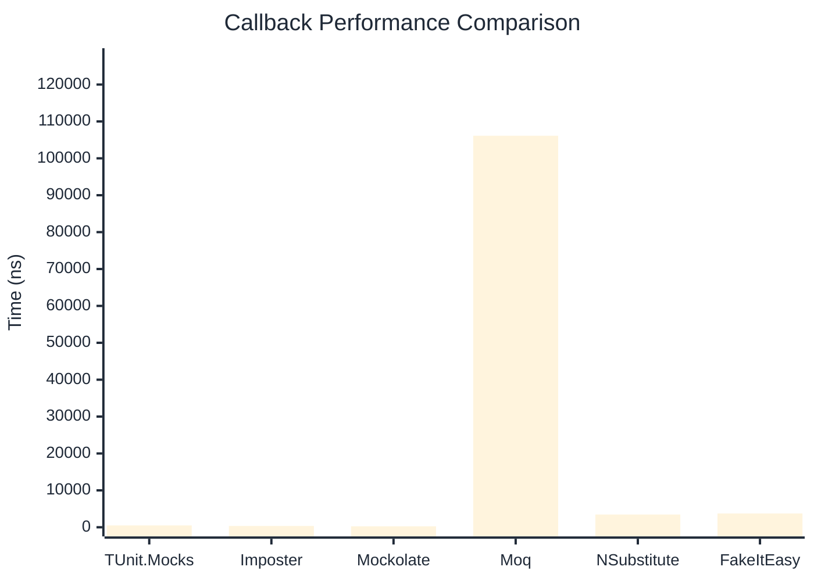
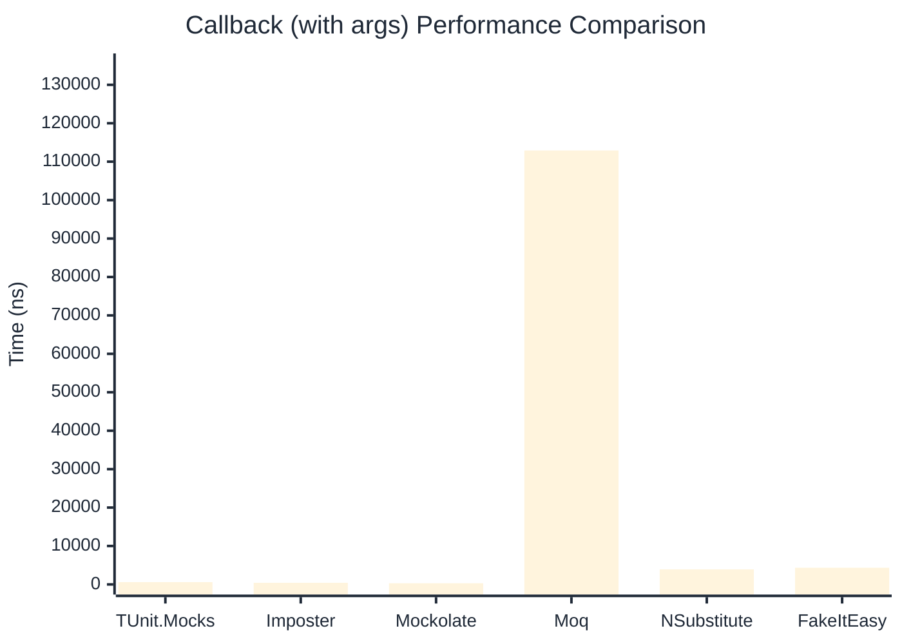

# Callback Benchmark

> Callback registration and execution — comparing **TUnit.Mocks** (source-generated) against runtime proxy-based mocking libraries.

:::info Last Updated
This benchmark was automatically generated on **2026-10-07** from the latest CI run.

**Environment:** Ubuntu Latest • .NET SDK 10.0.401
:::

## 📊 Results

Callback registration and execution:

| Library | Mean | Error | StdDev | Allocated |
|---------|------|-------|--------|-----------|
| **TUnit.Mocks** | 497.6 ns | 0.91 ns | 0.85 ns | 3.12 KB |
| Imposter | 349.7 ns | 1.79 ns | 1.59 ns | 2.64 KB |
| Mockolate | 258.9 ns | 0.84 ns | 0.74 ns | 1.8 KB |
| Moq | 106,123.3 ns | 843.21 ns | 747.48 ns | 13.29 KB |
| NSubstitute | 3,449.6 ns | 12.09 ns | 9.44 ns | 7.85 KB |
| FakeItEasy | 3,744.1 ns | 15.42 ns | 14.43 ns | 7.44 KB |

```mermaid
%%{init: {
  'theme':'base',
  'themeVariables': {
    'primaryColor': '#2563eb',
    'primaryTextColor': '#1f2937',
    'primaryBorderColor': '#1e40af',
    'lineColor': '#6b7280',
    'secondaryColor': '#7c3aed',
    'tertiaryColor': '#dc2626',
    'background': '#ffffff',
    'pie1': '#2563eb',
    'pie2': '#7c3aed',
    'pie3': '#dc2626',
    'pie4': '#f59e0b',
    'pie5': '#10b981',
    'pie6': '#06b6d4',
    'pie7': '#ec4899',
    'pie8': '#6366f1'
  }
}}%%
xychart-beta
  title "Callback Performance Comparison"
  x-axis ["TUnit.Mocks", "Imposter", "Mockolate", "Moq", "NSubstitute", "FakeItEasy"]
  y-axis "Time (ns)" 0 --> 127348
  bar [497.6, 349.7, 258.9, 106123.3, 3449.6, 3744.1]
```

---

### with args

| Library | Mean | Error | StdDev | Allocated |
|---------|------|-------|--------|-----------|
| **TUnit.Mocks** | 604.0 ns | 5.18 ns | 4.04 ns | 3.21 KB |
| Imposter | 432.0 ns | 5.52 ns | 4.89 ns | 2.8 KB |
| Mockolate | 304.3 ns | 6.11 ns | 9.14 ns | 1.84 KB |
| Moq | 112,918.8 ns | 465.28 ns | 388.53 ns | 13.72 KB |
| NSubstitute | 3,914.1 ns | 53.48 ns | 50.03 ns | 8.41 KB |
| FakeItEasy | 4,340.7 ns | 14.64 ns | 12.98 ns | 9.26 KB |

```mermaid
%%{init: {
  'theme':'base',
  'themeVariables': {
    'primaryColor': '#2563eb',
    'primaryTextColor': '#1f2937',
    'primaryBorderColor': '#1e40af',
    'lineColor': '#6b7280',
    'secondaryColor': '#7c3aed',
    'tertiaryColor': '#dc2626',
    'background': '#ffffff',
    'pie1': '#2563eb',
    'pie2': '#7c3aed',
    'pie3': '#dc2626',
    'pie4': '#f59e0b',
    'pie5': '#10b981',
    'pie6': '#06b6d4',
    'pie7': '#ec4899',
    'pie8': '#6366f1'
  }
}}%%
xychart-beta
  title "Callback (with args) Performance Comparison"
  x-axis ["TUnit.Mocks", "Imposter", "Mockolate", "Moq", "NSubstitute", "FakeItEasy"]
  y-axis "Time (ns)" 0 --> 135503
  bar [604, 432, 304.3, 112918.8, 3914.1, 4340.7]
```

## 🎯 Key Insights

This benchmark compares **TUnit.Mocks** (source-generated) against runtime proxy-based mocking libraries for callback registration and execution.

---

:::note Methodology
View the [mock benchmarks overview](/docs/benchmarks/mocks) for methodology details and environment information.
:::

*Last generated: 2026-10-07T02:41:59.908Z*
