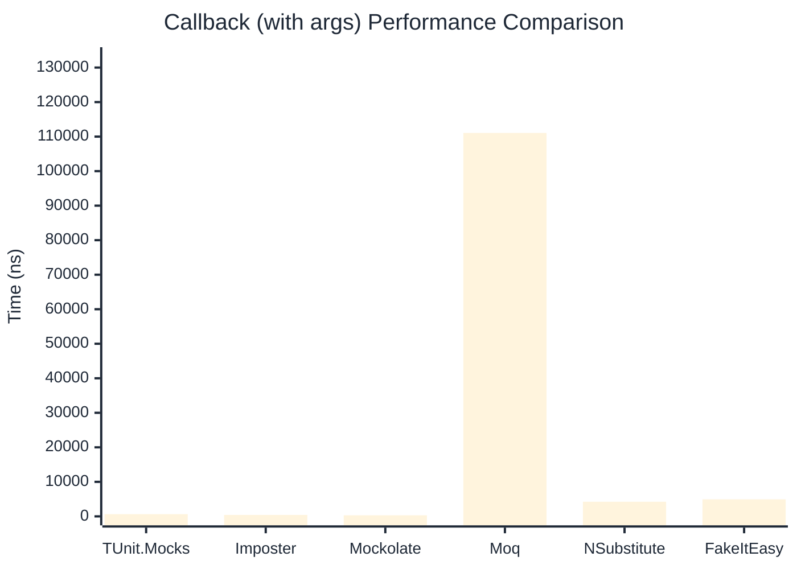

# Callback Benchmark

> Callback registration and execution — comparing **TUnit.Mocks** (source-generated) against runtime proxy-based mocking libraries.

:::info Last Updated
This benchmark was automatically generated on **2026-09-27** from the latest CI run.

**Environment:** Ubuntu Latest • .NET SDK 10.0.401
:::

## 📊 Results

Callback registration and execution:

| Library | Mean | Error | StdDev | Allocated |
|---------|------|-------|--------|-----------|
| **TUnit.Mocks** | 558.0 ns | 10.89 ns | 18.78 ns | 3.11 KB |
| Imposter | 403.4 ns | 7.95 ns | 9.47 ns | 2.66 KB |
| Mockolate | 272.3 ns | 4.22 ns | 3.95 ns | 1.8 KB |
| Moq | 107,933.1 ns | 955.06 ns | 797.51 ns | 13.29 KB |
| NSubstitute | 3,654.8 ns | 61.25 ns | 51.15 ns | 7.85 KB |
| FakeItEasy | 3,881.4 ns | 76.66 ns | 142.09 ns | 7.44 KB |

```mermaid
%%{init: {
  'theme':'base',
  'themeVariables': {
    'primaryColor': '#2563eb',
    'primaryTextColor': '#1f2937',
    'primaryBorderColor': '#1e40af',
    'lineColor': '#6b7280',
    'secondaryColor': '#7c3aed',
    'tertiaryColor': '#dc2626',
    'background': '#ffffff',
    'pie1': '#2563eb',
    'pie2': '#7c3aed',
    'pie3': '#dc2626',
    'pie4': '#f59e0b',
    'pie5': '#10b981',
    'pie6': '#06b6d4',
    'pie7': '#ec4899',
    'pie8': '#6366f1'
  }
}}%%
xychart-beta
  title "Callback Performance Comparison"
  x-axis ["TUnit.Mocks", "Imposter", "Mockolate", "Moq", "NSubstitute", "FakeItEasy"]
  y-axis "Time (ns)" 0 --> 129520
  bar [558, 403.4, 272.3, 107933.1, 3654.8, 3881.4]
```

---

### with args

| Library | Mean | Error | StdDev | Allocated |
|---------|------|-------|--------|-----------|
| **TUnit.Mocks** | 640.0 ns | 12.57 ns | 12.91 ns | 3.2 KB |
| Imposter | 424.5 ns | 7.03 ns | 6.57 ns | 2.82 KB |
| Mockolate | 306.0 ns | 3.50 ns | 3.11 ns | 1.84 KB |
| Moq | 111,063.9 ns | 863.81 ns | 765.75 ns | 13.72 KB |
| NSubstitute | 4,236.5 ns | 79.06 ns | 73.96 ns | 8.41 KB |
| FakeItEasy | 4,933.9 ns | 60.25 ns | 53.41 ns | 9.4 KB |

```mermaid
%%{init: {
  'theme':'base',
  'themeVariables': {
    'primaryColor': '#2563eb',
    'primaryTextColor': '#1f2937',
    'primaryBorderColor': '#1e40af',
    'lineColor': '#6b7280',
    'secondaryColor': '#7c3aed',
    'tertiaryColor': '#dc2626',
    'background': '#ffffff',
    'pie1': '#2563eb',
    'pie2': '#7c3aed',
    'pie3': '#dc2626',
    'pie4': '#f59e0b',
    'pie5': '#10b981',
    'pie6': '#06b6d4',
    'pie7': '#ec4899',
    'pie8': '#6366f1'
  }
}}%%
xychart-beta
  title "Callback (with args) Performance Comparison"
  x-axis ["TUnit.Mocks", "Imposter", "Mockolate", "Moq", "NSubstitute", "FakeItEasy"]
  y-axis "Time (ns)" 0 --> 133277
  bar [640, 424.5, 306, 111063.9, 4236.5, 4933.9]
```

## 🎯 Key Insights

This benchmark compares **TUnit.Mocks** (source-generated) against runtime proxy-based mocking libraries for callback registration and execution.

---

:::note Methodology
View the [mock benchmarks overview](/docs/benchmarks/mocks) for methodology details and environment information.
:::

*Last generated: 2026-09-27T02:37:02.890Z*
