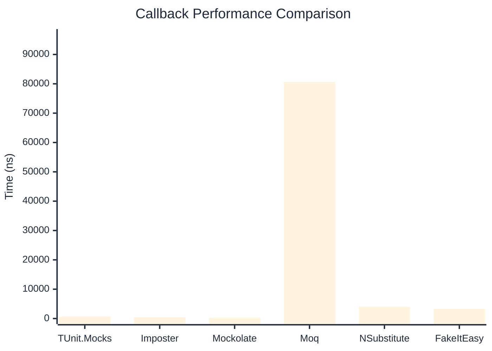
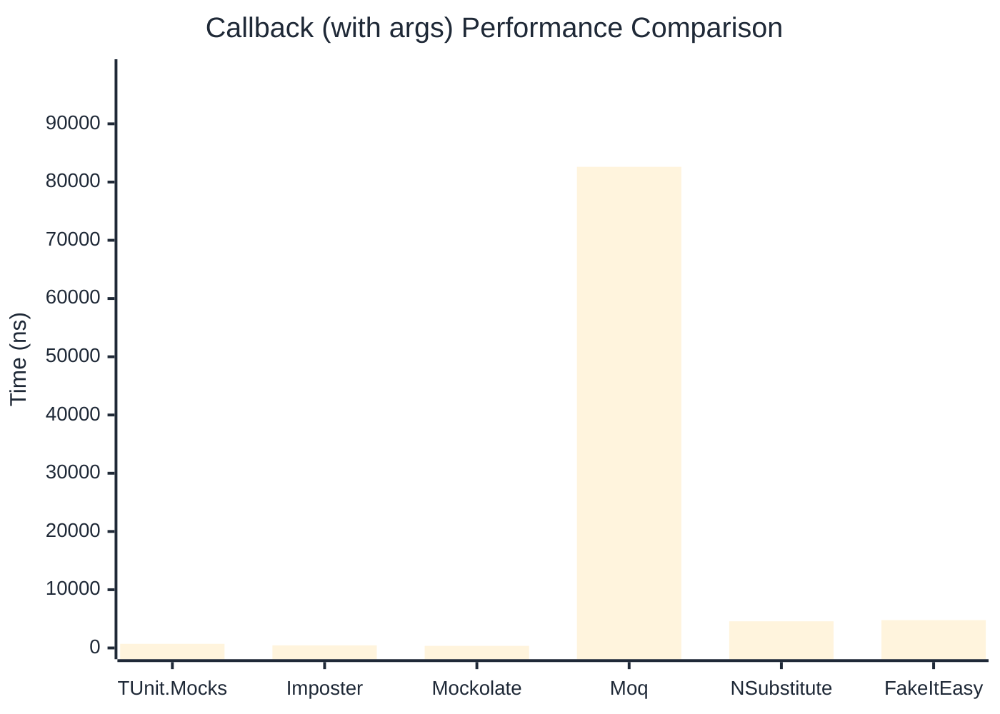

# Callback Benchmark

> Callback registration and execution — comparing **TUnit.Mocks** (source-generated) against runtime proxy-based mocking libraries.

:::info Last Updated
This benchmark was automatically generated on **2026-10-06** from the latest CI run.

**Environment:** Ubuntu Latest • .NET SDK 10.0.401
:::

## 📊 Results

Callback registration and execution:

| Library | Mean | Error | StdDev | Allocated |
|---------|------|-------|--------|-----------|
| **TUnit.Mocks** | 616.1 ns | 9.65 ns | 9.03 ns | 3.12 KB |
| Imposter | 402.3 ns | 4.41 ns | 3.68 ns | 2.66 KB |
| Mockolate | 313.2 ns | 4.34 ns | 3.63 ns | 1.8 KB |
| Moq | 80,614.9 ns | 1,363.16 ns | 1,275.10 ns | 13.24 KB |
| NSubstitute | 4,005.9 ns | 79.25 ns | 88.08 ns | 7.85 KB |
| FakeItEasy | 3,283.2 ns | 63.65 ns | 95.27 ns | 7.44 KB |

```mermaid
%%{init: {
  'theme':'base',
  'themeVariables': {
    'primaryColor': '#2563eb',
    'primaryTextColor': '#1f2937',
    'primaryBorderColor': '#1e40af',
    'lineColor': '#6b7280',
    'secondaryColor': '#7c3aed',
    'tertiaryColor': '#dc2626',
    'background': '#ffffff',
    'pie1': '#2563eb',
    'pie2': '#7c3aed',
    'pie3': '#dc2626',
    'pie4': '#f59e0b',
    'pie5': '#10b981',
    'pie6': '#06b6d4',
    'pie7': '#ec4899',
    'pie8': '#6366f1'
  }
}}%%
xychart-beta
  title "Callback Performance Comparison"
  x-axis ["TUnit.Mocks", "Imposter", "Mockolate", "Moq", "NSubstitute", "FakeItEasy"]
  y-axis "Time (ns)" 0 --> 96738
  bar [616.1, 402.3, 313.2, 80614.9, 4005.9, 3283.2]
```

---

### with args

| Library | Mean | Error | StdDev | Allocated |
|---------|------|-------|--------|-----------|
| **TUnit.Mocks** | 707.6 ns | 7.56 ns | 7.07 ns | 3.21 KB |
| Imposter | 448.6 ns | 1.86 ns | 1.55 ns | 2.82 KB |
| Mockolate | 357.7 ns | 1.90 ns | 1.68 ns | 1.84 KB |
| Moq | 82,614.6 ns | 1,608.07 ns | 1,651.37 ns | 13.67 KB |
| NSubstitute | 4,576.0 ns | 90.79 ns | 253.08 ns | 8.41 KB |
| FakeItEasy | 4,779.7 ns | 92.08 ns | 132.06 ns | 9.41 KB |

```mermaid
%%{init: {
  'theme':'base',
  'themeVariables': {
    'primaryColor': '#2563eb',
    'primaryTextColor': '#1f2937',
    'primaryBorderColor': '#1e40af',
    'lineColor': '#6b7280',
    'secondaryColor': '#7c3aed',
    'tertiaryColor': '#dc2626',
    'background': '#ffffff',
    'pie1': '#2563eb',
    'pie2': '#7c3aed',
    'pie3': '#dc2626',
    'pie4': '#f59e0b',
    'pie5': '#10b981',
    'pie6': '#06b6d4',
    'pie7': '#ec4899',
    'pie8': '#6366f1'
  }
}}%%
xychart-beta
  title "Callback (with args) Performance Comparison"
  x-axis ["TUnit.Mocks", "Imposter", "Mockolate", "Moq", "NSubstitute", "FakeItEasy"]
  y-axis "Time (ns)" 0 --> 99138
  bar [707.6, 448.6, 357.7, 82614.6, 4576, 4779.7]
```

## 🎯 Key Insights

This benchmark compares **TUnit.Mocks** (source-generated) against runtime proxy-based mocking libraries for callback registration and execution.

---

:::note Methodology
View the [mock benchmarks overview](/docs/benchmarks/mocks) for methodology details and environment information.
:::

*Last generated: 2026-10-06T02:37:20.591Z*
